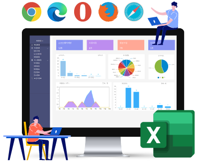

# Forguncy | 포건시


**포건시 도움말을 통해, 설치/인증 방법부터 개발하고 배포하는 웹 개발의 전체 과정을 학습해 보실 수 있습니다.**


[포건시(Forguncy)](https://www.grapecity.co.kr/solutions/forguncy)는 개발자부터 비개발자까지 Excel을 사용할 줄 아는 누구나 기업용 또는 사내 웹 솔루션을 개발할 수 있는 Excel 기반의 노코드(No-Code) 웹 솔루션 개발 도구입니다.

HTML, JavaScript, CSS를 몰라도 Excel에서 작업하는 것과 동일하게, 셀 병합, 셀 스타일과 다양한 셀 타입(텍스트 상자, 버튼, 날짜, 체크박스 등)을 사용하여 쉽고 빠르게 웹 화면과 다양한 웹 입력 양식을 개발할 수 있습니다.

또한, 포건시를 통해 기존의 Excel 파일로 관리하던 데이터를 원클릭으로 데이터베이스화(전산화) 할 수 있으며, 다양한 Excel(엑셀) 함수 그리고 조건부 서식, 필터, 피벗 기능을 이용하여, 쉽고 빠르게 데이터 분석과 관리를 위한 웹 기반의 기업/사내 시스템을 직접 개발할 수 있습니다.

여러분이 직접 효율적인 업무를 위한 사내 웹 시스템/솔루션을 개발하고 운영할 수 있습니다.

<mark style="background-color:yellow;">지금 바로 Forguncy를</mark> <mark style="background-color:yellow;"></mark><mark style="background-color:yellow;">**다운로드**</mark><mark style="background-color:yellow;">하여 직접 테스트해보세요!!</mark>

> * [Forguncy 공식 홈페이지](https://www.grapecity.co.kr/solutions/forguncy?utm_source=dev.grapecity.co.kr\&utm_medium=referral\&utm_campaign=forum\&utm_term=home\&utm_content=fgc)
> * [Forguncy 튜토리얼](https://www.grapecity.co.kr/solutions/forguncy/tutorial?utm_source=dev.grapecity.co.kr\&utm_medium=referral\&utm_campaign=forum\&utm_term=tutorial\&utm_content=fgc)
> * [Forguncy Q\&A](https://dev.grapecity.co.kr/bbs/board.php?bo_table=forguncy_qna)
> * [Forguncy FAQ](https://dev.grapecity.co.kr/bbs/board.php?bo_table=forguncy_faq)
