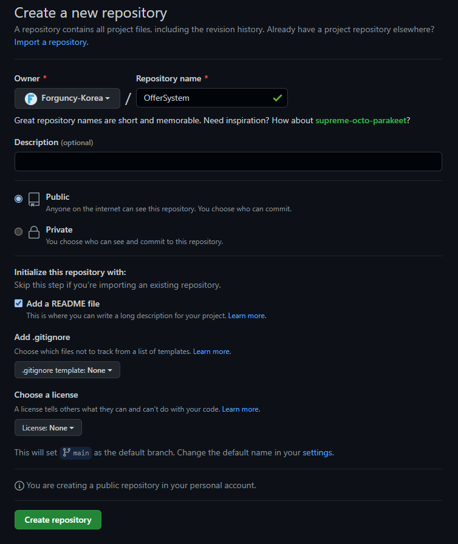

# 프로젝트 생성 및 열기

포건시를 사용하면 여러 사용자가 동일한 프로젝트를 공동 편집하고 관리할 수 있는 멀티플레이어 공동 작업을 수행할 수 있습니다. 이 섹션에서는 프로젝트를 만들고 여는 방법에 대해 설명합니다.

## 프로젝트 생성&#x20;

공동 작업 프로젝트를 만들기 전에 Git 공동 작업 서버를 준비하거나, 엔터프라이즈에 git 서버를 배포하거나, 클라우드의 git 서버를 사용해야 합니다.

이 섹션에서는 GitHub를 공동 작업 서버로 사용하여 프로젝트를 만들고 여는 방법을 보여 줍니다.&#x20;

1. github에 등록하고 계정에 성공적으로 로그인하면 저장소를 만들 수 있습니다.아래    Create a new repository 버튼을 클릭합니다.&#x20;

<figure><figcaption></figcaption></figure>

2. 새 저장소 만들기 페이지에서 저장소이름 입력하고 오픈 소스가 비공개인지 공개인지 여부를 선택하고 실제 비즈니스 상황에 따라 다른 설정을 설정합니다.\
   설정이 완료되면 create repository를 클릭합니다.&#x20;

<figure><figcaption></figcaption></figure>

3. 생성이 완료되면 저장소 주소를 가져옵니다.

<figure><figcaption></figcaption></figure>

4. 협업개발을 위한 포건시 파일 또는 빈 프로젝트를 열고 리본 메뉴 모음에서 \[공동작업-> 프로젝트 생성하기]를 선택하여 공동 작업 프로젝트 작성 대화 상자를 팝업합니다.\
   텍스트 상자에 단계에서 가져온 저장소 주소를 입력합니다.

<figure><figcaption></figcaption></figure>

브랜치 이름 뒤에 있는 새로 고침 버튼 클릭하여 분기 이름을 새로 고치고 드롭다운 상자에서 업로드할 분기를 선택할 수 있습니다.

저장소가 개인 리포지토리인 경우 처음 로그인할 때 원격 서버 인증도 수행하고 사용자 이름 또는 이메 암호를 입력합니다. (GitHub의 경우 비밀번호에 토큰을 입력하여야 합니다. )

<figure><figcaption></figcaption></figure>

사용자 정보를 입력한 후 확인을 클릭합니다.

5. 현재 열려 있는 포건 프로젝트 파일 또는 빈 프로젝트를 공동 작업 서버에 업로드하면 서버 측에서 새 공동 작업 프로젝트가 만들어집니다.\
   업로드가 완료되면 github에 다음과 같이 표시됩니다.

<figure><figcaption></figcaption></figure>

디자이너에서 공동 작업 개발 그룹의 프로젝트 만들기 회색을 사용할 수 없으며 다른 상태는 사용할 수 있습니다.

<figure><figcaption></figcaption></figure>

## 프로젝트 열기&#x20;

공동 작업 서버가 공동 작업 프로젝트를 만든 후 다른 사용자는 공동 작업 서버의 주소를 입력하여 원격 프로젝트를 열어 공동 작업에 참여할 수 있습니다.

리본 메뉴 막대에서 공동작업-> 프로젝트 열기를 선택하여 공동 작업 프로젝트 대화 상자를 엽니다.

텍스트 상자에 공동 작업 서버의 주소를 입력합니다

<figure><figcaption></figcaption></figure>

분기 이름 뒤에 있는 새로 고침 버튼을 클릭하여 분기 이름을 새로 고치고 드롭다운 상자에서 분기를 선택여 공동 작업 프로젝트를 열 수 있습니다.

저장소가 개인 리포지토리인 경우 처음 로그인할 때 원격 서버 인증도 수행하고 사용자 이름 또는 이메일 및 암호를 입력합니다[.](http://gitee.com/)

## **사용자 설정**&#x20;

공동 작업 프로젝트를 만들고 연 후 제출 기록에 표시되는 사용자 이름을 설정할 수 있습니다. 모든 제출은 이 사용자 이름을 사용합니다.

리본 메뉴 모음에서 \[공동작업-> **사용자 설정]**&#xC744; 선택하여 사용자 설정 대화 상자를 표시합니다.

초기 사용자 이름은 컴퓨터에 로그온한 사용자 이름이며 이메일은 포건시를 활성화하는 이메일입니다.

<figure><figcaption></figcaption></figure>
