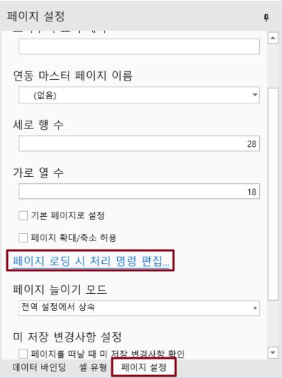
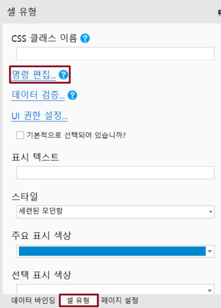
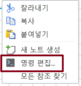
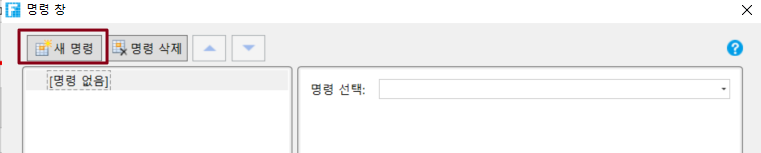
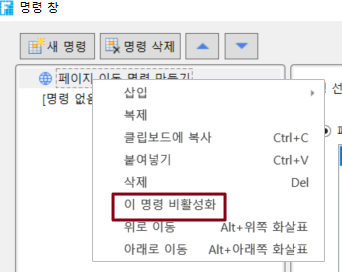

# 명령

포건시에서 명령은 페이지 점프, 팝업 또는 데이터베이스에 데이터를 제출하는 버튼을 클릭하는 등 비즈니스를 수행하는 데 중요한 기능입니다.&#x20;

이미지 업로드, 첨부 파일, 데이터 탐색 버튼, 페이지 매김 탐색 버튼, 프로세스 막대, 로그인 사용자 및 바코드 셀 유형을 제외한 모든 셀 유형은 편집 명령을 지원합니다. 페이지가 로드될 때 명령을 설정할 수도 있습니다.

명령에는 페이지 점프, 팝업 페이지, 팝업 페이지 닫기, 데이터 테이블 작업, Excel로 테이블 내보내기, Excel로 페이지 내보내기, PDF로 페이지 인쇄/내보내기, 쿼리, 정렬, 조건, 레코드 점프, 팝업 메시지 상자, JavaScript 명령, 메일 구독 명령, 셀 속성 설정, 메일 보내기 명령, 웹 페이지 인쇄 명령, 반복 명령, 테이블 작업, 파일 다운로드, Excel 데이터 가져오기, 저장 프로시저 호출 명령, 서버 쪽 명령, 열 옵션 명령, 템플릿 명령을 호출합니다.

명령 창에서 순서대로 실행되는 여러 명령을 작성할 수 있습니다. 명령을 삭제, 위로 이동, 아래로 이동, 삽입, 복사 또는 비활성화할 수도 있습니다.

## 페이지가 로드될 때 명령 및 셀 명령

페이지 로드 명령은 셀 명령과 마찬가지로 해당 명령을 설정하고 실행할 수 있습니다.

### 페이지가 로드될 때 명령

페이지가 로드될 때 명령은 페이지가 로드되는 동안 실행되는 명령입니다.

페이지를 열고 속성 설정 영역에서 페이지 설정 탭을 선택하고 페이지 로드 시 명령 편집을 클릭하여 명령을 설정합니다.

### 셀 명령

셀 명령은 버튼, 하이퍼링크 및 이미지와 같은 유형의 셀을 클릭할 때 실행되는 명령입니다.

이미지 업로드, 첨부 파일, 데이터 탐색 버튼, 페이징 탐색 버튼, 프로세스 막대, 로그인 사용자 및 바코드 셀 유형을 제외한 모든 셀 유형 설정이 완료되면 속성 설정 영역의 셀 설정 탭에서 명령 편집을 선택하여 명령을 설정할 수 있습니다. 또는 셀을 마우스 오른쪽 버튼을 클릭하고 마우스 오른쪽 버튼 클릭 메뉴에서 \[명령 편집]을 선택하여 명령을 설정합니다.

## 명령 작업

### 새 명령 만들기

명령 창에서 \[새 명령]을 클릭합니다.

또는 명령 목록의 빈 공간을 마우스 오른쪽 버튼을 클릭하고 팝업 메뉴에서 \[명령 추가]를 클릭하고 명령 유형을 선택합니다.

또는 명령을 마우스 오른쪽 버튼을 클릭하고 팝업 메뉴에서 \[새명령 추가]를클릭하고 명령 유형을 선택합니다.&#x20;

### 명령 복사 &#x20;

명령을 마우스 오른쪽 버튼을 클릭하고 \[복제]를 선택합니다. 또는 Ctrl 키를 누른 채 명령을 드래그하여 명령을 해당 위치로 복사합니다.

### 명령 삭제

명령을 선택하고 \[명령 삭제]를 클릭합니다. 또는 삭제 바로 가기 Delete를 사용하여 명령을 삭제합니다. 또는 명령을 마우스 오른쪽 단추로 클릭하고 \[삭제]를 선택합니다.

### 명령 비활성화&#x20;

명령을 마우스 오른쪽 버튼 클릭하고 \[이 명령 비활성화] 선택합니다.

### 이동 명령

명령을 선택하고 클릭하거나 이동합니다.

또는 명령을 마우스 오른쪽 버튼으로 클릭하고 위로 이동 또는 아래로 이동을 선택합니다. 또는 위 또는 아래로 이동하는 바로 가기 Alt+Up 및 Alt+Down을 사용하여 명령의 위치를 변경합니다. 직접 드래그하여 명령 위치를 변경할 수도 있습니다.
