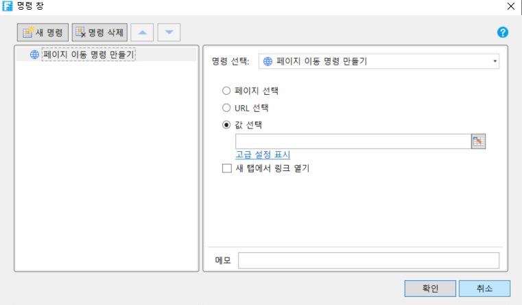

# 페이지 명령 - 페이지 이동

페이지 이 명령을 사용하여 페이지 간에 페이지 이동 구현하고 일반적으로 버튼, 하이퍼링크 등과 같은 셀 유형에서 페이지 간 이동을 구현하는 데 사용됩니다.

## 페이지 이동 명령설정&#x20;

페이지 이동 명령 만들기에서 페이지를 설정해야 하며 내부 페이지 또는 외부 페이지일 수 있습니다.

### 페이지 선택

페이지 선택을 클릭하면  앱의 모든 페이지가 나열되고 페이지 중 하나가 선택되고 명령이 실행되면 해당 페이지로 이동합니다.

.png>)

### URL 선택&#x20;

외부 URL로 이동하며 일반적으로 https://www.grapecity.co.kr같이 앱이 아닌 페이지로 이동하는 데 사용됩니다.

목록에 최근에 액세스한 URL 중 일부는 아래 입력 상자에 점프할 외부 URL을 직접 선택하거나 입력할 수 있습니다.

.png>)

### 값 선택 (페이지 또는 외부 URL)

값을 지정하는 방법에는 여러 가지가 있습니다.

* 내부 페이지: 내부 페이지의 이름을 입력하면 앱에서 페이지를 선택하는 것과 동일한 효과를 내는 내부 페이지로 바로 이동할 수 있습니다.
* URL: 지정된 외부 URL과 동일한 효과로 외부 URL을 입력할 수 있습니다.
* 수식: 수식을 직접 입력하거나 페이지에서 셀을 선택하여 수식의 계산 또는 셀 값에 따라 이동할 수 있습니다.

예를 들어 페이지 이 명령의 지정된 값을 "=B4"로 설정하고 B4 값을 https://www.grapecity.co.kr그런 다음 실행 후, 이 버튼을 클릭, 당신식 웹 사이트로 이동, "= B4"공식의 계산 결과에 따라 점프합니다.

.png>)

### 새 탭에서 링크 열기

"새 탭에서 페이지 열기"를 선택하면 선택한 페이지 이동 방법에 관계없이 브라우저에서 새 탭이 열리고 점프하는 페이지가 열리거나 현재 페이지에서 이동하는 페이지가 열립니다.

기본값은 이 옵션을 선택하지 않는 것입니다.


페이지 이동 명령 뒤에 있는 명령은 실행되지 않습니다.


 
