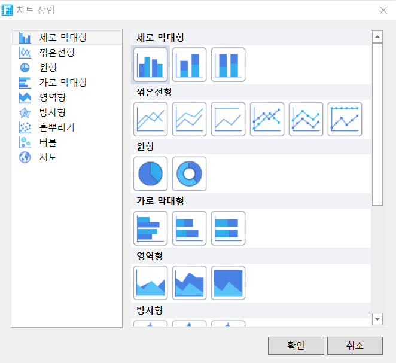

# 차트

차트는 화면에 표시되는 그래픽 구조를 말하며, 통계 정보 속성(시간, 수량 등)을 시각화할 수 있으며, 지식 마이닝 및 정보의 시각화에 중요한 역할을 합니다.

차트는 데이터의 차이를 쉽게 보고 추세를 예측하여 데이터 비교 또는 데이터 변경 추세를 한 눈에 볼 수 있으므로 데이터 관계를 빠르고 효율적으로 표현할 수 있습니다.

이 장에서는 포건시의 차트에 대해 설명합니다.

## 차트 유형&#x20;

포건시는 차트 유형으로 세로 막대형, 꺽은선형, 원형, 가로 막대형, 영역형, 방사형, 흩뿌리기, 버블, 지도 지원합니다.

**세로 막대형 차트**: 데이터 간의 양을 비교하는 데 적합한 클러스터 및 누적 세로 막대형 차트로 선택할 수 있습니다.

**꺾은 선형 차트**: 데이터 집합을 반영하는 추세에 적합한 라인 차트, 누적 라인 차트, 데이터 마커가 있는 라인 차트 및 데이터 마커가 있는 누적 라인 차트를 선택할 수 있습니다.

**원형 차트**: 관련 데이터 간의 비례 관계를 반영하는 데 적합합니다.

**가로 막대형 차트**: 세로 막대형 차트와 누적 막대형 차트로 선택하여 세로 막대형 차트와 마찬가지로 항목 간의 비교를 표시할 수 있습니다.

**영역 차트:** 시간이 지남에 따라 수량의 변화를 강조하는 영역 및 누적 영역 차트로 선택할 수 있으며 총 값 추세에 주의를 기울이는 데 사용할 수도 있습니다.

**방사형 차트:** 레이터 마커가 있는 레이더 차트 및 세 개 이상의 차원을 표시하는 변수에 대한 채우기 레이더 맵을 선택할 수 있습니다.

**흩뿌리기 차트**: 부드러운 선과 데이터 마커가 있는 산점도, 부드러운 선이 있는 산점도, 선 및 데이터 마커가 있는 산점도 및 선이 있는 산점도를 선택할 수 있습니다. 두 변수 간에 상관 관계가 있는지 확인하거나 좌표점을 요약하는 데 사용되는 분포 패턴입니다.

**버블 차트**: 세 변수 간의 관계를 보여 줍니다.

**지도 차트**: 색상 맵, 버블 맵 및 히트 맵 중에서 선택할 수 있습니다. 맵은 지리적 영역 간에 범주의 값을 표시하고 비교하는 데 사용됩니다.
