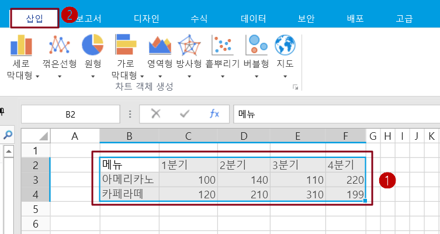
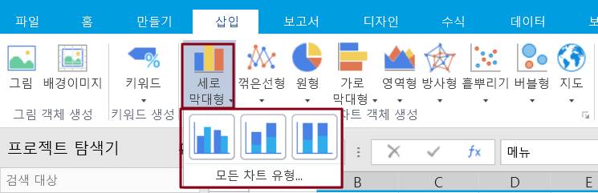
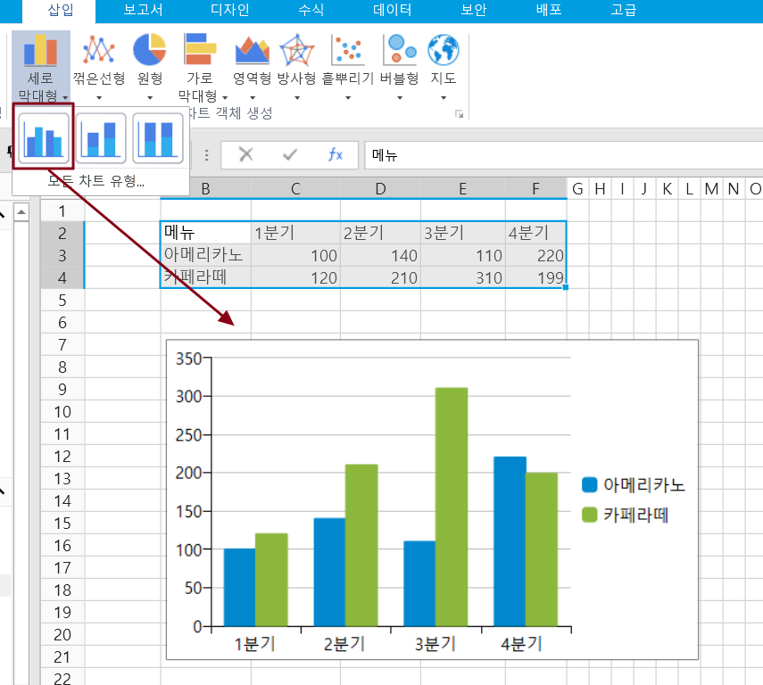
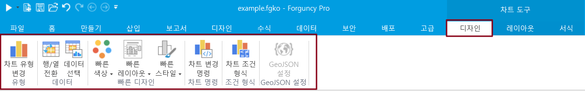
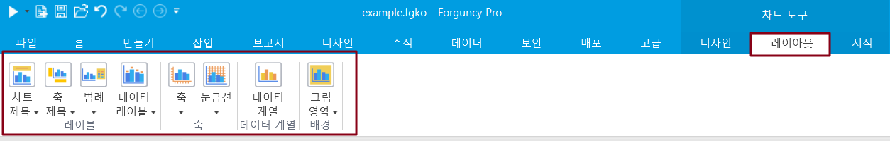
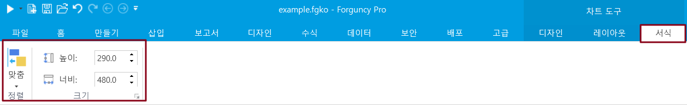
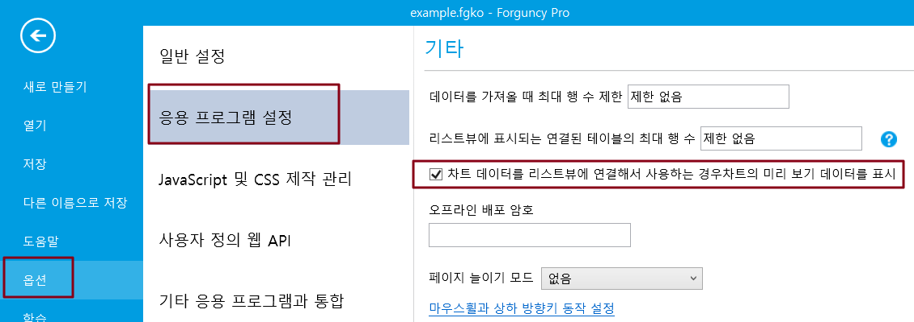

# 기본 사용

차트를 사용하여 데이터를 표시하고, 데이터를 더 흥미롭고, 매력적이며, 읽기 쉽고, 평가하거나, 사용자가 데이터를 분석하고 비교하는 데 도움이 될 수 있습니다.

이 섹션에서는 차트를 사용하는 기본 방법에 대해 설명합니다.

## 차트 이해하기&#x20;

차트에는 제목, 축 레이블, 범례, 그리드 선 등을 비롯한 여러 요소가 포함되어 있으며, 이러한 요소를 표시하거나 숨기거나 위치와 형식을 변경할 수 있습니다. 차트의 구성은 아래 그림에 나와 있습니다.

## 차트 추가하기&#x20;

포건시에 차트를 추가하는 방법은 다음과 같습니다.

 셀 범위 또는 테이블을 선택하고 리본 메뉴 모음에서 삽입을 선택합니다.

 차트 영역에서 차트 유형을 선택하고 각 차트 유형을 여러 하위 차트 유형으로 나누면 차트 유형 아래의 모든 하위 차트 유형을 클릭하여 나열하고 하위 유형을 선택한 후 직접 삽입할 수 있습니다.

모든 차트 유형을 클릭하여 팝업 대화 상자에서 차트 유형을 선택할 수도 있습니다. 예를 들어 다음 그림과 같이 클러스터된 세로 막대형 차트를 선택합니다.

 차트 유형을 선택하여 차트를 삽입합니다. 예를 들어 다음 그림과 같이 클러스터된 세로 막대형 차트를 삽입합니다.

## 차트 설정&#x20;

차트를 추가한 후 리본 메뉴의 차트 도구 영역에서 디자인, 레이아웃, 서식 탭 및 설정을 선택할 수 있습니다.

### 디자인&#x20;

차트의 디자인 설정에 대한 설명은 아래 표에 나와 있습니다.

| 설정         | 설명                                                                                                                                                                                                                     |
| ---------- | ---------------------------------------------------------------------------------------------------------------------------------------------------------------------------------------------------------------------- |
| 차트 유형 변경   | 다른 유형의 차트로 변경합니다.                                                                                                                                                                                                      |
| 행/열 전환     | 
축에서 데이터를 교환합니다.

데이터 원본이 테이블인 경우 행/열을 전환할 수 없습니다.
                                                                                                                                                          |
| 데이터 선택     | 
차트에 포함된 데이터 영역을 변경합니다.

데이터 원본이 셀 범위인 경우 Excel에서와 동일한 작업을 수행합니다. 데이터 원본이 테이블인 경우 테이블에서 템플릿 행의 셀을 하나만 선택할 수 있으며, 이 셀은 데이터 열을 나타내고 여러 셀을 선택할 수 없습니다. 이는 셀을 데이터 원본으로 사용했을 때와 다릅니다. 자세한 내용은 데이터 원본 선택을 참조하십시오.
 |
| 빠른 색상      | 차트 데이터 계열의 색상을 변경하여 선택할 수 있는 다양한 색 구성표를 제공하며 선택한 테마에 따라 색상이 변경됩니다.                                                                                                                                                     |
| 빠른 레이아웃    | 차트 요소의 표시 및 레이아웃인 차트의 빠른 레이아웃 스타일을 변경합니다.                                                                                                                                                                              |
| 빠른 스타일     | 차트의 스타일을 변경하고, 차트 스타일은 현재 테마의 얼굴을 사용하고, 다른 테마로 전환하면 차트 스타일의 색상이 변경됩니다.                                                                                                                                                 |
| 차트 변경 명령   | 차트 명령을 사용하여 차트 클릭 영역의 값, 클래스, 계열 이름 등을 가져오고 차트 데이터 영역을 클릭하는 명령을 설정할 수 있습니다. 자세한 내용은 차트 명령을 참조하십시오.                                                                                                                     |
| 차트 조건 형식   | 차트의 조건부 서식 지정을 참조하십시오.                                                                                                                                                                                                 |
| GeoJSON구성  | 맵을 삽입할 때 맵을 구성하는 GeoJSON이 필요합니다(지도 참조).                                                                                                                                                                                |

## 레이아웃&#x20;

차트의 레이아웃 설정에 대한 설명은 아래 표에 나와 있습니다.

| 설정       | 설명                                                                                                                                                                                                                                                                                                                                                                                                                                                                                                                                                                                                 |
| -------- | -------------------------------------------------------------------------------------------------------------------------------------------------------------------------------------------------------------------------------------------------------------------------------------------------------------------------------------------------------------------------------------------------------------------------------------------------------------------------------------------------------------------------------------------------------------------------------------------------- |
| 차트 제목    | 
차트 제목을 표시할지 여부를 설정하고 서식을 지정합니다.

없음: 차트 제목을 표시하지 않습니다.

차트 제목 표시: 차트 영역 상단에 제목을 표시하고 [기타 제목 옵션]을 클릭하여 제목 텍스트, 채우기 색상 및 투명도, 테두리 색상 및 너비 및 글꼴 관련 설정을 포함하여 차트 제목 서식을 지정합니다. 기본 제목은 차트 제목입니다.
                                                                                                                                                                                                                                                                                                                                                                                        |
| 축 제목     | 

가로/세로 축 제목을 표시할지 여부를 설정하고 서식을 지정합니다.

기본 가로 축 제목:
<ul><li>없음: 축 제목을 표시하지 않습니다.</li><li>제목 표시: 기본 가로 축 제목을 표시하고 [기타 기본 가로 축 제목 옵션]을 클릭하여 제목 텍스트 및 글꼴 관련 설정을 포함하여 가로 축 서식을 지정합니다. 기본 제목은 축 제목입니다.</li></ul>
기본 누진 축 제목:
<ul><li>없음: 축 제목을 표시하지 않습니다.</li><li>제목 표시: 기본 세로좌표 제목을 표시하고 [기타 기본 세로 축 제목 옵션]을 클릭하여 제목 텍스트 및 글꼴 관련 설정을 포함하여 세로 축 서식을 지정합니다. 기본 제목은 축 제목입니다.</li></ul>                                                                                                                                                                                               |
| 범례       | 
범례를 표시할지 여부와 범례 배치 위치 및 서식을 설정합니다.

없음: 범례를 닫고 범례를 표시하지 않습니다.

오른쪽에 범례 표시: 범례를 표시하고 오른쪽으로 정렬합니다.

맨 위에 범례 표시: 범례를 표시하고 맨 위에 정렬합니다.

왼쪽에 범례 표시: 범례를 표시하고 정렬합니다.

맨 아래에 범례 표시: 범례를 표시하고 아래쪽에 정렬합니다.  기타 범례 옵션: 범례 표시를 설정한 후 [기타 범례 옵션]을 클릭하여 범례의 위치 및 방향, 배경색 및 투명도, 테두리 색상 및 너비 및 글꼴 관련 설정을 포함하여 범례의 서식을 지정합니다.
                                                                                                                                                                                                                                               |
| 데이터 레이블  | 
데이터 레이블을 표시할지 여부를 설정하고 서식을 지정합니다.

없음: 선택 영역의 데이터 레이블을 취소합니다.

레이블 표시: 데이터 레이블을 표시합니다. [기타 데이터 레이블 옵션]을 클릭하여 데이터 레이블의 서식을 지정하고 서식이 지정된 데이터 계열을 선택한 다음 레이블 옵션, 숫자 서식 및 글꼴 관련 설정을 설정합니다.
                                                                                                                                                                                                                                                                                                                                                                                            |
| 축        | 
가로/세로 축의 형식과 레이아웃을 설정합니다.

기본 가로 축:
<ul><li>없음:</li><li>왼쪽에서 오른쪽 축 표시: 레이블이 지정된 왼쪽에서 오른쪽 축을 표시합니다.</li><li>레이블 없는 축 표시: 레이블이 없고 눈금 표시만 있는 축을 표시합니다.</li></ul>
기본 누진 축:
<ul><li>없음: 축이 표시되지 않습니다.</li></ul>
기본 축 표시: 기본 순서와 레이블을 사용하는 축을 표시합니다.

천 단위 축 표시: 숫자 단위가 천인 축을 표시합니다.

백만 단위 축 표시: 숫자 단위가 백만인 축을 표시합니다.

10억 단위 축 표시: 숫자 단위가 10억인 축을 표시합니다.

로그 눈금 축 표시: 10을 기준으로 로그 눈금 축을 표시합니다.  

다른 주요 누진 축 옵션: 세로 축의 색상, 너비, 선종류, 숫자의 서식, 글꼴에 대한 설정을 설정할 수 있으며 축 옵션에서 축의 최소값, 최대값, 기본 눈금 단위, 로그 눈금, 표시 단위, 기본 눈금 표시 유형 및 사용자 지정 각도를 설정할 수 있습니다.
 |
| 눈금선      | 

가로/세로 그리드 선을 표시할지 여부를 설정하고 서식을 지정합니다.

기본 가로 그리드 선:
<ul><li>없음: 그리드 선이 표시되지 않습니다.</li><li>주 그리드 선: 주 눈금 단위를 표시하는 가로 그리드 선입니다. 테두리 색상, 너비, 대시 유형 등 그리드 선의 스타일을 지정하려면 [기타 기본 가로 그리드 선 옵션]을 클릭합니다.</li></ul>
기본 세로 그리드 선:
<ul><li>없음: 그리드 선이 표시되지 않습니다.</li><li>주 그리드 선: 주 눈금 단위를 표시하는 세로 그리드 선입니다. 테두리 색상, 너비, 대시 유형 등 그리드 선의 스타일을 지정하려면 [기타 기본 세로 그리드 선 옵션]을 클릭합니다.</li></ul>                                                                                                                                                                                                |
| 데이터 계열   | 
데이터 계열의 속성을 변경합니다.

세로 막대형 차트와 선 그래프를 지원하는 복합 차트를 사용하면 복합 차트(이중 축 차트)를 설정하고 데이터 계열 중 하나를 보조 축으로 설정할 수 있습니다. 또한 테두리의 색상, 너비 및 대시 유형, 데이터 마커 유형 및 크기를 포함하여 데이터 계열의 테두리 스타일 및 데이터 태그 옵션을 설정할 수 있습니다.
                                                                                                                                                                                                                                                                                                                                                                                      |
| 그림 영역    |                                                                                                                                                                                                                                                                                                                                                                                                                                                                                                                                                                                                    |

### 서식 &#x20;

차트의 서식에 대한 설명은 아래 표에 나와 있습니다.

| 설정  | 설명                                                                          |
| --- | --------------------------------------------------------------------------- |
| 정렬  | 선택한 여러 차트에 대한 정렬 규칙을 설정합니다. 왼쪽, 가운데, 오른쪽, 위쪽, 세로, 아래쪽, 가로 및 세로로 설정할 수 있습니다. |
| 높이  | 차트의 높이를 설정합니다.                                                              |
| 너비  | 차트의 너비를 설정합니다.                                                              |


차트를 마우스 오른쪽 단추로 클릭하거나 팝업 메뉴에서 선택하여 차트 유형, 글꼴, 데이터 원본 영역을 변경하고 차트 영역의 서식을 지정할 수도 있습니다.


## 미리보기 설정&#x20;

테이블을 데이터 원본으로 사용하여 차트를 만들면 테이블의 데이터 원본을 기반으로 디자이너에서 차트의 미리 보기가 생성됩니다. 일반적으로 처음 20개의 레코드에서 데이터를 미리 보는 데 사용되며 모든 레코드가 아닙니다.

\[파일-> 옵션-> 응용 프로그램 설정]을 선택하고 \[기타] 영역에서 \[차트 데이터를 리스트뷰에 연결해서사용하는 경우 차트의 미리 보기 데이터를 표]를 선택합니다. 이 옵션은 기본적으로 켜져 있습니다.


테이블이 통계 필드를 사용하고 테이블에 많은 양의 데이터가 있는 통계 필드가 있는 경우 디자이너에서 미리 보기를 생성하는 데 시간이 오래 걸립니다. 이 시점에서 이 옵션을 선택 취소합니다.


