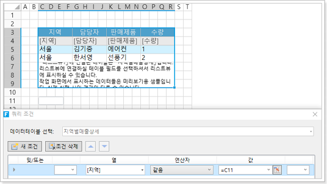
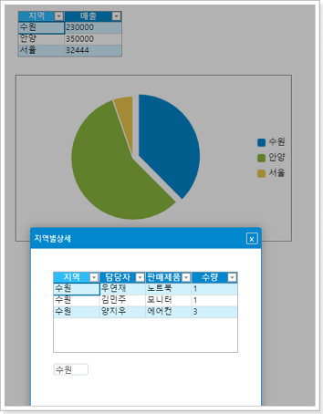

# 차트 명령

포건시의 차트에 명령을 추가할 수 있으며 차트를 클릭하면 설정한 명령이 실행됩니다.&#x20;

차트를 선택한 후 리본 메뉴 모음에서 \[차트 도구-디자인-> 차트  변경 명령]을 선택하면 차트 명령 설정 대화 상자가 나타납니다.

차트 명령을 설정하면 다음 명령에서 직접 사용할 수 있는 계열 이름, 클래스 및 값과 같은 기본 매개 변수가 자동으로 생성됩니다.

.png>)

차트의 범주 부분을 클릭하면 상세 정보를 확인할 수 있는 기능을 구현합니다.

1. 리스트뷰 선택하고 리본 메뉴에서 \[삽입]>\[원형] 을 선택하고 원형 차트를 클릭하여 원형차트를 삽입합니다.

.png>)

2. &#x20;원형 차트를 선택하고 리본 메뉴 모음에서 \[차트 도구-디자인-> 차트 변경 명령]을 선택하여 차트 명령 설정 대화 상자를 표시합니다.

.png>)

차트 명령 설정 대화 상자에서 \[팝업 페이지]로 명령을 선택하고 페이지를 \[지역별상세페이지]로 선택하고 고급 설정을 수행합니다.

소스 셀을 클릭한 후 팝업 대화 상자에서 변수 목록에서 변수를 선택하고 삽입을 두 번 클릭합니다. 이러한 변수는 시스템에서 자동으로 생성됩니다.

.png>)

여기서는 클래스만 필요하므로 매개 변수 클래스를 팝업 페이지의 대상 셀에 전달합니다.

.png>)

3. 세부 정보 페이지에서 영역이 C11의 값과 같을 때 테이블에 대한 쿼리 조건을 설정합니다. 10행 셀 설정을 숨깁니다.\
   테이블의 조회 조건 설정은 테이블 조회를 참조하십시오.

4. 설정이 완료되면 확인을 클릭하여 페이지를 실행합니다.\
   원형 차트의 다른 영역을 클릭하면 해당 지역의 해당 지역에 대한 판매 세부 정보가 나타납니다.


* 일부 차트 유형은 데이터 마커가 없는 선, 영역, 레이더, 데이터 마커가 없는 산점도 및 열 맵을 비롯한 차트 설정 명령을 지원하지 않습니다.
* 차트 유형에 따라 차트 명령을 설정할 때 결과 매개 변수가 다를 수 있습니다(예:버블 차트의 매개 변수는 계열 이름, X 값, Y 값, 크기).

