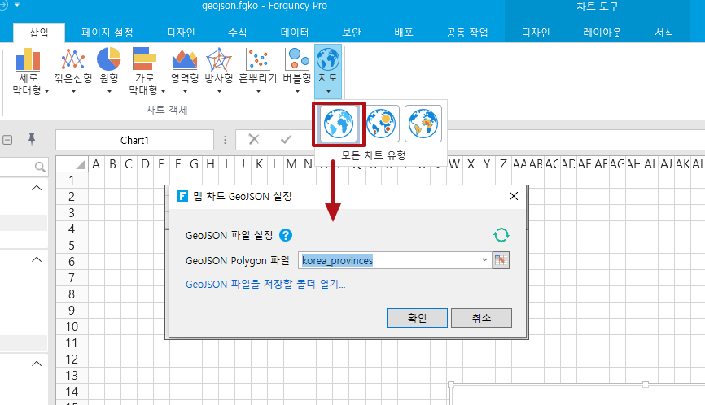

# 지도차트

데이터에 지리적 영역(예: 국가, 지방, 카운티 또는 우편번호)이 있는 경우 지도 차트를 사용하여 지리적 영역 전체에 걸쳐 범주 값을 표시하고 비교할 수 있습니다.

지도를 활용해 여러 지방, 지역별 매출 등 데이터를 반영하면, 각 지역별 분석지표의 분포와 동향을 다른 형태의 차트보다 직관적이고 생생하게 보여줄 수 있을 것이다 .

이 섹션에서는  지도 차트를 사용하는 방법을 설명합니다.

## &#x20;

## 지도 삽입

지도 차트를 사용하기 전에 지도의 GeoJSON 파일을 준비해야 합니다. GeoJSON은 다양한 지리 데이터 구조를 인코딩하기 위한 형식입니다.

다음은 포건시에서 지도를 삽입하는 동작을 설명합니다.

  지도를 준비하는 데 사용되는 GeoJSON 파일은 두 가지 GeoJSON 유형(좌표 및 윤곽선) 을 지원합니다.좌표형의 GeoJSON은 점 지도를 그릴 수 있고, 윤곽 선형의 GeoJSON은 영역 지도를 그릴 수 있습니다 .

좌표 유형 GeoJSON 파일의 파일 이름은 " Korea\_point.json"과 같이 "\_point.json"으로 끝나야 하며, 윤곽선 유형 GeoJSON 파일은 "Korea\_area.json"과 같이 "\_area.json"으로 끝나야 합니다.

  셀 범위나 테이블을 데이터 소스로 선택하고 리본 메뉴 표시줄에서 "삽입"을 클릭한 다음 지도에서 하위 유형을 선택합니다..png>)

<figure><figcaption></figcaption></figure>

  지도 유형을 선택하면 지도 GeoJSON 구성 대화 상자가 열리며, "GeoJSON 파일을 저장할폴더 열기"를 클릭하고 준비된 GeoJSON 파일을 열린 폴더에 복사합니다. 여기에 있는 GeoJSON 파일은 이 프로젝트 파일에서만 사용할 수 있습니다.

<figure><figcaption></figcaption></figure>

포건시 설치 경로에서 "Forguncy\Website\DesignerResources\Map" 폴더를 찾아 거기에 GeoJSON 파일을 복사할 수도 있습니다. 여기서 GeoJSON 파일은 전역 파일입니다. 즉, 모든 이동형 문서에서 이 파일을 사용할 수 있습니다.

* 포건시빌더를 설치할 때 설치 디렉터리가 기본 디렉터리인 경우 이 파일의 경로는 다음과 같습니다.
*
  * Windows 시스템은 32비트 운영 체제입니다: C:\Program Files\Forgency\Website\DesignerResources\Map  &#x20;
  * Windows 시스템은 64비트 운영 체제입니다: C:\Program Files (x86)\Forgency\Website\DesignerResources\Map
* Forguncy   빌더를 설치할 때 설치 디렉터리가 사용자 지정 경로인 경우 이 파일의 경로는 "Custom Path\Forguncy\Website\DesignerResources\Map"입니다.

  작업이 완료되면 클릭하세요.아이콘은 GeoJSON 파일 목록을 새로 고침하고, 새로 고친 후 드롭다운 버튼을 클릭하면 해당 유형의 GeoJSON 파일 목록이 표시됩니다.

<figure><figcaption></figcaption></figure>

  목록에서 파일을 선택하고 "확인"을 클릭하면 지도 차트가 삽입됩니다.

<figure><figcaption></figcaption></figure>

## 하위차트 유형

지도에는 색상 지도, 버블 지도, 열 지도 등 세 가지 하위 차트 유형이 포함됩니다.

#### 색상지도&#x20;

색상 맵은 다양한 지역에 따라 분류되며 다양한 색상을 표시합니다.

색상 맵에서는 GeoJSON 개요 파일만 구성하면 됩니다.

<figure><figcaption></figcaption></figure>

<figure><figcaption></figcaption></figure>

#### 버블 지도 

버블 맵은 지정된 지리적 영역 내의 데이터를 표시하며 버블의 영역은 데이터의 크기를 나타냅니다. 버블맵은 범주형 데이터의 수치적 크기를 비교하는 데 적합합니다.

GeoJSON  Polygon파일과 Point 파일은 색상 지도에서 구성해야 합니다.

<figure><figcaption></figcaption></figure>

<figure><figcaption></figcaption></figure>

#### 열지도&#x20;

채도나 색조 차이를 사용하여 특정 지리적 영역의 값 분포를 표시합니다.

GeoJSON  Polygon파일과 Point 파일은 색상 지도에서 구성해야 합니다.

<figure><figcaption></figcaption></figure>

## 범례&#x20;

색상지도와 열지도 맵에서 데이터를 범례에 매핑하도록 지도 범례를 설정하면 차트를 더 쉽게 이해할 수 있습니다.

색상지도의 범례 설정을 예로 들어보겠습니다 . 컬러맵을 선택한 후 리본 메뉴 바에서 "차트 도구-레이아웃- 범례 "를 선택합니다 . "없음"을 선택하거나 범례를 표시할 위치를 선택할 수 있습니다.

<figure><figcaption></figcaption></figure>

예를 들어 왼쪽에 범례 표시를 선택하면 지도의 왼쪽 하단에 범례가 표시됩니다.

<figure><figcaption></figcaption></figure>

범례를 변경할 수 있습니다. "기타 범례 옵션"을 클릭하여 설정 대화 상자를 엽니다. 범례의 채우기, 테두리 스타일 및 글꼴을 설정할 수 있습니다.&#x20;

<figure><figcaption></figcaption></figure>

| 설정  |                |                                                                                                                                                                                                                                                                                                                                                                                                                     |
| --- | -------------- | ------------------------------------------------------------------------------------------------------------------------------------------------------------------------------------------------------------------------------------------------------------------------------------------------------------------------------------------------------------------------------------------------------------------- |
| 옵션  | 유형             | 
범례 유형을 설정하면 "마디없는" 또는 "부분적으로"을 선택할 수 있습니다.

마디없는:    부분적으로:

 
 |
| 위치  | 공들여 나열한 것      | 범례의 레이아웃을 수직 또는 수평으로 설정합니다.                                                                                                                                                                                                                                                                                                                                                                                         |
| 조정  | 범례의 방향을 설정합니다. |                                                                                                                                                                                                                                                                                                                                                                                                                     |
| 데이터 | 레이블            | 범례 유형을 연속형으로 설정한 경우 범례의 양쪽 끝에 텍스트를 설정할 수 있으며, 양쪽 끝의 텍스트 내용은 "high, low"와 같이 영문 쉼표로 구분해야 합니다.                                                                                                                                                                                                                                                                                                                        |
| 데이터 | 조각들            | 
범례 유형을 세그먼트로 설정하면 각 세그먼트의 값 범위를 사용자 정의할 수 있습니다. 예를 들어 세그먼트 값 범위를 "0,2000,4000,7000"으로 설정하면 데이터가 [0,2000), [2000,4000), [4000,7000]의 세 세그먼트로 나누어집니다.

                                                                                 |
| ㅍ   | 조각 레이블         | 
범례 유형을 세그먼트로 설정한 경우 세그먼트 값 범위를 설정한 후 각 세그먼트에 대한 레이블을 설정하여 각 세그먼트의 값 범위를 보다 명확하게 표시할 수도 있습니다. 예를 들어, 세그먼트 라벨이 " 0 이상 2000 미만, 2000 이상 4000 미만, 4000 이상 7000 이하 "로 설정되면 표시됩니다. 다음과 같다:

                                                                                                                                                                                                                  |
