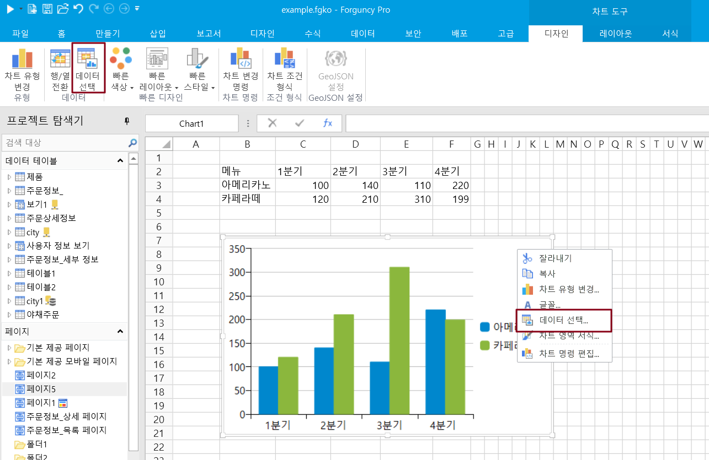
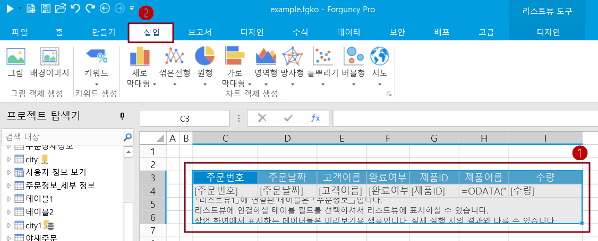
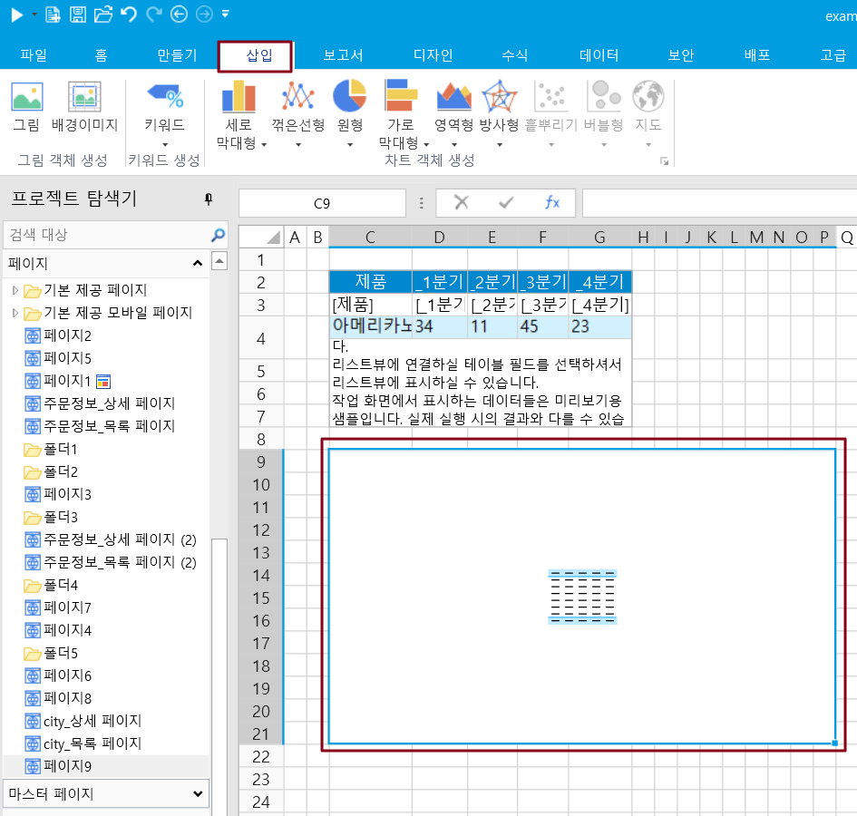
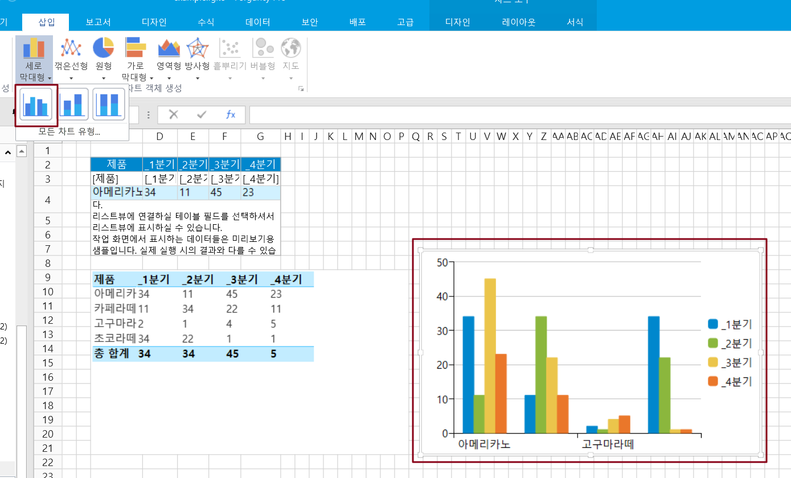
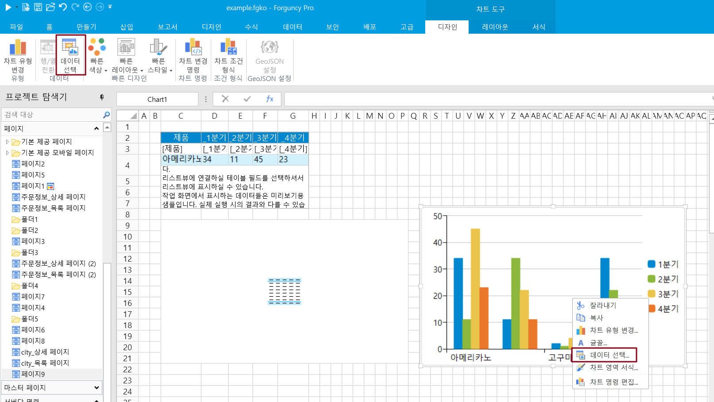
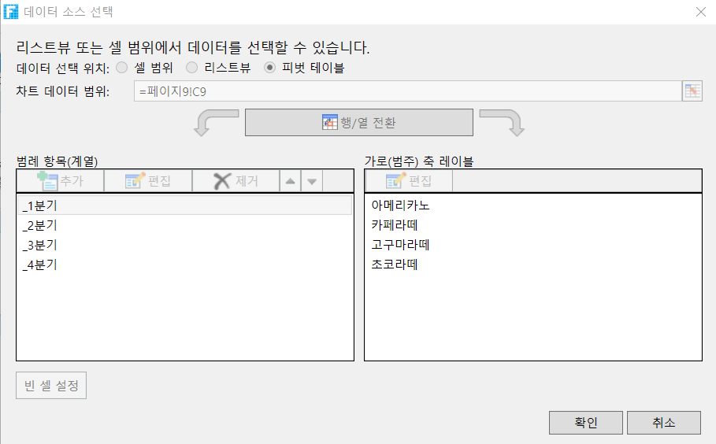

# 데이터 소스 선택

&#x20;차트를 삽입할 때 선택할 수 있는 방법은  네가지 데이터 원본(셀 데이터, 리스트뷰, 데이터테이블 및 피벗 테이블 데이터)이 있습니다.

셀과 리스트뷰로및 데이터테이블을  데이터소스로   선택할 때 가로 및 세로 축에는 몇 가지 차이점이 있습니다.

* 셀을 데이터 원본으로 사용하는 경우 포건시의 차트 작업은 Excel의 작업과 거의 동일합니다.
* 리스트뷰는 데이터 원본으로 사용하는 경우 템플릿 행의 셀을 하나만 선택하여 데이터 열을 나타낼 수 있으며 여러 셀을 선택할 수 없습니다.
* 데이터테이블은 데이터소스로 사용하는 경우 데이터 소스에서 하나의 컬럼만 계역 데이터로 선택할 수 있습니다.&#x20;

이 섹션에서는 셀, 리스트뷰, 데이터테이블, 피벗 테이블을 사용하여 데이터 원본에 대한 차트를 만드는 방법을 설명합니다.

## 셀을 데이터 원본으로 사용  

셀을 데이터 원본으로 사용하는 경우 포건시의 차트 작업은 Excel의 작업과 거의 동일합니다. 다음은 데이터 원본에 대한 차트 및 해당 설정을 셀로 삽입하는 방법에 대해 자세히 설명합니다.

 셀 범위를 데이터 원본으로 선택하고 리본 메뉴 모음에서 \[삽입]을 선택합니다.

 차트 영역에서 차트 유형을 선택하고 각 차트 유형을 여러 하위 차트 유형으로 나누면 차트 유형 아래의 모든 하위 차트 유형을 클릭하여 나열하고 하위 유형을 선택한 후 직접 삽입할 수 있습니다.

예를 들어 다음 그림과 같이 클러스터된 세로 막대형 차트를 선택합니다.

 차트 유형을 선택하여 차트를 삽입합니다. 예를 들어 다음 그림과 같이 클러스터된 세로 막대형 차트를 삽입합니다.

  **데이터 원본을 선택합니다.** 리본 메뉴 모음에서 \[차트 도구->디자인-> 데이터 선택]을 선택하거나 차트에서 마우스 오른쪽 버튼을 클릭하고 팝업 메뉴에서 데이터 선택을 선택하여 차트에 표시된 데이터를 추가로 변경하고 재정렬합니다.

이 시점에서 데이터는 셀 범위에서 가져온 다음 Excel에서와 같이 설정할 수 있습니다.

* **차트 데이터 범위:** 차트 데이터 범위를 직접 입력하거나 클릭한 후 차트 영역을 다시 선택합니다.
* **행/열 전환:** 행/열 전환을 클릭하여 데이터가 그려지는 방식을 빠르게 변경합니다. 예를 들어 워크시트 데이터가 필요한 차트를 만들거나 세로(숫자) 축을 표시하는 가로(범주) 축에 표시할 데이터 행입니다.
* **범례 항목(계열):** 범례 항목(계열)을 추가, 편집, 삭제, 위로 또는 아래로 이동합니다.
* **가로(범주) 축 레이블:** 가로(범주) 축 레이블을 편집합니다.

<figure><figcaption></figcaption></figure>

## **리스트뷰를 데이터 원본으로 사용**  

리스트뷰를 데이터 원본으로 사용하는 경우 템플릿 행의 셀을 하나만 선택하여 데이터 열을 나타낼 수 있으며 여러 셀을 선택할 수 없습니다. 다음은 데이터 원본에 대한 차트 및 해당 설정을 테이블로 삽입하는 방법에 대해 자세히 설명합니다.

 리스트뷰를 데이터 원본으로 사용하려면 먼저 페이지에 테이블과 필드가 이미 바인딩되어 있어야 하며 테이블 영역을 데이터 원본으로 선택한 다음 리본 메뉴 모음에서 \[삽입]을 선택해야 합니다.

 차트 영역에서 차트 유형을 선택하고 각 차트 유형을 여러 하위 차트 유형으로 나누면 차트 유형 아래의 모든 하위 차트 유형을 클릭하여 나열하고 하위 유형을 선택한 후 직접 삽입할 수 있습니다.

예를 들어 다음 그림과 같이 클러스터된 세로 막대형 차트를 선택합니다.

 차트 유형을 선택하여 차트를 삽입합니다. 예를 들어 다음 그림과 같이 클러스터된 세로 막대형 차트를 삽입합니다.

.png>)

  데이터 원본을 선택합니다. 리본 메뉴 모음에서 \[디자인-> 데이터 선택]을 선택하거나 차트에서 마우스 오른쪽 버튼을 클릭하고 팝업 메뉴에서 \[데이터 선택]을 선택하여 차트에 표시된 데이터를 추가로 변경하고 재정렬합니다.

다음과 같이 설정할 수 있습니다.

* 범례 항목(계열)을 추가, 편집, 삭제, 위로 또는 아래로 이동합니다.
* 가록(범주) 축 레이블을 편집합니다.

<figure><figcaption></figcaption></figure>

테이블을 데이터 원본으로 사용하는 경우 테이블에서 템플릿 행의 셀을 하나만 선택할 수 있으며, 데이터는 한 열로 표시되고 둘 이상의 셀은 선택할 수 없습니다. 이는 셀을 데이터 원본으로 사용했을 때와 다릅니다.

범례 항목(계열)을 선택하고 편집을 클릭하여 계열 이름을 편집하거나 선택한 템플릿 행의 셀을 변경하여 하나의 셀, 즉 데이터 열만 선택할 수 있습니다.

## 데이터 테이블을 데이터 소스로 사용&#x20;

데이터 테이블을 데이터 원본으로 직접 사용하여 차트를 만들 수 있습니다.

  빈 차트를 생성한 후 차트를 선택하고 마우스 오른쪽 버튼을 클릭한 후 오른쪽 클릭 메뉴에서 "데이터 선택"을 선택하면 데이터 선택 대화 상자가 팝업됩니다.

<figure><figcaption></figcaption></figure>

<figure><figcaption></figcaption></figure>

  데이터 선택 대화 상자에서 "데이터 소스"를 선택한 후 데이터 소스 옆의 "설정"을 클릭하여 데이터를 가져오면 다음과 같은 대화 상자가 나타납니다.

차트 데이터 소스로 설정할 데이터 테이블을 선택한 후 선택 항목, 쿼리 조건, 쿼리 행 수, 정렬 등을 설정할 수 있습니다.

두 가지 유형의 옵션이 있습니다.

* 바인딩열: 데이터 테이블의 필드를 바인딩합니다.
* 수식: 수식으로 설정합니다. 함수를 사용할 수 있으며 페이지의 셀/이름을 참조하거나 다른 열을 참조합니다.

<figure><figcaption></figcaption></figure>

  "확인"을 클릭하여 설정 대화 상자를 닫은 후 다음 설정을 지정할 수도 있습니다.

* 범례 항목(계열): 범례 항목(계열)을 추가, 수정, 삭제, 위아래로 이동, 데이터 테이블을 데이터 소스로 사용하는 경우 데이터 소스의 한 열만 계열 데이터로 선택할 수 있습니다.
* 가로(범주) 축 레이블: 가로(범주) 축 레이블을 편집합니다. 데이터 테이블을 데이터 소스로 사용하는 경우 데이터 소스에서 하나의 컬럼만 축 레이블 값으로 선택할 수 있습니다.
* 빈 셀: 빈 셀을 공백, 0 값 또는 선으로 연결하여 표시하도록 설정할 수 있습니다.

<figure><figcaption></figcaption></figure>

  데이터 소스가 설정되면 차트를 미리 볼 수 있습니다.

<figure><figcaption></figcaption></figure>

## 피벗 테이블을 데이터 원본으로 사용 

피벗 테이블을 데이터 원본으로 사용하여 피벗 차트를 만들 수도 있습니다. 피벗 테이블을 데이터 원본으로 사용하는 경우 흩뿌리기 차트, 버블차트 및 지도를 만드는 것은 지원되지 않습니다.

다음은 피벗 테이블을 데이터 원본에 대한 차트 삽입 및 해당 설정에 대해 자세히 설명합니다.

 피벗 테이블을 데이터 원본으로 사용하려면 먼저 페이지에 테이블과 필드가 이미 바인딩되어 있고 해당 테이블이 원본으로 피벗 테이블을 만들어야 합니다.

그런 다음 피벗 테이블 영역을 데이터 원본으로 선택하고 리본 메뉴 모음에서 삽입을 선택합니다.

 차트 영역에서 차트 유형을 선택하고 각 차트 유형을 여러 하위 차트 유형으로 나누면 차트 유형 아래의 모든 하위 차트 유형을 클릭하여 나열하고 하위 유형을 선택한 후 직접 삽입할 수 있습니다.

예를 들어 다음 그림과 같이 클러스터된 세로 막대형 차트를 선택합니다.

 차트 유형을 선택하여 차트를 삽입합니다. 예를 들어 다음 그림과 같이 클러스터된 세로 막대형 차트를 삽입합니다.

  데이터 원본을 봅니다. 리본 메뉴 모음에서 \[디자인-> 데이터 선택]을 선택하거나 차트에서 마우스 오른쪽 버튼을 클릭하고 팝업 메뉴에서 \[데이터 선택]을 선택하면 데이터 소스 선택 대화 상자가 나타나지만 편집할 수는 없습니다.

차트의 데이터는 피벗 테이블에서 가져온 것이므로 차트 데이터 영역을 수정하거나 범례 항목 및 가로 축 레이블 등을 편집할 수 없습니다.

