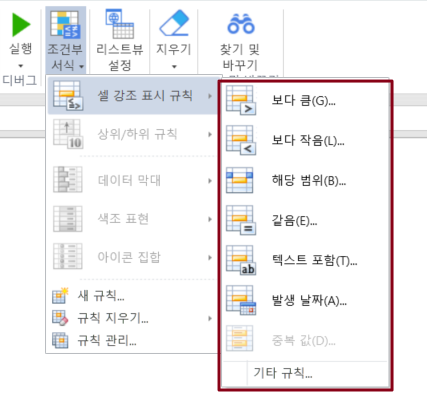
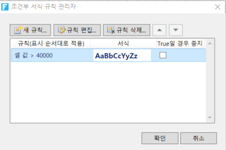

# 셀 조건부 서식

Excel과 동일한 조건부 서식 기능을 사용할 수 있으므로 셀 또는 셀 범위에 대해 여러 조건부 서식을 지정할 수 있으며 셀 내용이 변경되면 셀의 서식이 변경됩니다.

조건부 서식을 지정할 셀을 선택하고 리본 메뉴 모음에서 \[홈]>\[ 조건부 서식]을 선택합니다.

## 셀 강조 표시 규칙&#x20;

셀의 서식을 지정하고 보다 크거나, 작거나, 해당 범위, 같음, 텍스트 포함 및 발생 날짜를 포함하여 셀 규칙 강조 표시에 대한 규칙을 설정할 수 있습니다.

## 새 규칙&#x20;

조건부 서식을 선택하고 \[새 규칙]을 클릭하고 팝업 새 서식 규칙 대화 상자에서 조건을 설정하고 \[서식]을 클릭하여 조건을 충족하는 셀의 서식을 지정합니다.

## 규칙 관리

조건부 서식을 선택하고 \[규칙 관리]를 클릭하면 팝업 조건 형식 규칙 관리자에서 규칙을 새로 만들기, 편집 및 지울 수 있습니다.

True인 경우 중지 체크박스 사용하여 규칙 계산이 중지된 시기를 제어합니다. "true이면 중지"를 선택하면 규칙이 true일 때 중지되고 다음 규칙이 더 이상 계산되지 않습니다.
