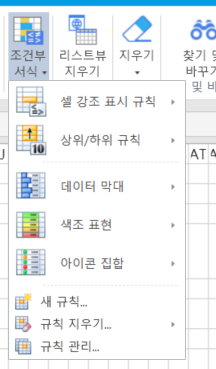
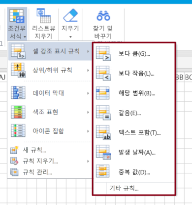
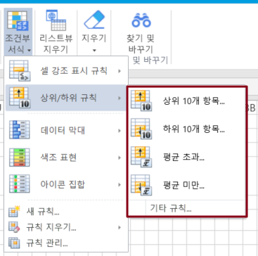
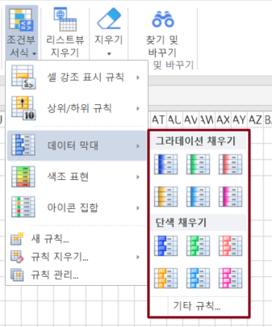
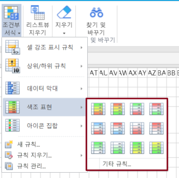
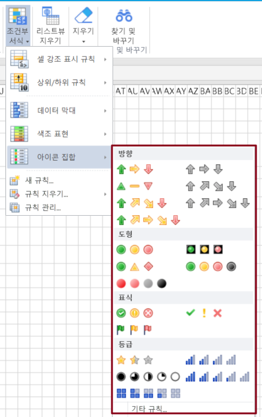

# 리스트뷰 조건부 서식

Excel과 동일한 조건부 서식 지정 기능이 제공되며 비즈니스 데이터를 필터링하기 위해 테이블에 대해 하나 이상의 조건부 서식을 지정할 수 있습니다.

테이블의 템플릿 행 또는 템플릿 행에서 셀을 선택할 때 조건부 서식은 테이블의 전체 열에 조건부 서식을 지정하는 것입니다.

조건부 서식을 지정할 테이블 템플릿 행의 셀을 선택하고 리본 메뉴 모음에서 \[홈]>\[조건부 서식]을 선택합니다.

## 셀 강조 표시 규칙&#x20;

보다 큼, 보다 작음, 해당 범위, 같음, 텍스트 포함, 발생 날짜, 중복 값의 강조 표시된 셀 규칙을 설정합니다.

## 항목 선택 규칙&#x20;

항목 선택 규칙에는 상위 10개, 하위 10개, 평균 초과 및 평균 미만이 포함됩니다.

## 데이터 막대&#x20;

데이터 막대를 사용하면 다른 셀을 기준으로 한 셀의 값을 볼 수 있습니다. 데이터 막대의 길이는 셀의 값을 나타냅니다. 데이터 막대가 길수록 값이 높을수록 데이터 막대가 짧아지고 값이 낮아집니다.

데이터 막대는 많은 양의 데이터에서 더 높은 값과 낮은 값을 관찰할 때 특히 유용합니다.

## 색조 표현

셀 값의 크기를 다른 색상 전환으로 표현하여 모든 값의 상대적 크기를 시각적으로 볼 수 있음을 나타내는 조건부 형식에서 일반적으로 사용되는 표현입니다.

## 아이콘 집합

아이콘 집합을 사용하여 데이터에 주석을 달고 임계값별로 데이터를 3\~5개의 범주로 분류할 수 있습니다. 각 아이콘은 값의 범위를 나타냅니다. 예를 들어 3방향 화살표 아이콘 집합에서 녹색 위쪽 화살표는 더 높은 값을 나타내고, 노란색 가로 화살표는 중간 값을 나타내고, 빨간색 아래쪽 화살표는 낮은 값을 나타냅니다.

## 새규칙&#x20;

다음 규칙 유형을 포함하여 새 사용자 지정 규칙을 만듭니다.&#x20;

* 셀 값을 기준으로 모든 셀의 서식 지정&#x20;
* 다음을 포함하는 셀만 서식 지정&#x20;
* 상위 또는 하위 값만 서식 지정&#x20;
* 평균보다 크거나 작은 값만 서식 지정&#x20;
* 고유 또는 중복 값만 서식 지정&#x20;
* 수식을 사용하여 서식을 지정할 셀 결정&#x20;

<figure><figcaption></figcaption></figure>

## 규칙 지우기&#x20;

규칙지우기를 선택하면 "선택한 셀의 규칙 지우기", "시트 전체에서 규칙 지우기", "이 테이블에서 규칙 지우기"를 할 수 있습니다.&#x20;

<figure><figcaption></figcaption></figure>

## 규칙 관리&#x20;

"규칙 관리"를 클릭하면 팝업되는 조건부 서식 규칙 관리자에서 규칙을 생성, 편집 및 삭제할 수 있습니다.

<figure><figcaption></figcaption></figure>
