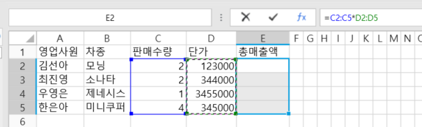
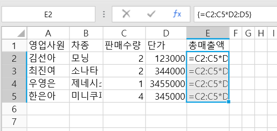
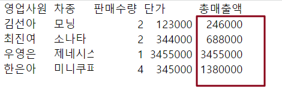

# 배열 수식

배열 수식은 셀에서만 사용할 수 있고 테이블에서는 지원되지 않습니다.&#x20;

배열 수식은 배열의 하나 이상의 계산에서 여러 계산을 수행할 수 있는 수식입니다. 배열을 행 값, 값 열 또는 행 값과 열 값의 조합으로 생각할 수 있습니다. 배열 수식은 여러 결과 또는 하나의 결과를 반환할 수 있습니다。

여러 셀을 포함하는 배열 수식을 다중 셀 수식이라고 하며 단일 셀에 있는 배열 수식을 단일 셀 수식이라고 합니다.

배열 수식을 사용하여 다음과 같은 보다 복잡한 계산을 수행할 수 있습니다.

* 셀 범위에 포함된 문자 수를 계산합니다.
* 특정 조건(예: 영역의 최소값 또는 상한과 하한 사이의 숫자)을 충족하는 숫자만 합산합니다.
* 일련의 값에서 각 _&#x6E;_&#xBC88;째 값을 합산합니다.

배열 수식은 Enter 키만 누르는 것이 아니라 Ctrl+Shift+Enter를 눌러 수식을 완료하기 때문에 CSE(Ctrl+Shift+Enter) 수식이라고도 합니다.

## 배열 수식 구문&#x20;

배열 수식은 표준 수식 구문을 사용합니다. 배열 수식은 등호로 시작하며 배열 수식에서 대부분의 기본 제공 Excel 함수를 사용할 수 있습니다.

배열 수식을 사용하려면 **Ctrl+Shift+Enter 키를 눌러** 수식을 제출해야 합니다. 이렇게 하면 배열 수식이 중괄호로 묶입니다. 중괄호를 수동으로 입력하면 수식이 텍스트 문자열로 변환되어 작동하지 않습니다.

배열 수식은 배열 수식 "{=SUM(C2:C11\*D2:D11)} "일반 수식과 함께"=SUM(C2\*D2, C3\*D3, C4\*D4, C5\*D5, C6\*D6, C7\*D7, C8\*D8, C9\*D9, C10\*D10, C11\*D11)과 같은 복잡한 수식을 작성하는 효율적인 방법입니다.

## 다중 셀 수식&#x20;

여러 셀을 포함하는 배열 수식을 다중 셀 수식이라고 하며 다음 예제에서는 다중 셀 수식을 사용하는 방법을 보여 줍니다.

그림 1에 표시된 판매 데이터에서 E 열의 총 판매 값을 계산하려면 다중 셀 수식을 사용할 수 있습니다.

 E2를 선택합니다:E5 셀 범위입니다.

 수식창에 수식 =C2:C5\*D2:D5를 입력합니다.

 수식창에 커서를 두고 Ctrl+Shift+Enter를 클릭하 배열 수식을 완료합니다. 수식 편집 표시줄에서 수식이 "{=C2:C5\*D2:D5}"로 표시되어 수식이 배열 수식이라는 것을 나타낼 수 있습니다.\
중괄호 "{}"를 사용하여 수식을 묶고 선택한 범위의 셀에 배열 수식을 삽입합니다.

 실행 후 브라우저 페이지에서 다중 셀 배열 수식의 계산을 볼 수 있습니다.

## **배열 수식을 편집하거나 삭제** 

배열 수식을 만든 후 상황에 따라 편집하거나 삭제할 수 있습니다. 배열 수식을 편집한 후 배열 수식을 만드는 것과 마찬가지로 단일 셀 수식과 다중 셀 수식을 포함하여 Ctrl+Shift+Enter를 눌러 배열 수식을 완료해야 합니다.

#### 배열 수식을 편집합니다 

* 단일 셀 수식의 경우 배열 수식을 두 번 클릭하여 편집 상태로 이동할 수 있으며 편집이 완료되면 Ctrl+Shift+Enter를 눌러 배열 수식을 완료합니다.
* 다중 셀 수식의 경우 다음 사항에 유의해야 합니다.

(1) 다중 셀 수식에서 셀 중 하나의 수식을 변경하고 Ctrl+Shift+Enter를 누르면 전체 범위의 배열 수식이 변경됩니다.

(2) 다중 셀 수식의 일부를 삭제할 수 없습니다. 배열 수식의 셀 범위를 줄이려면 전체 배열 수식에 적용되는 셀 범위를 선택한 다음 Delete 키를 눌러 삭제하고 다중 셀 수식을 다시 만들어야 합니다.

(3) 여러 셀 수식에 빈 셀을 삽입할 수 없습니다.

#### 배열 수식을 삭제합니다 

* 단일 셀 수식의 경우 셀을 직접 선택하고 Delete 키를 눌러 삭제할 수 있습니다.
* 다중 셀 수식의 경우 다음 사항에 유의해야 합니다.

(1) 다중 셀 수식을 삭제할 때 전체 셀 범위를 선택하고 Delete 키를 눌러 삭제합니다.

(2) 다중 셀 수식의 일부를 삭제할 수 없습니다.

## 배열 수식의 이점

배열 수식은 일반 수식에 비해 다음과 같은 이점을 제공합니다.

* 일관성\
  이 셀 범위에 배열 수식을 적용한 후 해당 범위의 셀 중 하나를 클릭하면 동일한 배열 수식이 표시됩니다.
* 보안\
  이 셀 범위에 배열 수식을 적용한 후에는 셀 중 하나에서 배열 수식을 개별적으로 변경하거나 삭제할 수 없으며 배열 수식이 적용된 전체 셀 범위를 선택한 다음 전체 범위의 배열 수식을 변경하거나 삭제해야 합니다.
