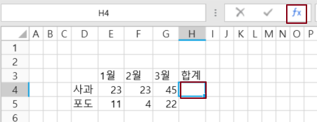
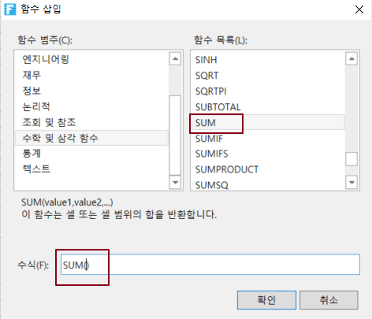
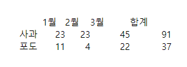
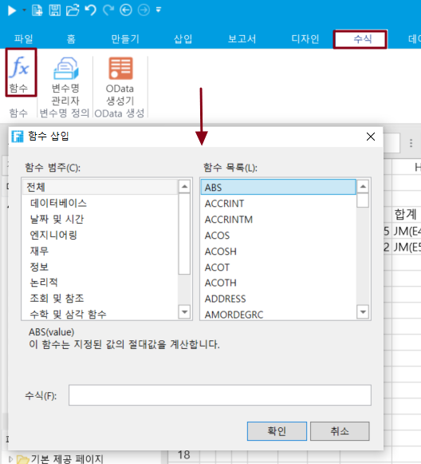

# 기본 수식 사용

수식은 항상 등호 "="로 시작하고 숫자, 수학 연산자(예: 더하기 또는 빼기 기호) 및 함수가 뒤따를 수 있습니다.

포건시에서 수식을 사용하는 방법에는 세 가지가 있습니다.

* 셀에 수식을 직접 입력합니다.
* 수식 표시줄에 수식을 삽입합니다.
* 메뉴 모음에서 \[수식-> 함수]를 선택합니다.

## 셀에 직접 수식 입력하기&#x20;

셀에 수식을 직접 입력합니다.&#x20;

예를 들어  셀이나 수식 표시줄의 오른쪽에 있는 편집 필드에 수식 =2\*3+5를 입력하고 2와 3을 곱한 다음 결과를 5에 더하여 실행한 후 답변 11을 얻습니다.

.png>)

## 수식 표시줄에 수식 삽입하기&#x20;

수식 표시줄에서 사용할 수 있습니다. 함수를 삽입합니다.

1. 셀을 선택합니다. 수식 표시줄을 클릭합니다.

2. 팝업 삽입 함수 대화 상자에서 함수를 선택하고 두 번 클릭하여 아래 수식 편집 막대에 함수를 추가합니다. 예를 들어 sum 함수를 선택하고 sum 함수를 두 번 클릭하여 수식 편집 모음에 추가합니다.

3. 함수 삽입 대화 상자의 수식 입력에 계산할 셀을 직접 입력할 수 있습니다. 또는 \[확인]을 클릭한 후 함수 삽입 대화 상자를 닫은 후 빌더의 셀 또는 수식 편집 모음에 계산할 셀을 입력합니다.


함수를 삽입하면 등호 "="를 자동으로 삽입합니다.


4. 수식 편집이 완료되면 Enter 키를 누르거나 다른 셀을 클릭하여 수식 편집 상태를 종료합니다. 실행 후 브라우저에서 수식의 계산을 볼 수 있습니다.

## 메뉴에서 \[수식]>\[함수] 선택&#x20;

함수를 삽입할 셀을 선택한 후 리본 메뉴 모음에서 \[수식-> 함수]를 선택하고 \[함수 삽입] 대화 상자에서 선택한 셀에 함수 삽입을 선택할 수도 있습니다.

