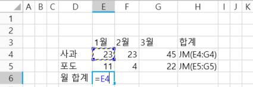
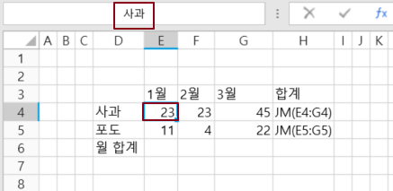

# 참조 스타일

셀을 참조하는 두 가지 Excel 수식을 지원합니다

A1 스타일 및 이름 스타일을 지원합니다. 하지만 Excel과 달리 포건시는 R1C1 참조 스타일을 지원하지 않습니다.

## A1 스타일&#x20;

행과 열을 구성하는 단일 셀로 구성됩니다. 행은 숫자로 번호가 매겨지며 열은 문자로 표시됩니다.

A1 스타일은 열을 나타내는 문자와 행을 숫자로 나타냅니다. 기본적으로 포건시는 A1 스타일을 사용하여 셀을 참조합니다.

 셀을 선택하고 등호 =를 입력합니다.

 커서가 등호 뒤에 있으면 셀을 선택하거나 다른 셀을 직접 입력합니다. 아래 그림에서 E4 셀을 선택하거나 "E4"를 직접 입력합니다.

 입력 연산자(예: 더하)를 입력합니다.

 다음 셀을 선택하거나 다른 셀을 직접 입력합니다. 아래 그림에서 E4 셀을 선택하거나 "E4"를 직접 입력합니다.

 Enter 키를 눌러 수식 작성을 완료합니다. 페이지가 실행되면 계산 결과가 페이지에 표시됩니다.

## 이름 스타일

이름을 사용하면 수식을 더 쉽게 이해하고 유지 관리할 수 있으며 셀 또는 셀 범위에 대한 이름을 정의할 수 있습니다. 이름 관리자를 사용하면 이러한 이름을 쉽게 업데이트, 감사 및 관리할 수 있습니다.

셀 이름 또는 셀 범위에 대한 이름을 정의하는 것은 이름 수식을 참조하십시오.

페이지의 셀 이름을 지정합니다.&#x20;

 셀을 선택하고 등호 =를 입력합니다.

 이름을 적용할 수식의 위치에 커서를 놓고 셀 이름을 입력합니다.

셀 이름을 올바르게 입력하면 글꼴 색상이 파란색으로 바뀌고 참조된 셀이 파란색 테두리에 의해 선택됩니다. 셀 이름이 문자인 경우 첫 글자를 입력한 후 목록에서 직접 사용할 이름을 선택할 수 있습니다.

  입력 연산자(예: 빼기)를 입력합니다. 참조할 다음 셀의 이름을 입력합니다.

셀 이름을 올바르게 입력하면 글꼴 색상이 녹색으로 바뀌고 참조된 셀이 녹색 테두리로 선택됩니다.

.png>)

  Enter 키를 눌러 수식 작성을 완료합니다. 페이지가 실행되면 계산 결과가 페이지에 표시됩니다.
