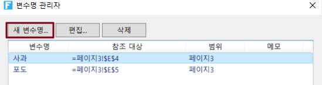
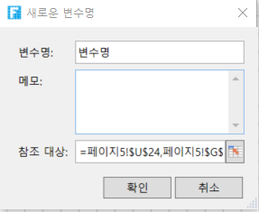

# 변수명 수식

Excel과 마찬가지로 이름 수식을 지원합니다. 변수명은 셀의 이름이며, 셀에 이름을 정의 한 후, 수식을 보다 직관적이고 이해하기 쉽게 만들기 위해 셀 이름으로 직접 작업을 수행 할 수 있습니다.

이름을 사용하면 수식을 더 쉽게 이해하고 유지 관리할 수 있습니다. 셀 범위, 함수, 상수 또는 테이블에 대한 이름을 정의할 수 있으며 이름 관리자에서 쉽게 관리할 수 있습니다.

셀 또는 셀 범위에 이름을 정의한 후 수식에서 직접 참조된 셀 또는 셀 범위를 참조하는 변수을 사용합니다.

## 이름 수식 만들기&#x20;

Excel에서와 동일한 두 가지 방법으로 이름 수식을 만듭니다.

* 방법 1. 이름 관리자를 사용합니다.

 페이지에서 셀 또는 셀 범위를 선택하고 리본 메뉴 모음에서 \[수식-> 변수명 관리자]를 클릭합니다.

 \[변수 관리자] 페이지에서 \[새 변수명]를 클릭하여 이름을 만듭니다.

 \[새로운 변수] 창에서 변수명, 메모를 입력하고 버튼을 누릅니다.

 \[확인]을 클릭하면 이름 지정이 완료됩니다. 셀 이름이 변수에 표시됩니다.

### 관리 이름&#x20;

두 방법 중 하나를 사용하여 셀의 이름을 지정한 후 이름 편집 및 이름 삭제를 포함하여 이름 관리자에서 이러한 이름을 관리할 수 있습니다.

방법1. 셀을 선택하고 이름 상자에서 셀 이름을 직접 수정하지만 메모 및 참조 위치를 수정할 수는 없습니다.

.png>)

방법2. 변수명 관리자에서 이름정보를 편집합니다.&#x20;

 리본 메뉴 막대에서 \[수식->변수명 관리자]를 클릭합니다.

.png>)

 \[변수명 관리자] 대화 상자에서 만든 셀 이름을 선택하고 \[편집]을 클릭합니다.

.png>)

 팝업 이름 편집 대화 상자에서 이름, 메모 및 참조 위치를 편집할 수 있습니다.
