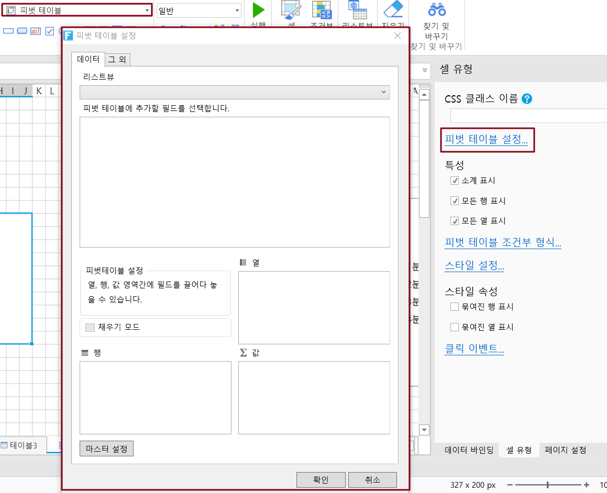
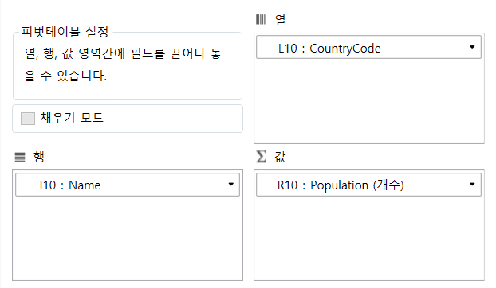
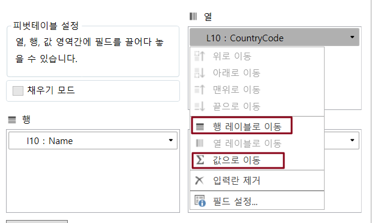
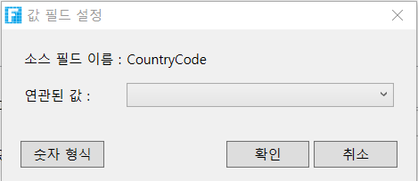
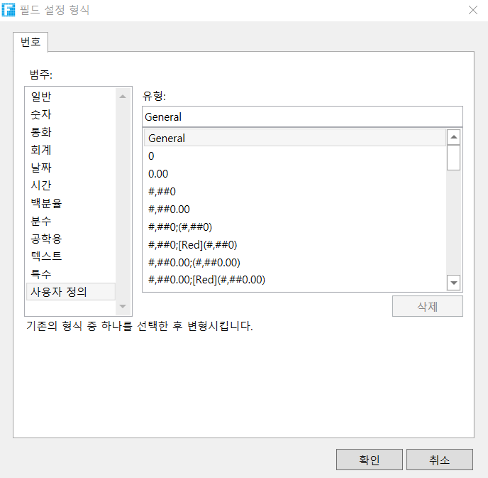
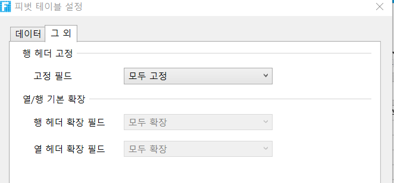

# 피벗 테이블 기본 사용

피봇 테이블은 테이블의 데이터를 요약하여 분석하므로 페이지에서 테이블을 바인딩해야 합니다.

## 피벗테이블 작성&#x20;

피벗 테이블을 빌드하는 방법은 다음과 같습니다.

 테이블을 바인딩한 후 페이지에서 범위를 선택하고 셀 유형을 피벗 테이블로 설정합니다.

 셀 설정에서 \[피벗 테이블 설정]을 클릭하여 피벗 테이블 설정 대화 상자를 표시합니다.

 피벗 테이블 설정 대화 상자에서 테이블을 선택하고 선택하면 테이블의 모든 필드가 아래 영역에 표시됩니다.

.png>)

 피벗 테이블에 추가할 필드를 선택하고 끌어서 놓기 방법을 사용하여 필드를 행, 열 및 값 영역으로 드래그합니다.

영역 간의 필드는 서로 이동할 수 있으며, 한 필드를 직접 선택하여 다른 영역으로 이동하거나 필드 오른쪽에 있는 드롭다운 메뉴를 클릭하고 선택을 클릭하여 다른 두 영역으로 이동할 수 있습니다.

 필드 설정입니다. 필드 오른쪽에 있는 드롭다운 메뉴를 클릭하고 필드 설정을 선택합니다.

* 필드와 연결된 값 및 숫자 형식은 행 및 열 영역의 필드 설정에서 설정할 수 있습니다.

* 값 영역의 필드 설정에서 필드의 사용자 정,  숫자 형식 등을 설정할 수 있습니다.

 설정이 완료되면 \[확인]을 클릭하여 피벗 테이블 설정 대화 상자를 닫고 피벗 테이블 작성을 완료합니다. 

페이지를 실행하여 브라우저에서 작성된 피벗 테이블을 볼 수 있습니다.

 피벗 테이블을 빌드한 후 피벗 테이블 속성을 설정할 수도 있습니다. 피벗 테이블 속성에는 소계 표시, 모든 행 표시, 모든 열 표가 포함됩니다. 기본적으로 이 세 가지를 선택합니다.

## 기타 설정&#x20;

피벗 설정 대화 상자에서 행 헤더 고정, 기본 확장 및 내보내기 설정을 수행할 수 있습니다.

* 행 헤더 고정: 고정된 행 헤더 필드를 설정하면 피벗 테이블의 스크롤 막대를 이동하든 고정된 행 머리글이 표시됩니다. 자세한 내용은 고정 및 확장 필드 설정을 참조하십시오.
* 열/행 기본 확장: 확장할 필드를 기본값으로 설정합니다. 확장된 필드는 클릭하여 축소할 수 있으며 축소된 필드는 클릭하여 확장할 수 있습니다. 자세한 내용은 고정 및 확장 필드 설정을 참조하십시오.
