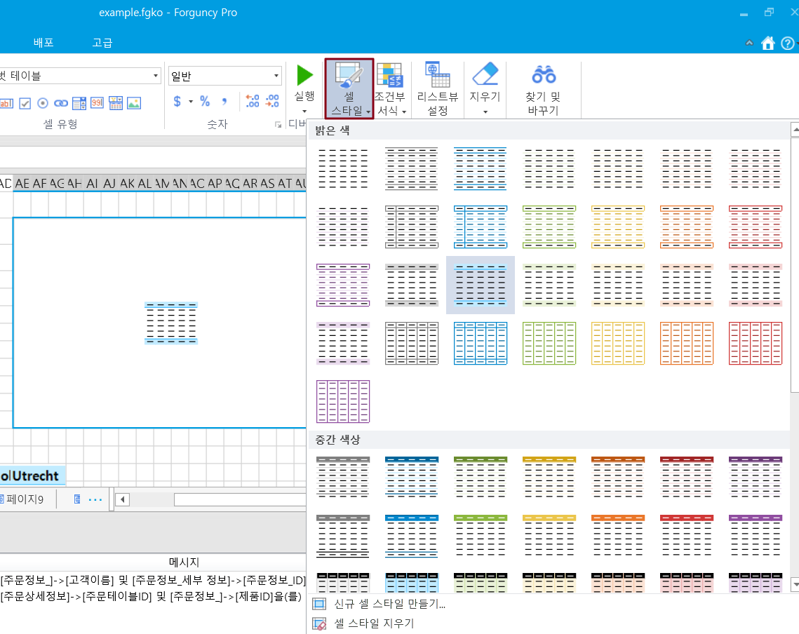
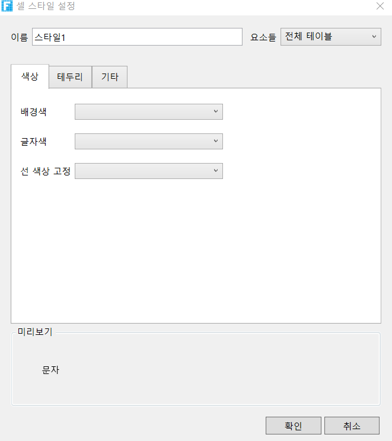
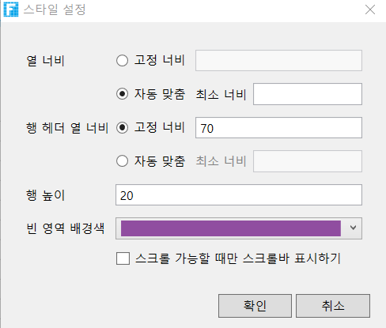

# 피벗 테이블 스타일

피벗 테이블을 빌드한 후 셀 스타일, 행 높이/열 너비 설정, 크롬 행/크롬 열 설정을 비롯한 스타일을 지정할 수 있습니다.

## 셀 스타일&#x20;

피벗 테이블을 선택하고 리본 메뉴 모음에서 \[셀 스타일]을 클릭합니다.스타일 목록에서 스타일을 클릭하여 피벗 테이블에 적용합니다.

스타일은 밝은 색상, 중간 색상 및 어두운 색상으로 구분된 색상 음영으로 분류됩니다. 이 세 가지 범주는 다른 색상, 다른 음영에 따라 다른 스타일로 나뉩니다. 피벗 테이블의 셀 스타일은 주제마다 다릅니다. 다음 그림은 기본 테마 아래의 피벗 테이블의 셀 스타일입니다.

### 신규 셀 스타일 만들기&#x20;

미리 설정된 셀 스타일이 요구 사항을 충족하지 않는 경우 사용자 지정 셀 스타일을 새로 만들고 적용할 수 있으며 사용자 지정 셀 스타일을 삭제할 수 있습니다.

 피벗 테이블을 선택합니다.리본 메뉴 모음에서 \[셀 스타일]을 클릭합니다.。

 기본 제공 셀 스타일 목록에서 새 셀 스타일을 클릭하여 셀 그리드 스타일 지정 대화 상자를 팝업합니다.

 \[이름] 뒤에 있는 텍스트 상자에 스타일의 이름을 입력합니다.

 스타일을 지정합니다. 배경색, 전경색 및 테두리를 설정합니다. 아래 미리 보기 영역에서 요소 스타일 효과를 볼 수 있습니다.

 \[확인]을 클릭하여 사용자 스타일을 저장합니다. 셀 스타일을 클릭하면 셀 스타일 목록 맨 위에 사용자 지정 스타일이 나열됩니다.

## **열 너비/행 머리글 열 너비/행 높이 설정** 

피벗 테이블 스타일을 설정하여 행 높이, 열 너비 및 공백 색상을 설정할 수 있습니다.

피벗 테이블을 선택하고 셀 유형에서 \[스타일 설정]을 클릭하여 스타일 지정 대화 상자를 표시합니다.

스타일 지정 대화 상자에서 다음 그림과 같이 피벗 테이블의 열 너비, 행 헤더 열 너비, 행 높이 및 빈 영역 배경을 설정합니다.

## 묶어진 행/묶어진 열 표시

스타일 속성에서 묶여 진 행 / 묶여진  열 표시 할지 여부를 선택할 수 있습니다.  기본적으로 묶어진 행, 열은 선택되어 있지 않습니다.&#x20;

.png>)

## **스크롤 가능할 때 스크롤 막대를 표시** 

스타일 속성에서 작업할 때만 스크롤 막대를 표시하도록 설정할 수 있습니다. 

피벗 테이블을 선택하고 셀 설정에서 \[스타일 설정]을 클릭하여 스타일 지정 대화 상자를 표시합니다.

스타일 지정 대화 상자에서 작업 시에만 스크롤 막대를 표시하도록 설정할 수 있으며 기본값은 확인 상태입니다.

.png>)

###

