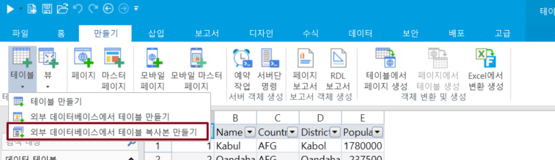
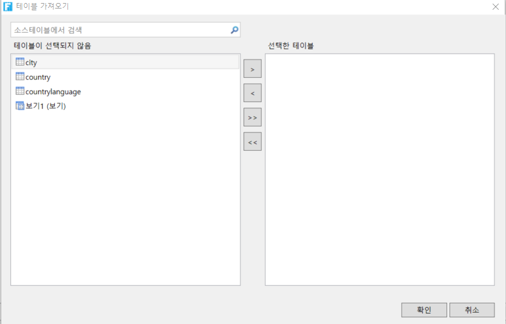
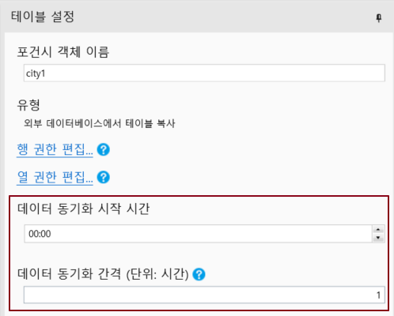
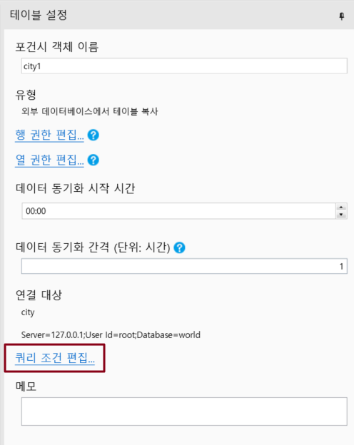

# 연결된 테이블의 복사본 만들기

포건시는 외부 데이터베이스의 데이터를 포건시에 복사하는 연결된 테이블 복사본을 만들 수 있으며, 여러 다른 데이터베이스의 연결된 테이블 복사본을  칸에 만들고 조작할 수 있습니다.

이 섹션에서는 연결된  테이블의 복사본을 만드는 방법에 대해 설명합니다.

 리본 메뉴 모음에서 \[만들기]>\[테이블]>\[외부 데이터베이스에서 테이블 복사본 만들기]를 선택합니다

 데이터 소스 선택 대화 상자에서  테이블의 복사본을 만들 데이터베이스 유형을 선택합니다.

 예를 들어 MySQL 데이터베이스의  테이블 복사본을 만든 다음 데이터 원본을 MySQL로 선택한 다음 연결 속성 대화 상자에 서버 이름, 사용자 이름, 암호, 포트 번호를 입력한 후 데이터베이스를 선택합니다.

 설정이 완료되면 "연결 테스트"를 클릭하여 서버 연결을 테스트하고 설정할 수 있습니다. \[확인]을 클릭합니다.

 \[확인]을 클릭한 후 \[테이블 가져오기] 대화 상자를 표시하고, 데이터 소스의 테이블 목록에서 가져올 테이블 또는 뷰를 선택하고, \[>]를 클릭하여 선택한 테이블 또는 뷰를 선택한 테이블 목록으로 이동하거나, \[>>]를 클릭하여 데이터 소스의 테이블 또는 뷰를 선택한 테이블 목록으로 이동합니다.


* 대상 소스가 뷰인 경우 "(뷰)" 접미사가 추가됩니다.
* 뷰를 선택한 경우 \[확인]을 클릭한 후 뷰의 기본 키를 선택합니다


테이블 복사본은 읽기 전용이며 데이터를 편집하고 수정할 수 없습니다.

* 행 및 필드 사용 권한 설정에서는 허용되는 작업만 볼 수 있도록 설정할 수 있습니다.
* 데이터 로그는 쿼리 작업을 기록할지 여부에 대한 로그만 설정할 수 있습니다.

## 연결된 테이블 복사본 동기화

포간시에 연결된 테이블 복사본을 만든 후 연결 테이블의 데이터를 수동으로 또는 자동으로 동기화 할 수 있습니다.

**수동 동기화**

연결 테이블 복사본을 선택하고 마우스 오른쪽 버튼을 클릭한 다음 마우스 오른쪽 버튼 클릭 메뉴에서 새로 고침을 선택합니다.

**자동 동기화**

테이블 설정에서 동기화 시작 시간과 동기화 간격을 설정하는 연결된  테이블 복사본을 엽니다. 동기화 간격은 1분 이상이어야 합니다.

이 설정은 백 엔드 데이터 동기화를 실행하는 데만 적용되며 데이터 동기화를 위해 디자이너에서 수동으로 새로 고쳐야 합니다.

## 쿼리 조건 설정&#x20;

연결된 테이블의 데이터 양이 많은 경우 연결된 테이블 복사본에 대한 쿼리 조건을 설정하여 데이터 양을 줄이고 비즈니스 요구 사항을 충족하는 데이터를 필터링할 수 있습니다.

연결 테이블 복사본을 열고 테이블 설정에서 쿼리 조건 편집을 클릭합니다.

쿼리 설정 대화 상자에서 쿼리 조건, 쿼리 행 수 및 정렬을 설정할 수 있습니다.
