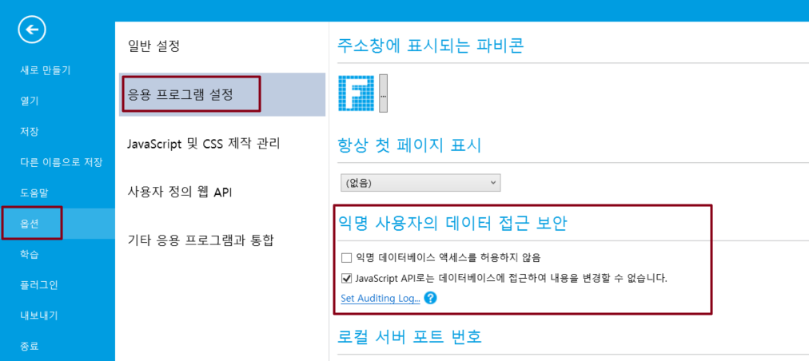

# 데이터 보안 설정

응용 프로그램에서 사용하는 데이터베이스의 보안을 설정합니다.

파일-> 옵션-> 응용 프로그램 설정을 선택하고 익명 데이터베이스 엑세스를 허용하지 않음 선택하면 외부 프로그램이 데이터베이스에 직접 액세스하지 못하도록 하여 정보 유출 및 악의적인 데이터베이스 변경을 방지할 수 있습니다.


이 속성을 설정하면 데이터 필드 또는 테이블이 있는 페이지에 로그인해야 액세스할 수 있는 사용자 권한 설정의 익명 액세스 설정이 재정의됩니다.


