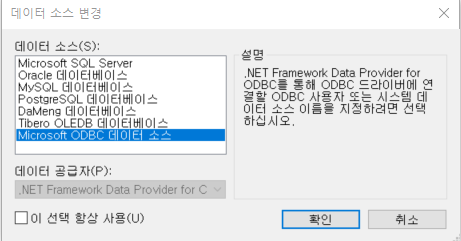
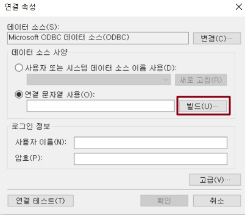
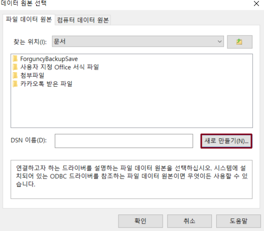
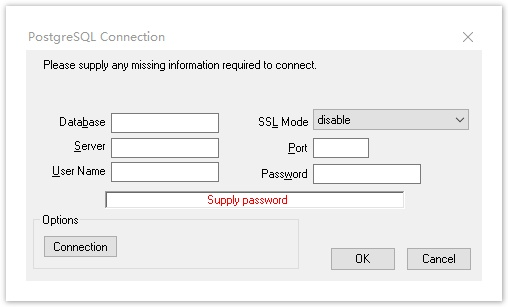

# ODBC를 통해 다른 데이터베이스에 연결

ODBC를 사용하여 PostgreSQL과 같은 다른 타사 데이터베이스에 대한 연결을 지원합니다.


ODBC를 사용하여 타사 데이터베이스에 연결하기 전에 사용자는 PostgreSQL에 연결하기 전에 psqlodbc 드라이버를 설치하는 것과 같은 해당 ODBC 연결 드라이버를 컴퓨터에 설치해야 합니다.


## **ODBC를 통해 다른 데이터베이스에 연결** 

다음은 PostgreSQL 연결의 예로 들며 ODBC를 통해 다른 데이터베이스에 연결하는 방법을 보여 줍니다.

 리본 메뉴 모음에서 \[데이터-> 데이터베이스에 연결]을 선택합니다.&#x20;

 데이터 소스를 Microsoft ODBC 데이터 원본으로 선택합니다.

 데이터 소스 사양에서 연결 문자열 사용을 선택하고 빌드를 클릭합니다.

 데이터 원본 선택에서 새로 만들기를 클릭합니다.

 새 데이터 원본만들기에서 드라이버를 선택하고 \[다음]을 클릭합니다.

 프롬프트에 따라 새 데이터 원본 만들기를 완료합니다.

 팝업 \[PostgresSQL Connector] 대화 상자에 관련 정보를 입력합니다.

 확인을 클릭하고 파일 데이터 원본에 연결한 후 팝업 연결 속성 대화 상자에 확인 암호를 입력하고 확인을 클릭한 다음 확인을 클릭합니다.

 \[확인]을 클릭한 후 \[테이블 가져오기] 대화 상자를 표시하고, 데이터 소스의 테이블 목록에서 가져올 테이블 또는 뷰를 선택하고, \[>]를 클릭하여 선택한 테이블 또는 뷰를 선택한 테이블 목록으로 이동하거나, \[>>]를 클릭하여 데이터 소스의 테이블 또는 뷰를 선택한 테이블 목록으로 이동합니다.


ODBC가 연결된 타사 데이터베이스는 레코드를 고유하게 식별하는 필드인 데이터 테이블의 기본 키를 설정해야 합니다.



* 연결 테이블에서 워크플로를 설정하거나 레코드 만들기 권한, 행 권한 및 필드 권한을 비롯한 데이터 권한을 설정해야 하는 경우 이 옵션을 선택해야 합니다.

&#x20;

포건시에서 연결된 테이블을 제거해도 외 데이터베이스의 데이터 테이블은 삭제되지 않습니다.

