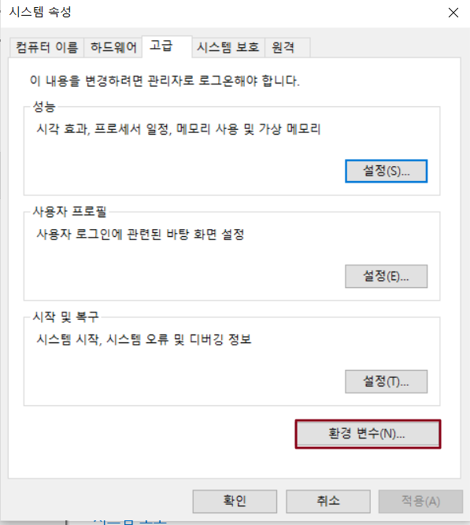
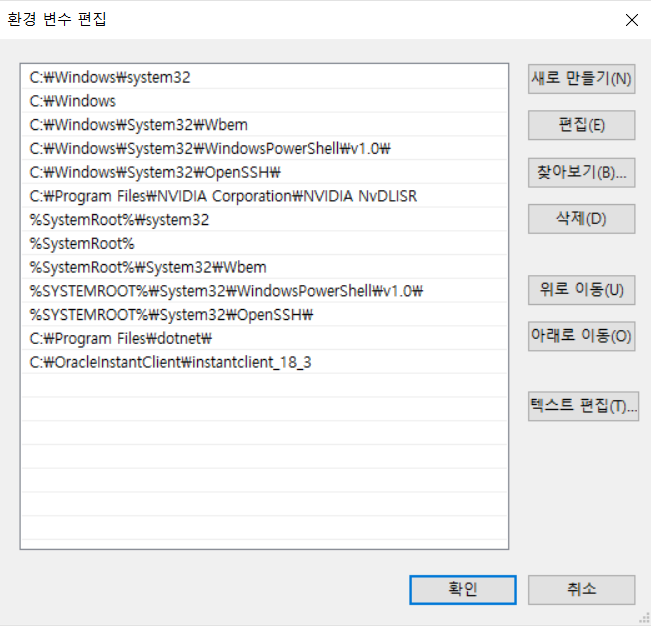
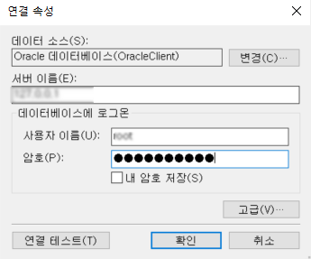
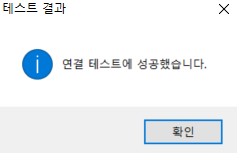

# Oracle에 연결

Oracle 데이터베이스에 연결하는 방법에 대해 설명합니다.


* 외부 데이터베이스에 연결된 포건시가 제대로 작동하려면 대상 데이터 테이블에 비어 있지 않은 고유하고 비어 있지 않은 기본 키(적어도 하나)를 설정해야 합니다. 기본 키를 선택할 때 text, ntext, Binary, Varbinary, image, hierarchyid, xml, sql\_variant, geometry, geography의 데이터 유형 필드를 선택하지 마십시오.
* 연결된 데이터 테이블을 만들면 포간시는 테이블의 기본 키를 가져오려고 시도하며 기본 키가 없는 경우 포간시는 비어 있지 않은 고유하고 비어 있지 않은 열을 기본 키로 찾습니다.


## Oracle 구성

Oracle 데이터베이스에 접속하려면 먼저 Oracle을 구성해야 합니다. Oracle에 접속하려면 구성이 완료되어야 합니다.

 OracleInstantClient 파일 압축 패키지를 로컬로 다운로드하여 압축을 다한 다음 C 디스크 또는 기타 고정 경로에 저장합니다. 다운로드 링크:

[https://cdn.grapecity.com.cn/huozige/tools/OracleInstantClient.zip.](https://cdn.grapecity.com.cn/huozige/tools/OracleInstantClient.zip.)

 시스템 환경 변수를 구성합니다.

&#x20;1\. 이 PC를 마우스 오른쪽 단추로 클릭하고 \[속성-고급 시스템 설정]을 선택하고 시스템 속성 대화 상자의 고급 탭에서 오른쪽 아래 모서리에 있는 \[환경 변수]를 클릭합니다.

2\. \[환경 변수]를 클릭하여 환경 변수의 편집 창으로 이동하고 \[시스템 변수] 아래에서 \[새로 만들기]를 클릭하여 두 개의 시스템 변수를 추가합니다.\
(1) 변수 이름 : ORACLE\_NAME; 변수 값: \[디렉토리 찾아보기]를 클릭하고 단계에서 파일의 저장 경로를 선택하고 파일의 두 번째 수준 디렉토리인 \[instantclient\_18\_3]을 선택한 다음 \[확인]을 클릭합니다. 파일이 C 디스크 루트에 저장된 경우 변수 값은 C:\OracleInstantClient\instantclient\_18\_3.\
(2) 변수 값: \[디렉토리 찾아보기]를 클릭하고 단계에서 파일의 저장 경로를 선택하고 파일의 두 번째 수준 디렉토리인 \[instantclient\_18\_3]을 선택한 다음 \[확인]을 클릭합니다. 파일이 C 디스크 루트에 저장된 경우 변수 값은 C:\OracleInstantClient\instantclient\_18\_3.

![새 환경 변수
&#x20;메모장 또는 기타 텍스트 편집기를 사용하여 \[OracleInstantClient\instantclient\_18\_3\] 디렉토리에 있는 \[tnsnames.ora\] 파일을 열어 편집합니다. ](../../.gitbook/assets/db13.png)

3\. 변수 \[Path]를 선택하고 \[편집]을 클릭하여 편집 인터페이스로 이동합니다. 오른쪽에 있는 \[새로 만들기]를 클릭하여 이전 단계의 변수 값과 동일한 새 환경 변수를 추가합니다.

4\. 환경 변수를 추가 및 편집한 후 \[확인]을 클릭하여 대화 상자를 닫습니다.

\
 메모장 또는 기타 텍스트 편집기를 사용하여 \[OracleInstantClient\instantclient\_18\_3] 디렉토리에 있는 \[tnsnames.ora] 파일을 열어 편집합니다.

여기서 name은 Oracle 서버 이름이며 이름을 사용자 지정할 수 있습니다. hostname은 서버의 호스트 이름입니다. servicename은 서비스 이름입니다.

편집이 완료되면 저장을 닫습니다.

 PC를 다시 시작합니다.

## Oracle에 연결 &#x20;

Oracle 데이터베이스에 연결하는 방법은 다음과 같습니다.

 리본 메뉴 모음에서 \[데이터]>\[데이터베이스 연결]을 선택합니다.

&#x20;     또는 테이블의 레이블 표시줄에서 마우스 오른쪽 버튼 클릭하고 연결된 데이터베이스에서 테이블에

&#x20;     연결을 선택합니다.

 데이터 소스를 \[Oracle 데이터베이스]로 선택합니다.

 서버 이름, 사용자 이름, 암호, 포트 번호를 입력한 후 데이터베이스를 선택합니다.

 설정이 완료되면 "연결 테스트"를 클릭하여 서버 연결을 테스트하고 설정할 수 있습니다.

&#x20;     \[확인]을 클릭합니다.

&#x20; \[확인]을 클릭하면 \[테이블 가져오기] 대화 상자가 나타나고, 데이터 소스의 테이블 목록에서 가져올 테이블을 선택하고, \[>]를 클릭하여 선택한 테이블을 선택한 테이블 목록으로 이동하거나, \[>>]을 클릭하여 데이터 소스의 테이블을 선택한 테이블 목록으로 이동합니다.


* 대상 소스가 뷰인 경우 "(뷰)" 접미사가 추가됩니다.
* 보기는 데이터 권한 설정을 지원합니다.
* 뷰를 선택한 경우 \[확인]을 클릭한 후 뷰의 기본 키를 선택합니다.


 \[확인]을 클릭하여 테이블을 가져옵니다. 테이블을 열면 테이블 설정에서 해당 형식이 아웃리치 테이블인 것을 볼 수 있습니다.

Oracle에 연결한 후 데이터베이스에 연결 아래의 드롭다운 버튼 클릭하면 연결된 데이터베이스가 나열됩니다.&#x20;


* "Forguncy에 데이터베이스 또는 테이블 스키마를 수정하도 허용"을 선택하면 새 필드 추가, 필드 삭제, 필드 이름 수정, 필드 기본값/필수/고유 설정 등과 같은 아웃리치 데이터 테이블을 활자 그리드에서 직접 수정할 수 있습니다.
* 연결된 테이블에서 워크플로를 설정하거나 레코드 만들기 권한, 행 권한 및 필드 권한을 비롯한 데이터 권한을 설정해야 하는 경우 이 옵션을 선택해야 합니다.

&#x20;

* 포건시가 데이터베이스 또는 테이블 구조를 수정할 수 있도록 허용을 선택한 후 데이터 형식이 텍스트, 사용자, 그림 및 첨부 파일인 필드 길이를 설정할 수도 있습니다.   

* 포건시에서 연결된 테이블을 제거해도 외부 데이터베이스의 데이터 테이블은 삭제되지 않습니다.


## 포건시 및 오라클 데이터베이스 필드&#x20;

포건시에서 생성된 필드에 해당하는 Oracle 데이터베이스의 필드 유형은 아래 표에 나와 있습니다.&#x20;

| 포건시 필드형  | Oracle 필드 유형           |
| -------- | ---------------------- |
| 예/아니오    | NUMBER(1)              |
| 이미지      | NVARCHAR2(500)         |
| 날짜       | DATE                   |
| 첨부파일     | NVARCHAR2(500)         |
| 사용자      | NVARCHAR2(500)         |
| 소수       | NUMBER                 |
| 시간       | INTERVAL DAY TO SECOND |
| 정수       | NUMBER                 |
| 텍스트      | NVARCHAR2(500)         |

포건시는 일부 Oracle 필드 유형을 지원하며 지원되지 않는 모든 필드 유형은 텍스트 유형으로 변환합니다.&#x20;
