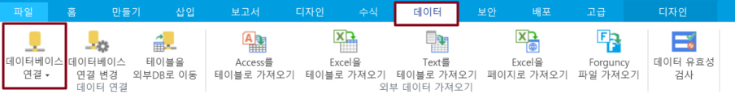
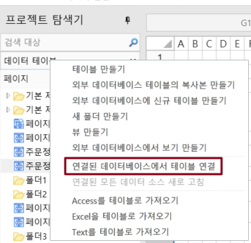
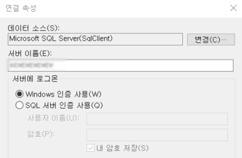
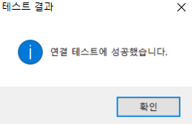
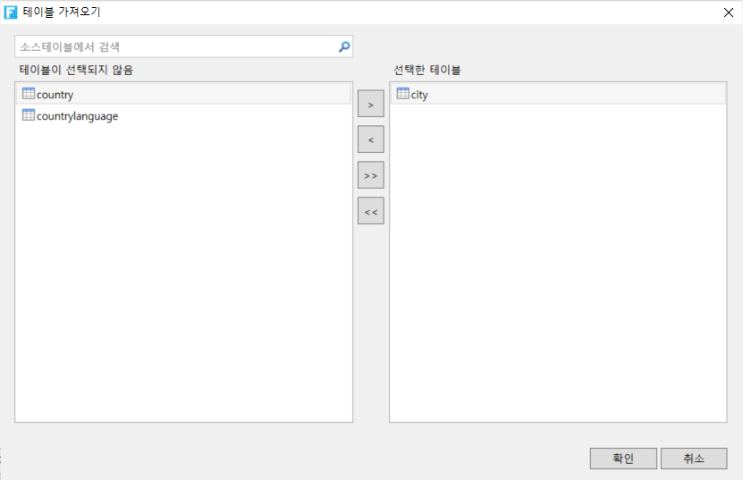
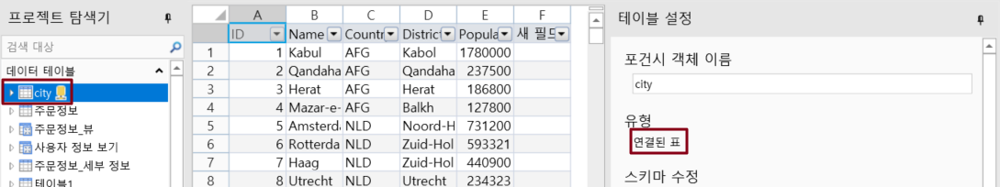
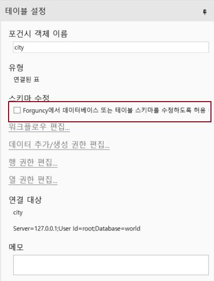
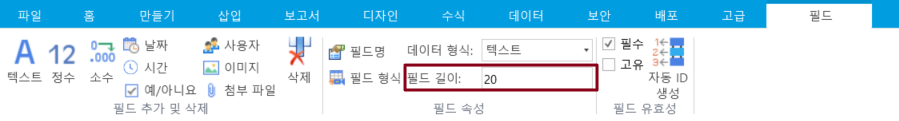

# SQL Server에 연결

SQL Server 데이터베이스에 연결하는 방법에 대해 설명합니다.


* 외부 데이터베이스에 연결된 포건시가 제대로 작동하려면 대상 데이터 테이블에 비어 있지 않은 고유하고 비어 있지 않은 기본 키(적어도 하나)를 설정해야 합니다. 기본 키를 선택할 때 text, ntext, Binary, Varbinary, image, hierarchyid, xml, sql\_variant, geometry, geography의 데이터 유형 필드를 선택하지 마십시오.
* 외부 데이터 테이블을 만들면 포건시는 테이블의 기본 키를 가져오려고 시도하며 기본 키가 없는 경우 포건시 비어 있지 않은 고유하고 비어 있지 않은 열을 기본 키로 찾습니다.


포건시에서 SQL Server 데이터베이스에 연결하는 방법은 다음과 같습니다.

 리본 메뉴 모음에서 \[데이터]>\[데이터베이스 연결]을 선택합니다.

&#x20;     또는 테이블의 레이블 표시줄에서 마우스 오른쪽 버튼 클릭하고 연결된 데이터베이스에서 테이블에

&#x20;     연결을 선택합니다.

 데이터 소스를 \[Microsoft SQL Server]로 선택합니다.

 Microsoft SQL Server 서버를 선택하고 서버에 로그인하는 방법을 지정합니다.

Windows 인증을 사용하여 로그인하거나 SQL Server 인증을 사용하여 로그인하고 사용자 이름과 암호를 입력할 수 있습니다. 데이터베이스 이름을 선택하거나 입력하여 데이터베이스에 연결합니다.


SQL Server 데이터베이스에 Windows 인증으로 연결하려면 포건 서버의 실행 계정을 Windows 인증에서 유효한 계정으로 변경해야 합니다. 기본적으로 포건시 서버의 실행 계정은 로컬 시스템입니다.

Windows의 제어판-> 시스템 및 보안-> 관리 도구-> 서비스에서 Forguncy Server Service를 엽니다.  &#x20;

로그인 탭에서 이 계정을 선택하고 SQL Server에 연결할 수 있는 Windows 인증 계정 및 암호를 입력합니다.                                                                                                  &#x20;


 설정이 완료되면 "연결 테스트"를 클릭하여 서버 연결을 테스트하고 설정할 수 있습니다.

&#x20;     \[확인]을 클릭합니다.

&#x20; \[확인]을 클릭하면 \[테이블 가져오기] 대화 상자가 나타나고, 데이터 소스의 테이블 목록에서 가져올 테이블을 선택하고, \[>]를 클릭하여 선택한 테이블을 선택한 테이블 목록으로 이동하거나, \[>>]을 클릭하여 데이터 소스의 테이블을 선택한 테이블 목록으로 이동합니다.


* 대상 소스가 뷰인 경우 "(뷰)" 접미사가 추가됩니다.
* 보기는 데이터 권한 설정을 지원합니다.
* 뷰를 선택한 경우 \[확인]을 클릭한 후 뷰의 기본 키를 선택합니다.


 \[확인]을 클릭하여 테이블을 가져옵니다. 테이블을 열면 테이블 설정에서 해당 형식이 아웃리치 테이블인 것을 볼 수 있습니다.

Sql Sever에 연결한 후 데이터베이스에 연결 아래의 드롭다운 버튼 클릭하면 연결된 데이터베이스가 나열됩니다.


* "Forguncy에 데이터베이스 또는 테이블 스키마를 수정하도 허용"을 선택하면 새 필드 추가, 필드 삭제, 필드 이름 수정, 필드 기본값/필수/고유 설정 등과 같은 연결된 데이터 테이블을 활자 그리드에서 직접 수정할 수 있습니다.
* 연결 테이블에서 워크플로를 설정하거나 레코드 만들기 권한, 행 권한 및 필드 권한을 비롯한 데이터 권한을 설정해야 하는 경우 이 옵션을 선택해야 합니다.

&#x20;

* 포건시가 데이터베이스 또는 테이블 구조를 수정할 수 있도록 허용을 선택한 후 데이터 형식이 텍스트, 사용자, 그림 및 첨부 파일인 필드 길이를 설정할 수도 있습니다.   

* 포건시에서 연결된 테이블을 제거해도 외 데이터베이스의 데이터 테이블은 삭제되지 않습니다.



## 포건시 및 SQL Server 데이터베이스 필드 유형&#x20;

포건시에서 생성된 필드는 아래 표에서 표시된 대로 SQL Server 데이터베이스의 필드 유형에 해당합니다.&#x20;

| 포건시  | SQL 서버 필드 유형  |
| ---- | ------------- |
| 사용자  | nvarchar(500) |
| 시간   | time(7)       |
| 텍스트  | nvarchar(500) |
| 그림   | nvarchar(500) |
| 정수   | bigint        |
| 소수   | floar(53)     |
| 날짜   | datetime      |
| \~이든 | bit           |
| 부록   | nvarchar(500) |

포건시는 일부 SQL Server필드 유형을 지원하며 지원되지 않는 모든 필드 유형은 텍스트 유형으로 변환됩니다. SQL Server의 필드 유형은 아래 표와 같이 포건시 셀의 필드 유형에 해당합니다.&#x20;

| SQL 서버 필드 유형     | 포건시  |
| ---------------- | ---- |
| bigint           | 정수   |
| bit              | \~이든 |
| char             | 텍스트  |
| date             | 날짜   |
| datetime         | 날짜   |
| datetime2        | 날짜   |
| datetimeoffset   | 텍스트  |
| decimal          | 소수   |
| float            | 소수   |
| Image            | 텍스트  |
| int              | 정수   |
| money            | 소수   |
| nchar            | 텍스트  |
| ntext            | 텍스트  |
| 숫자               | 소수   |
| nvarchar         | 텍스트  |
| nvarchar(최대)     | 텍스트  |
| real             | 소수   |
| smalldatetime    | 날짜   |
| smallint         | 정수   |
| smallmoney       | 소수   |
| sql\_variant     | 텍스트  |
| sysname          | 텍스트  |
| text             | 텍스트  |
| time             | 시간   |
| tinyint          | 텍스트  |
| uniqueidentifier | 텍스트  |
| varchar          | 텍스트  |
| varchar(최대)      | 텍스트  |

 

