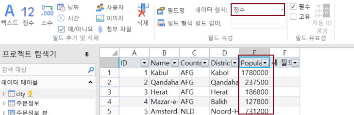
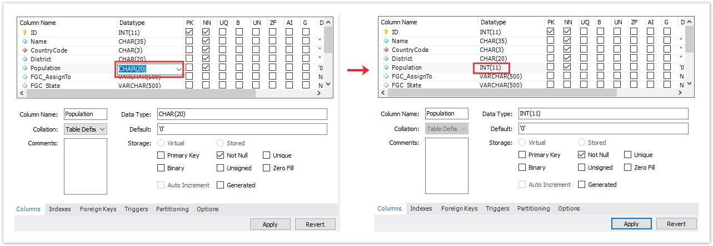

# 필드 형식을 다시 가져오기

포건시에서 외 데이터베이스의 데이터 테이블에 연결한 후에는 외부 데이터테이블의 필드 유형을 활자 그리드에서 직접 수정할 수 없습니다.

연 데이터베이스에서 필드 형식을 수정한 후 포건에서 필드 형식을 다시 가져올 수 있습니다.

## 필드 유형 다시 가져오기&#x20;

MySQL 데이터베이스에 연결된 테이블을 예로 들어 보겠습니다. MySQL의 데이터 테이블 "City"를 연결합니다. 여기서 \[Population] 필드의 형식은 \[텍스트]이고 수정된 필드의 형식은 \[정수]입니다.

연결된 데이터베이스에서 필드 유형을 변경합니다.&#x20;

데이터 테이블 앞의 확장 필드를 클릭하고 \[Population] 필드를 선택한 후 마우스 오른쪽 단추로 클릭하고 마우스 오른쪽 버튼 클릭 메뉴에서 \[열 유형 다시 가져오기]를 선택하면 연결 데이터 테이블에서 필드 유형을 다시 가져오고 데이터 테이블을 새로 고칩니다.
