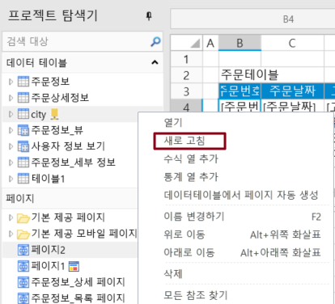
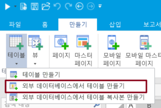
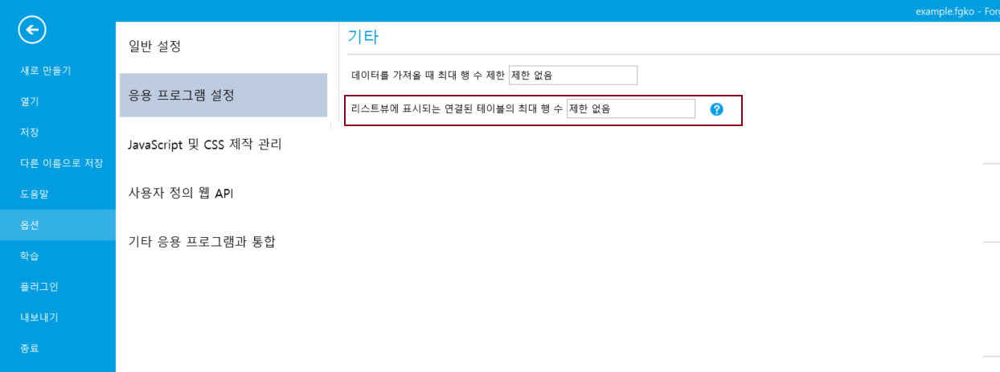
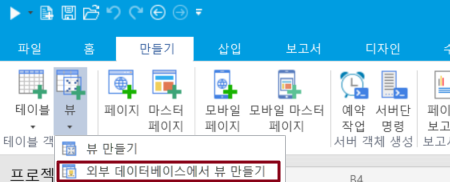
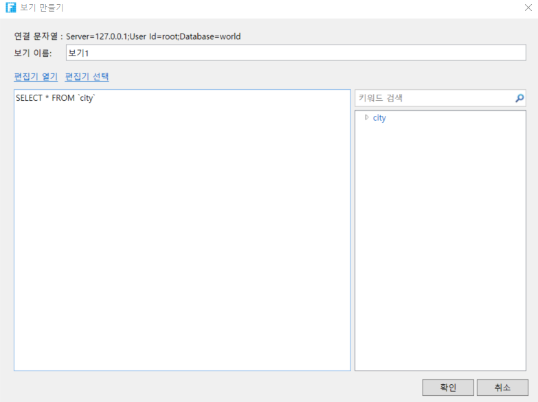
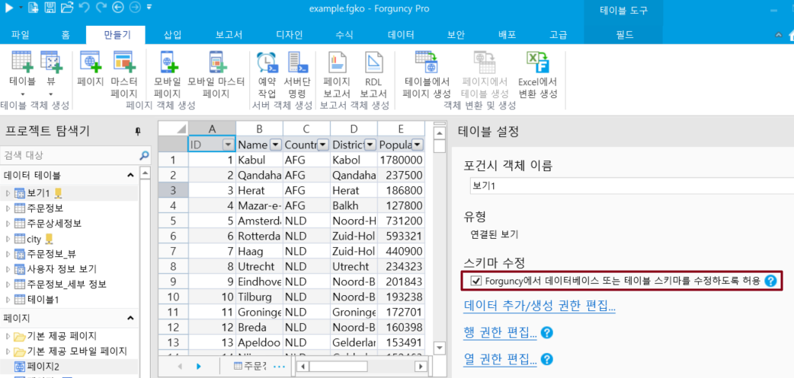

# 외부 데이터베이스 사용하기

외부 데이터베이스에 연결한 후 데이터베이스의 테이블을 포건시에 가져온 후 일련의 작업을 수행할 수 있습니다.

## 연결된 데이터테이블을 새로 고치기

포건시는 외부 데이터베이스 데이터를 실시간으로 완전히 자동으로 업데이트할 수 없으며 새로 고침 기능을 사용하여 포건시에 표시되는 데이터를 동기화할 수 있습니다.

연결된 데이터 테이블에서 마우스 오른쪽 버튼을 클릭하고 새로 고침을 선택합니다.

## 외부 데이터베이스에서 데이터 테이블 만들기&#x20;

외 데이터베이스에서 데이터 테이블 만들기를 지원합니다. 만든 데이터 테이블은 기본 dbo패턴을 사용합니다.


연결된 데이터베이스에서 테이블을 만들 때 포건시는 테이블 및 열 추가를 포함하여 "데이터베이스 또는 테이블 구조를 수정할 수 있도록 허용"을 자동으로 선택합니다.


리본 메뉴에서 \[테이블]>\[외부 데이터베이스에서 테이블 만들기]를 선택합니다.

팝업 연결 속성 대화 상자에서 데이터 원본을 선택한 후 데이터 테이블을 만들 수 있는 권한이 있는 사용자를 사용하여 서버에 로그하고 데이터베이스에 연결하여 데이터 테이블을 만들고 필드를 추가합니다.

## 외부 테이블 설정&#x20;

디자이너에서 외 데이터 테이블을 표시할 최대 행 수를 설정할 수 있습니다.

\[파일]>\[옵션]>\[응용 프로그램 설정]>\[기타] > \[리스트뷰에서 표시되는 연결된 테이블의 최대 행 수] 0보다 큰 정수 또는 무제한을 설정하고 설정이 완료되면 연결된테이블을 새로 고쳐 적용합니다.

## 연결 데이터베이스에서 뷰 만들기&#x20;

연결 데이터베이스에서 데이터 뷰 생성을 지원합니다.

리본 메뉴 모음에서 \[만들기]>\[뷰]>\[외부 데이터베이스에서 뷰 만들기]를 선택합니다.&#x20;

이터 원본을 선택한 후 데이터베이스에 연결하여 뷰 이름 및 SQL 문을 편집하여 뷰를 만들 수 있는 보 만들기 대화 상자를 엽니다.

뷰를 만든 후 뷰를 열면 형식이 연결된 뷰를 볼 수 있으며 기본적으로 "Forguncy에서 데이터베이스 또는 테이블 스키마를 수정하도록 허"을 선택합니다.

뷰를 편집/삭제/이름을 바꾸는 기능은 마우스 오른쪽 버튼 클릭하고, 오른쪽 클릭 메뉴에서 선택할 수 있습니다.

## &#x20;

