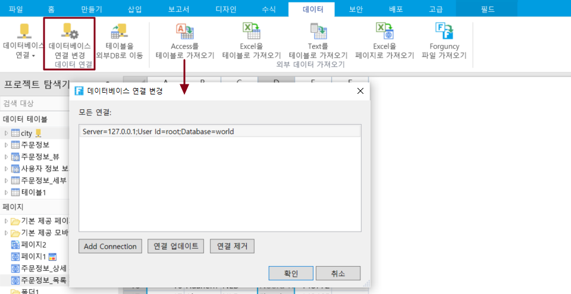

# 데이터베이스 연결 변경

포건시는 외부 데이터베이스를 지원하며 이러한 데이터베이스 연결을 통합적으로 관리할 수 있습니다.

리본 메뉴에서 \[데이터]>\[ 데이터베이스 연결 변경]을 선택하고 데이터베이스 연결 관리 대화 상자를 표시하여 연결된 데이터베이스 연결을 나열합니다.

## 연결 정보 추가&#x20;

\[Add Connection] 클릭하고 연결 속성 대화 상자를 표시하여 데이터 원본을 변경하여 다른 데이터베이스에 연결할 수 있습니다.

## 연결 정보 업데이트

연결 업데이트를 선택하고 연결 정보 업데이트를 클릭한 후 연결 속성 대화 상자가 나타나면 연결 정보를 변경할 수 있습니다.

## 연결 제거

연결 제거를 선택하고 연결 정보 삭제를 클릭하여 데이터 연결을 삭제합니다. 데이터 연결을 삭제하기 전에 해당 데이터 연결에서 가져온 데이터 테이블을 삭제해야 합니다.
