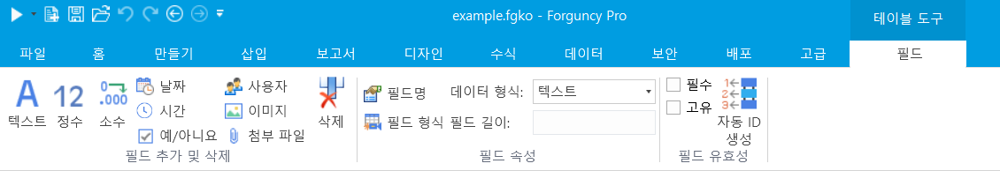

# 필드 유형

테이블에서 각 열은 필드입니다. 테이블은 열(필드)을 만들어 데이터를 저장하며 각 행 필드(열)의 조합을 레코드라고 합니다.

## 필드 설정

데이터 테이블을 열 때 리본 메뉴에서 테이블 도구 필드를 선택하여 필드를 다음과 같이 설정할 수 있습니다.

| 설정        | 설명                                                                                            |
| --------- | --------------------------------------------------------------------------------------------- |
| 필드 추가     | 데이터 형식에 대한 버튼 클릭하면 현재 선택한 필드 열 뒤에 해당 데이터 형식에 대한 새 필드가 추가됩니다.                                  |
| 필드 삭제     | 필드를 선택하고 \[삭제] 버튼 클릭하면 선택한 필드가 삭제됩니다. 필드를 삭제하면 필드 관련 데이터도 삭제됩니다.                              |
| 필드명 수정    | 필드를 선택하고 \[이름]을 클릭하여 선택한 필드 이름을 수정합니다.                                                        |
| 기본        | 필드를 선택하고 \[기본값]을 클릭하여 선택한 필드 기본값을 수정합니다.                                                      |
| 데이터 형식    | 선택한 필드의 데이터 유형을 표시합니다. 드롭다운 목록에서 다른 데이터 형식을 선택하여 선택한 필드의 데이터 형식을 변경할 수도 있습니다.                 |
| 필수        | 필수 체크박스 선택하면 각 레코드에서 선택한 필드의 데이터를 비워 둡니다.                                                     |
| 고유        | 고유 체크박스 선택하면 각 레코드에서 선택한 필드의 데이터를 반복할 수 없습니다.                                                 |
| 자동 ID 생성  | A001, XS\_20170101\_001 등과 같은 필수 일련 번호를 자동으로 생성하는 규칙을 정의합니다. 자세한 사항은 [자동ID생성](id.md)을 참고하세요.  |

## 필드 유형

가능한 저장 데이터를 기반으로 포건시는 다음과 같은 유형의 필드를 제공합니다.

| 필드유형  | 설명                                                                                                                                                                                                                                                                                                                                                        |
| ----- | --------------------------------------------------------------------------------------------------------------------------------------------------------------------------------------------------------------------------------------------------------------------------------------------------------------------------------------------------------- |
| 텍스트   | 텍스트 정보를 저장합니다.                                                                                                                                                                                                                                                                                                                                            |
| 정수    | 정수 정보를 저장합니다.                                                                                                                                                                                                                                                                                                                                             |
| 소수    | 소수 자릿수가 있는 숫자 정보를 저장합니다.                                                                                                                                                                                                                                                                                                                                  |
| 날짜    | 날짜 정보를 저장합니다. 연도, 분기, 월 및 일의 네 개의 하위 필드가 있습니다.                                                                                                                                                                                                                                                                                                            |
| 시간    | 시간 정보를 저장합니다                                                                                                                                                                                                                                                                                                                                              |
| 예/아니오 | 예/아니요 정보를 저장하고 데이터베이스에 실제로 저장된 값은 "1" 또는 "0"이며 여기서 "1"은 "예"를 나타내고 "0"은 "아니오"를 나타냅니다.                                                                                                                                                                                                                                                                      |
| 사용자   | 
사용자 정보 저장(SQL Server 및 Oracle에서 텍스트 열 유형으로 변환 가능). 전체 이름, 메시지, 역할, 사용자 지정 속성, 조직 상위 필드 등이 있습니다.
<ul><li>역할 하위 필드의 경우 사용자가 둘 이상의 역할에 속하는 경우 각 역할은 쉼표로 구분됩니다.</li><li>각 사용자 지정 속성은 사용자가 사용자 지정 속성의 값인 하위 필드의 값에 해당하는 하위 필드를 생성합니다.</li><li>사용자 시스템에서 조직 구조를 구성한 경우 조직 상위 하위 필드를 통해 쿼리 또는 조건부 명령에서 쉽게 사용할 수 있도록 조직 구조의 모든 상위 리더를 가져올 수 있습니다.</li></ul> |
| 이미지   | 그림을 \[GUID\_ 파일 이름]으로 저장합니다(SQL Server 및 Oracle에서 텍스트 열 유형으로 변환 가능).                                                                                                                                                                                                                                                                                      |
| 첨부파일  | 첨부 파일을 \[GUID\_ 파일 이름]으로 저장합니다(SQL Server 및 Oracle에서 텍스트 열 유형으로 변환 가능).                                                                                                                                                                                                                                                                                   |
