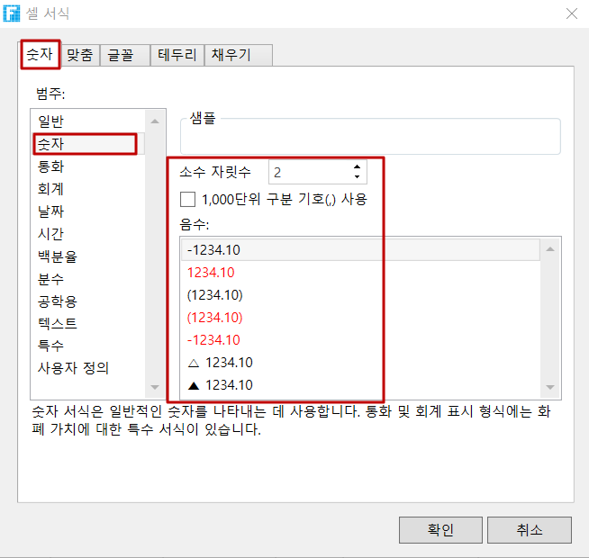

# 소수 필드

소수 형식의 데이터를 저장할 수 있는 데이터 테이블에 소수  세그먼트를 추가합니다.

## 소수 필드 추가&#x20;

* 방법 1. 데이터 테이블에서 첫 번째 행의 마지막 셀(필드 추가)의 드롭다운 버튼 클릭하여 드롭다운 목록에서 소수 선택합니다.

.png>)

* 방법 2. 데이터 테이블을 열고 리본 메뉴에서 테이블 도구 필드를 선택하고 소수점 유형의 버튼을 클릭합니다. 소수를 클릭하면 데이터 테이블에 소수가 추가되고 필드 이름을 변경하고 아래 그림과 같이 데이터를 추가할 수 있습니다.

.png>)

소수를 클릭하면 데이터 테이블에 작은 숫자 세그먼트가 추가되고 필드 이름을 변경하고 데이터를 추가할 수 있습니다.

## 소수점 서식 지정

페이지에서 소수 세그먼트를 테이블에 바인딩한 후 소수 자릿수, 천 단위 구분 기호 사용 여부 등을 포함하여 소수 자릿수의 서식을 지정할 수 있습니다.

아래 절차대로 진행합니다.

1. 테이블의 셀에 마우스 오른쪽 버튼으로 클릭하고 팝업 메뉴에서 \[셀 서식]을 선택합니다.                                                                                           또는 리본 메뉴에서 \[시작]을 선택하고 \[숫자] 영역을 클릭합니다
2. \[셀 서식 지정] 대화 상자의 \[숫자] 탭에서 \[숫자]로 분류를 선택하고 소수 자릿수, 천 단위 구분 기호 및 음수 서식을 지정합니다.                                                                                                                                                                                                                 셀 서식 탭을 전환하여 정렬, 글꼴, 테두리 및 채우기를 설정할 수도 있습니다.
3. 실행 후 페이지에서 설정된 소수 스타일을 볼 수 있습니다.

