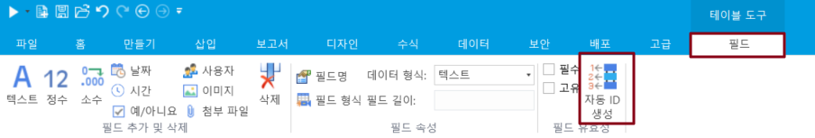
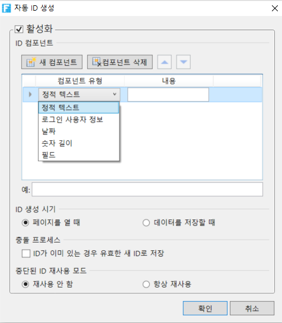

# 자동 ID 생성

데이터 테이블을 열면 리본 메뉴에서 테이블 도구 필드를 선택하여 필드를 자동 ID 생성을 할 수 있습니다.\
필드 유형이 텍스트인 경우에만 자동 ID 생성을 설정할 수 있습니다.

\[자동 ID 생성] 대화상자에서 활성화를 체크하여 자동 ID 생성을 설정합니다.&#x20;

| 컴포넌트 유형        | 
구성 범주는 정정텍스트, 로그인 사용자 정보, 날짜, 숫자길이  및 필드  다섯 가지 범주로 나뉩니다. 시퀀스 번호는 포함되어야 하며 하나만 포함할 수 있습니다.
<ul><li>정적텍스트: 설정된 문자 내용이 번호 매기기에 직접 나타납니다.</li><li>로그인 사용자 정보: 로그인한 사용자의 이름, 전체 이름, 역할 및 사용자 지정 속성과 같은 로그인 사용자에 대한 정보를 선택할 수 있습니다.</li><li>날짜: 번호가 생성된 시간이며 yyyymmdd, yyyy 등과 같은 표시 형식을 지정할 수 있습니다.</li><li>숫자 길이 : 1부터 시작하는 시퀀스 번호로, 지정된 비트 수가 3인 경우 001로 표시할 수 있습니다.</li><li>필드: 데이터 테이블의 필드를 선택하고 텍스트, 정수, 소수, 날짜, 여부, 사용자 유형 및 관련 필드를 선택할 수 있습니다.</li></ul>
번호 매기기 구성 요소를 새로 추가, 삭제, 위로 이동 및 아래로 이동할 수 있습니다.
 |
| -------------- | ------------------------------------------------------------------------------------------------------------------------------------------------------------------------------------------------------------------------------------------------------------------------------------------------------------------------------------------------------------------------------------------------------------------------------------------------------------------------------------------------------------------------ |
| 예              | 설정된 ID에 따라 빌드 번호의 샘플 미리 보기를 구성합니다.                                                                                                                                                                                                                                                                                                                                                                                                                                                                                       |
| ID생성시기         | <ul><li>
ID 매기기 구성에 필드가 포함된 경우 생성 시기는 필드 변경 및 저장 시간입니다.
<ul><li>필드 변경 시: 콘텐츠 필드가 변경된 경우에만 자동 번호가 생성됩니다.</li><li>저장 시: 레코드를 저장할 때 자동 번호를 생성합니다.</li></ul></li><li>
ID 매기기 구성에 필드가 포함되지 않은 경우 생성 시기는 "채우기 시간" 및 "저장 시"입니다.
<ul><li>채우기: 페이지를 열면 자동 번호가 생성됩니다.</li><li>저장 시: 레코드를 저장할 때 자동 번호를 생성합니다.</li></ul></li></ul>                                                                                                                                                                                         |
| 충돌 프로세스        | 이 옵션을 선택하면 번호가 이미 있는 경우 저장할 때 번호를 다시 설정합니다.                                                                                                                                                                                                                                                                                                                                                                                                                                                                              |
| 중단된 ID 재사용 모드  | 일반적으로 테이블의 숫자는 연속적입니다. 테이블에서 레코드를 삭제하면 중단 번호가 발생하고 삭제된 레코드의 번호를 스크랩 번호라고도 합니다. 레코드 삭제로 인해 중단되지 않고 테이블의 번호가 계속 유지되도록 하려면 "재사용" 스크랩 번호를 선택해야 합니다. 이렇게 하면 다음에 번호가 생성될 때 사용되지 않습니다.                                                                                                                                                                                                                                                                                                                                          |


* 자동 ID 생성이  켜져 있으면 필드의 필수 및 고유 유효성 검사도 켜지고 취소할 수 없습니다. 아웃리치 테이블인 경우 필드의 필수 및 고유 유효성 검사가 자동으로 켜지지 않습니다.
* 데이터 테이블이 ODBC를 통해 연결된 다른 타사 데이터베이스인 경우 자동 번호 매기기가 지원되지 않습니다.

