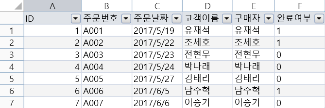

# 데이터 설정

기본 레이아웃을 이해하면 포건시빌더에서 데이터를 만들 수 있습니다.

## 데이터 시트

포건시는 데이터 테이블에 데이터가 저장됩니다.&#x20;

데이터 테이블에 여러 필드를 설정하거나 여러 레코드를 저장할 수 있습니다. 데이터 테이블에는 다음 그림과 같이 Excel과 같은 모양과 구조가 있습니다.&#x20;

Excel과 마찬가지로 사용할 수 있으며 빌더에서 테이블의 데이터를 수정할 수 있습니다.

이 장에서는 그리드에서 비즈니스 데이터를 설정하는 방법을 설명합니다.

