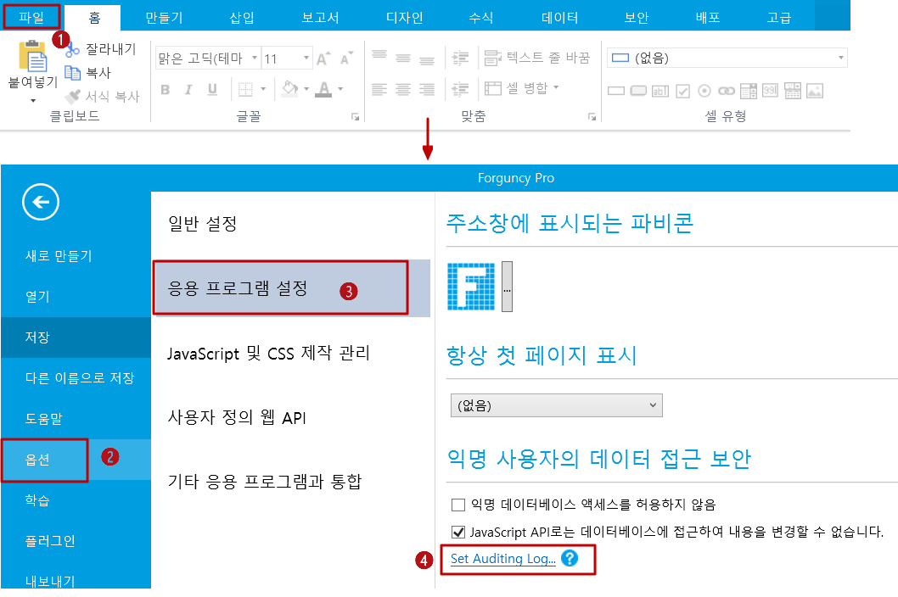
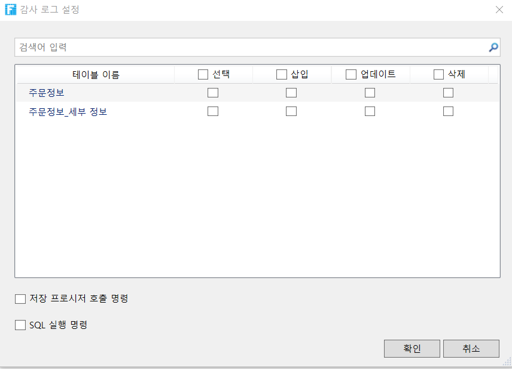

# 감사 로그

감사 로그는 데이터에 대한 최종 사용자 액세스 작업을 기록합니다. 로그를 사용하면 권한이 없는 사용자가 데이터에 액세스하거나 조작했는지 확인할 수 있습니다.

감사 로그 설정 대화 상자에서 감사 로그를 설정할 데이터 테이블을 선택한 후 쿼리, 추가, 편집 및 삭제합니다.


* 개발 중인 응용 프로그램을 디버깅할 때 데이터 테이블에 대한 작업은 감사 로그에 기록되지 않습니다. 데이터 테이블에 대한 작업은 포건시 서버가 응용 프로그램을 게시한 후에만 로그에 기록됩니다.
* 저장 프로시저 호출 명 및 SQL 실행 명령 체크박스 선택하여 두 명령을 모두 실행할 때 데이터베이스에 대한 작업도 로그에 기록됨을 나타냅니다.


## 데이터 로그 확인

로그 파일의 주소는 포건시 서비스 쪽의 시작 계정에 따라 다릅니다.

<table><thead><tr><th width="186.8">계정 로그인</th><th>파일 위치</th></tr></thead><tbody><tr><td>로컬 시스템 계정 (기본값)</td><td>C:\Windows\Temp\포건시 작업 로그</td></tr><tr><td>특정 사용자 계</td><td>C:\Users&#x3C; 사용자 계정 이름>\AppData\Local\Temp\포건시 작업 로그</td></tr></tbody></table>

로그 파일의 파일 이름은 포건시 데이터 작업 로그\_< 앱 이름 >.csv 입니다.


< 앱 이름 > 배포할 때 \[배포 설정] 대화 상자에서 설정한 \[앱 이름]입니다.


로그 파일에는 다음 표에 나와 있습니다.

| 내용            | 설명                                                                         |
| ------------- | -------------------------------------------------------------------------- |
| 시간            | 사용자가 데이터 작업을 수행한 시간                                                        |
| 테이블 형식        | 포건시와 외부 테이블의 두 가지 유형                                                       |
| 데이터베이스 연결 문자열 | 테이블 유형이 외부 테이블인 경우 데이터베이스 연결 문자열이 나열됩니다. 테이블 유형이 포건 테이블인 경우 \[없음]으로 표시됩니다. |
| 테이블 이름        | 작업의 데이터 테이블 이름입니다. 테이블 유형이 외부 테이블인 경우 데이터베이스에 테이블 이름이 표시됩니다.               |
| 사용자 이름        | 데이터 작업을 수행하는 사용자 이름입니다. 사용자가 로그인하지 않은 경우 비어 있습니다.                          |
| IP 주소         | 데이터 작업을 수행하는 사용자의 IP 주소입니다.                                                |
| 작업 수행         | 네 가지 작업 유형: 쿼리, 추가, 편집, 삭제.                                                |
| 성공 여부         | 작업이 성공했는지 여부: 성공 또는 실패.                                                    |
| 운영 정보         | SQL 언어와 유사한 형식으로 작업에 대한 특정 정보를 설명합니다.                                      |
