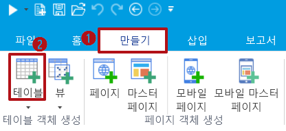
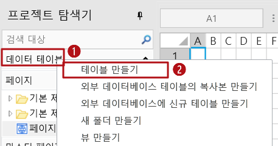
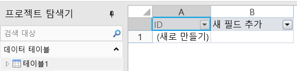
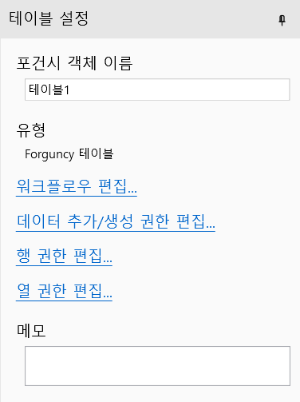
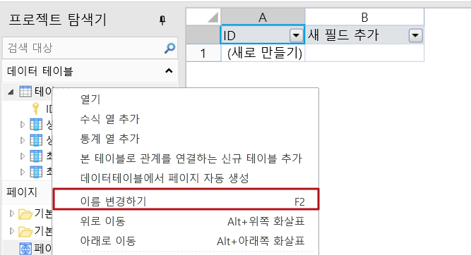
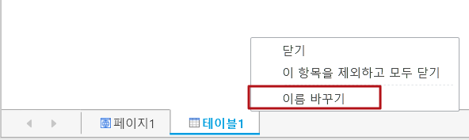
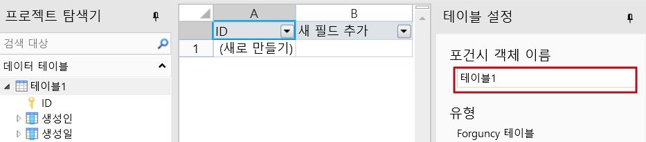
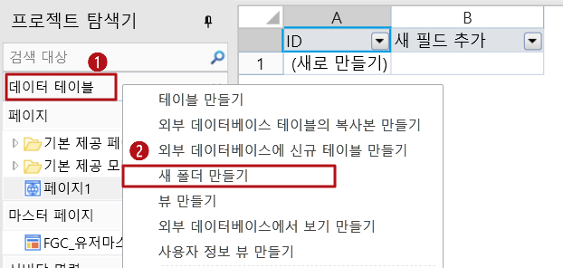
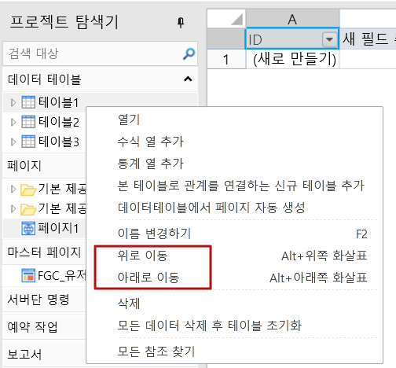
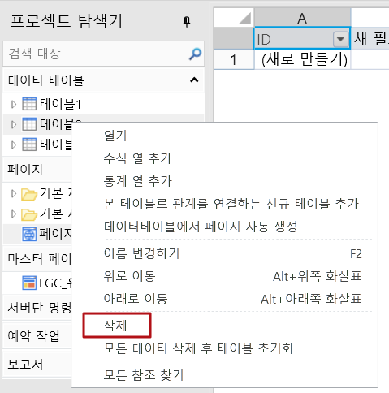

# 데이터 테이블 만들기

데이터 테이블은 데이터를 저장하는 데 사용되는 영역입니다. Excel 테이블의 개념과 마찬가지로 필드, 레코드로 나열됩니다. 데이터 테이블에 여러 필드를 설정하거나 여러 레코드를 저장할 수 있습니다. 아래 그림의 주문 테이블에는 ID, 주문 번호, 주문 날짜, 고객 이름, 구매자 및 완료 여부에 대한 6개의 필드와 7개의 레코드가 있습니다. 여기서 ID는 자체 증가 필드이며 편집할 수 없습니다.

## 데이터 테이블 만들기  &#x20;

그리드에서 데이터 테이블을 만드는 두 가지 방법이 있습니다.

* 방법 1. 리본 메뉴 모임에서 \[만들기]> \[테이블]을 선택합니다.

* 방법 2. 디자이너 개체 관리자 테이블 탭을 마우스 오른쪽 버튼을 클릭하고 팝업 메뉴에서 테이블 만들기를 선택합니다.

작역 영역에서 테이블 1을 볼 수 있습니다.

오른쪽 테이블 설정에서 테이블 이름과 메모를 설정할 수 있습니다. 메모를 설정한 후 데이터 테이블 위로 마우스를 가져가면 설정된 메모 정보가 표시됩니다.

워크플로우 설정은  워크플로우 설정을 참고하십시오. 데이터 권한은 데이터 권한을 참고하십시오.

## 데이터 테이블 기본작업  &#x20;

데이터 테이블 기본 작업에는 데이터 테이블 이름 바꾸기, 테이블 폴더 만들기, 데이터 테이블 이동, 데이터 테이블 삭제가 포함됩니다.

### 데이터 테이블 이름 변경 &#x20;

데이터 테이블의 이름을 바꾸는 방법은 네 가지가 있습니다.

* 방법 1. 데이터 테이블을 선택하고 F2 키를 눌러 데이터 테이블의 이름을 바꿉니다.
* 방법 2.데이터 테이블을 선택하고 마우스 오른쪽 버튼을 클릭하고 팝업 메뉴에서 \[이름 변경하]를 선택하여 데이터 테이블의 이름을 바꿉니다.

* 방법 3. 데이터 테이블을 열고 작업 영역 아래쪽의 레이블을 두 번 클릭하거나 마우스 오른쪽 버튼을 클락하여 \[이름 바꾸기]를 선택합니다.

* 방법 4. 데이터 테이블을 열고 작업 영역 오른쪽에 있는 테이블 설정에서 테이블 이름을 수정합니다.

### 테이블 폴더 만들기

디자이너 개체 관리자 테이블 탭에서 마우스 오른쪽 버튼을 클릭하고 \[새 폴더 만들기]를 선택하여 테이블 폴더를 만듭니다. 폴더에서 직접 데이터 테이블을 만들 수 있습니다.

### 데이터 테이블 이동 &#x20;

연결된 테이블 중 일부를 폴더로 드래그하거나 데이터 테이블의 위치를 드래그할 수 있습니다.

데이터 테이블을 선택하고 마우스 오른쪽 버튼을 클릭하거나, 위로 이동 또는 아래로 이동을 선택하거나, 키 조합 Alt+Up, Alt+Down을 사용하여 데이터 테이블의 위치를 이동할 수도 있습니다.

### 데이터 테이블 삭제 &#x20;

데이터 테이블에서 마우스 오른쪽 버튼 클릭하고 \[삭제]를 선택하거나 Delete 키를 직접 눌러 데이터 테이블을 삭제합니다.

데이터 테이블을 삭제한 후 테이블의 데이터도 삭제되고 데이터를 복구할 수 없으므로 주의해서 사용하십시오.

