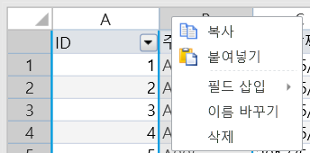
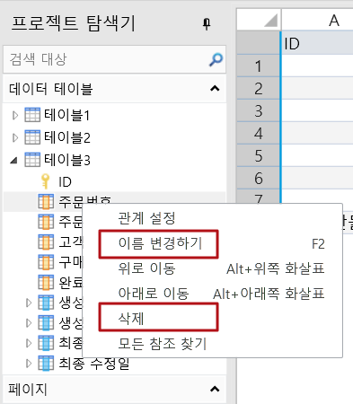
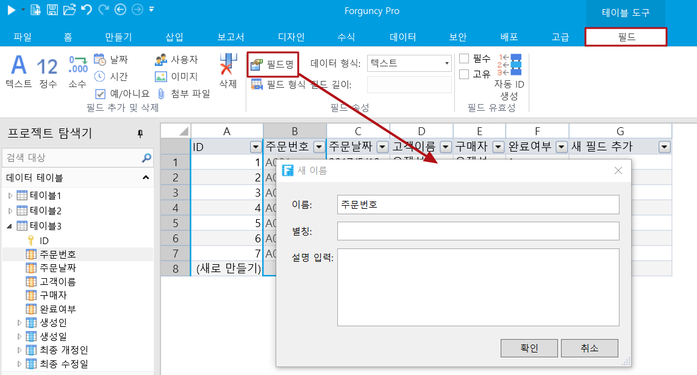

# 필드 만들기

데이터 테이블에서 각 열은 필드입니다. 데이터 테이블에 열(필드)을 만들어 데이터를 저장하면 각 행 필드(열)의 조합을 레코드라고 합니다.

아래 그림의 주문 테이블에는 ID, 주문 번호, 주문 날짜, 고객 이름, 구매자 및 완료 여부에 대한 6개의 필드와 7개의 레코드가 있습니다. 여기서 ID는 자체 증가 필드이며 편집할 수 없습니다.

.png>)

## 필드 유형 &#x20;

가능한 저장 데이터를 기반으로 테이블 다음과 같은 유형의 필드를 제공합니다.

<table><thead><tr><th width="180.35125243526397">항목</th><th>설명</th><th data-hidden></th></tr></thead><tbody><tr><td>텍스트  </td><td>텍스트 정보를 저장 </td><td></td></tr><tr><td>정수  </td><td>정수 정보를 저장 </td><td></td></tr><tr><td>소수</td><td>소수 자릿수가 있는 숫자 정보를 저장</td><td></td></tr><tr><td>날짜  </td><td>
날짜 정보를 저장

연도, 분기, 월 및 일의 네 개의 하위 필드가 있
</td><td></td></tr><tr><td>시간  </td><td>시간 정보를 저장</td><td></td></tr><tr><td>예/아니오   </td><td>
예/아니 정보를 저장

데이터베이스에 실제로 저장된 값은 "1" 또는 "0"이며 여기서 "1"은 "예"를 나타내고 "0"은 "아니오"를 나타냅니다  
</td><td></td></tr><tr><td>사용자  </td><td>
사용자 정보 저장(SQL Server 및 Oracle에서 텍스트 열 유형으로 변환 가능). 전체 이름, 메시지, 역할, 사용자 지정 속성, 조직 상위 필드 등이 있음 
<ul><li><em>역할 하위 필드의 경우 사용자가 둘 이상의 역할에 속하는 경우 각 역할은 쉼표로 구분됩니다.</em></li><li><em>각 사용자 지정 속성은 사용자가 사용자 지정 속성의 값인 하위 필드의 값에 해당하는 하위 필드를 생성합니다.</em></li><li><em>사용자 시스템에서 조직 구조를 구성한 경우 조직 상위 하위 필드를 통해 쿼리 또는 조건부 명령에서 쉽게 사용할 수 있도록 조직 구조의 모든 상위 리더를 가져올 수 있습니다.</em></li></ul></td><td></td></tr><tr><td>이미지  </td><td>
그림을 [GUID_ 파일 이름]으로 저장

(SQL Server 및 Oracle에서 텍스트 열 유형으로 변환 가능)
</td><td></td></tr><tr><td>첨부파일   </td><td>
첨부 파일을 [GUID_ 파일 이름]으로 저장

(SQL Server 및 Oracle에서 텍스트 열 유형으로 변환 가능).
</td><td></td></tr></tbody></table>

## 필드 만들기 &#x20;

데이터 테이블에 필드를 만드는 단계는 다음과 같습니다.

아래 절차 대로 진행하세요.

1. 데이터 테이블에서 첫 번째 행의 마지막 셀(필드 추가)의 드롭다운 버튼 클릭하여 드롭다운 목록에서 필드 유형을 선택합니다. 새로 추가된 필드는 현재 열 옆에 표시되며 필요한 필드를 계속 추가할 수 있습니다. _(ID 필드는 테이블을 만든 후 자동으로 추가되는 필드입니다. 사용자가 레코드를 추가하면 ID 필드에서 레코드의 일련 번호를 자동으로 생성합니다. 사용자는 필드를 삭제하거나 필드의 값을 수정할 수 없습니다.)_&#x20;

.png>)

2. &#x20;필드의 이름을 지정합니다.필드 이름이 있는 셀 마우스 오른쪽 버튼을 클릭하고 팝업 메뉴에서 \[이름 바꾸기]를 선택하여 필드 이름을 수정합니다. 필드 이름이 있는 셀을 두 번 클릭하여 필드 이름을 수정할 수도 있습니다.      &#x20;

.png>)

3. 테이블을 만들면 다음과 같은 기본 제공 필드가 자동으로 생성됩니다. 이러한 필드는 수정하거나 삭제할 수 없으며 ID를 제외한 모든 필드는 테이블의 작업 영역에 나타나지 않습니다. 이러한 필드의 값은 표시, 조건부 식 및 워크플로 등에 사용할 수 있습니다.

.png>)

## 필드 작업 &#x20;

필드를 만든 후 필드를 선택하여 필드를 복사, 붙여넣기, 이름 바꾸기, 삭제 등을 수행할 수 있습니다.


필드 삭제할 때 필드가 있는 열을 선택하고 마우스 오른쪽 버튼을 클릭하여 \[삭제]를 선택할 수 있다. 필드를 삭제하면 관련 데이터도 삭제됩니다.


데이터 테이블을 확장하고 필드를 선택하고 마우스 오른쪽 버튼을 클릭한 다음 마우스 오른쪽 버튼 메뉴에서 "이름 변경하기" 및  "삭제"를 선택할 수도 있습니다.

### 필드 이름을 설정하기  &#x20;

필드를 만든 후 필드를 선택하고 리본 메뉴 모음에서 \[필드]> \[필드명]을 선택하면 필드의 별칭과 설명 설정할 수 있는 새 이름 대화 상자가 나타납니다.

