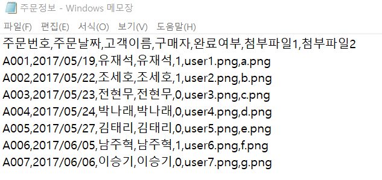
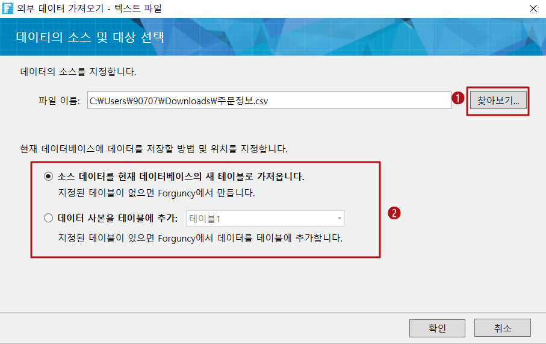
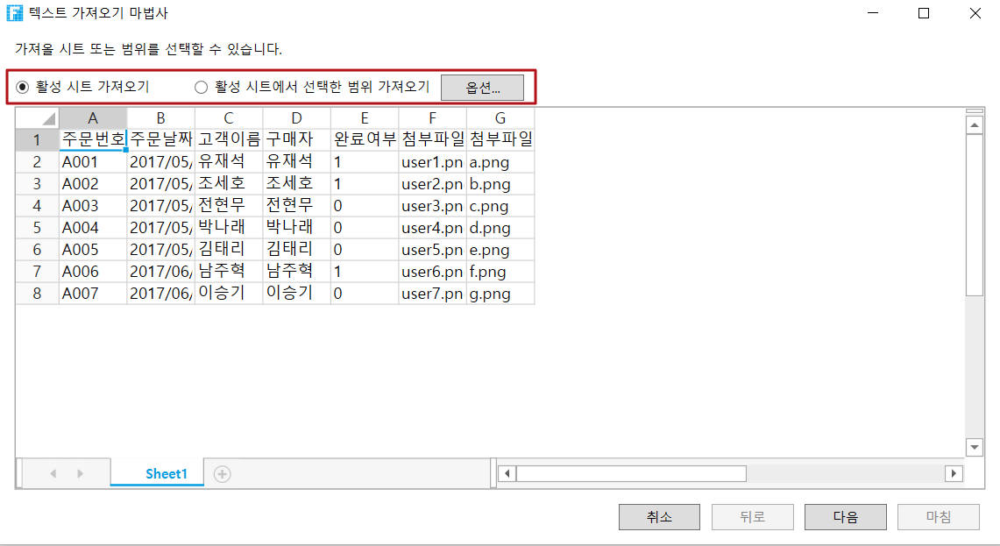
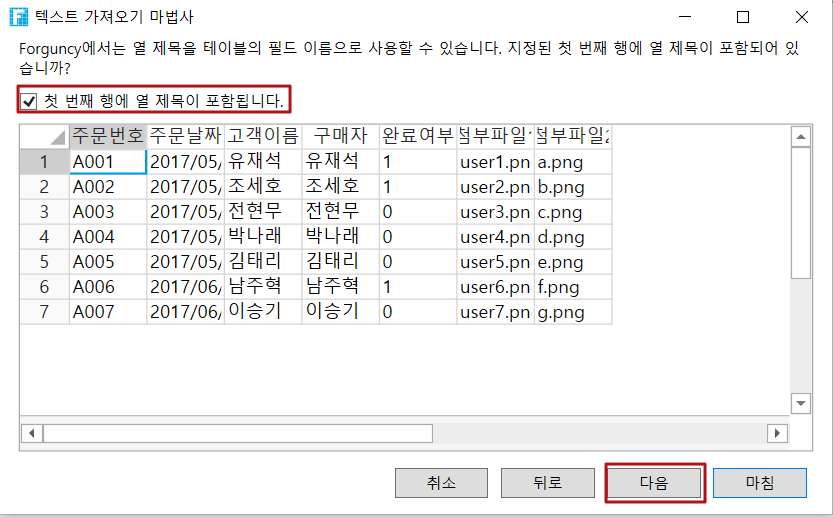
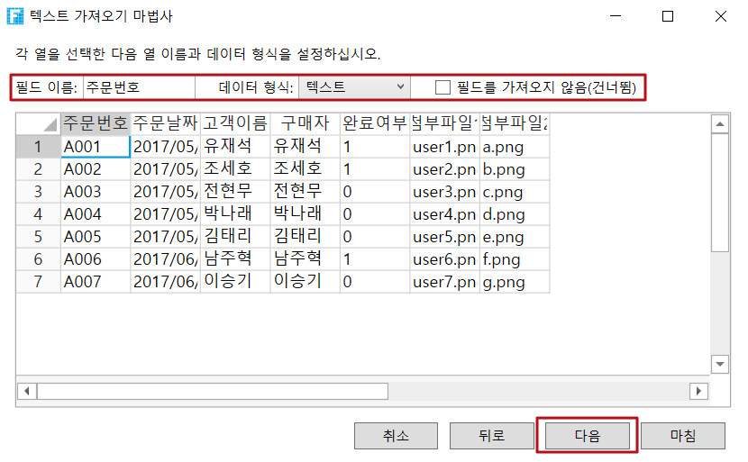
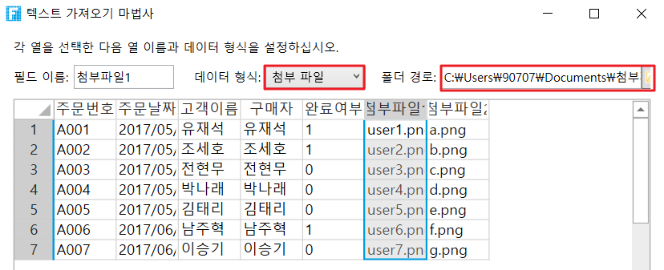
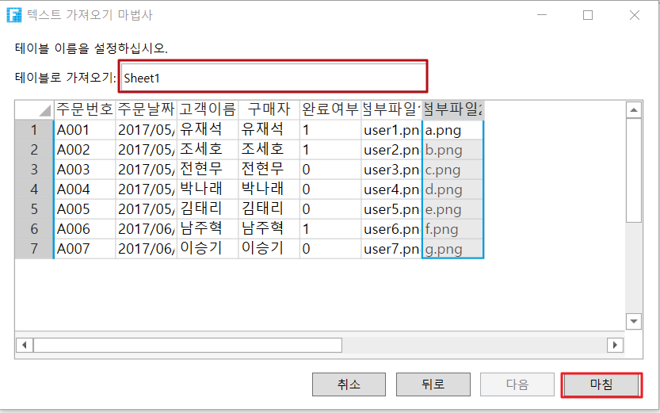

# 텍스트 파일로 데이터 테이블 만들기

포건시는 텍스트 파일의 데이터를 가져와 데이터 테이블을 생성할 수 있도록 지원하며 쉼표로 구분된 텍스트 파일과 탭으로 구분된 텍스트 파일을 지원합니다.

예를 들어 포건시에서 다음 그림과 같이 텍스트 파일을 사용하여 데이터 테이블을 만듭니다.

## 텍스트 파일로 데이터 테이블 만들기&#x20;

위의 그림에 있는 텍스트 파일을 이용하여 데이터 테이블 만드는 방법은 아래와 같습니다.

아래 절차대로 진행하세요.

 리본 메뉴 모음에서 \[데이터]>\[Text를 테이블로 가져오기]를 선택합니다.                                            &#x20;

 \[찾아보기]를 클릭하고 가져올 텍스트 파일을 선택한 다음 \[확인]을 클릭합니다. 데이터가 현재 데이터베이스에 저장되는 방법과 위치를 지정할 수 있습니다.

* 소스 데이터를 현재 데이터베이스의 새 테이블로 가져오기: 텍스트 파일의 데이터를 새로 만든 테이블로 가져옵니다.
* 테이블에 사본을 테이블 추가: 텍스트 파일의 데이터가 기존 테이블에 추가됩니다.                     &#x20;

 가져온 범위를 선택하여 선택한 워크시트 또는 선택한 셀 범위를 선택합니다.

다음을 클릭합니다.                                                                                                                                                                                                                   텍스트 파일을 가져올 때 \[옵션]을 클릭하여 \[가져오기 옵션] 대화 상자를 엽니다. 텍스트 파일의  구분 기호, 열 구분 기호, 텍스트 한정자 및 인코딩 등을 설정할 수 있습니다.                                   &#x20;

필드 이름을 설정합니다. 첫 번째 행의 셀 내용을 필드 이름으로 사용하려면 "첫 번째 행에 열 제목 포함됩니다" 를 클릭합니다.

다음을 클릭합니다.                                                                                                                      &#x20;

가져온 필드의 데이터 형식을 설정합니다. 필드를 선택하여 이름 및 데이터 형식을 수정합니다. 필드를 가져오지 않으려면 필드를 선택한 후 "필드 가져오기 않음(건너뜀)"을 선택할 수도 있습니다.                                                                                             선택한 필드의 데이터 형식을 그림 및 첨부 파일로 설정한 경우 폴더의 주소를 설정해야 합니다. 이미지 또는 첨부 파일 필드의 데이터가 절대 경로인 경우 폴더 주소를 설정하지 않을 수도 있습니다. 폴더 주소가 그림 또는 첨부 파일의 데이터와 결합되어 전체 주소로 결합되는 경 지정된 파일에 액세스할 수 있습니다.

첨부 파일 필드의 데이터에는 여러 첨부 파일이 있을 수 있으며 여러 첨부 파일 이름 사이에 "|"가 있을 수 있습니다. "양식 1.csv| 양식 2.csv"과 같이 구분됩니다.                                                              &#x20;

테이블 이름을 설정하고 \[마침]버튼을 클릭합니다.                                                                                                                                                                                             2단계에서 "데이터 사본을 레코드에 추가"를 선택하면 테이블 이름이 결정되고 수정할 수 없으며 가져온 레코드가 테이블에 이미 있는 레코드 뒤에 추가됩니다.

 \[마침]을 클릭하면 텍스트 파일의 데이터를 포건시의 데이터 테이블로 가져옵니다. 임의로 생성된 GUID는 가져온 그림 및 첨부 파일의 파일 이름 앞에 자동으로 추가됩니다.
