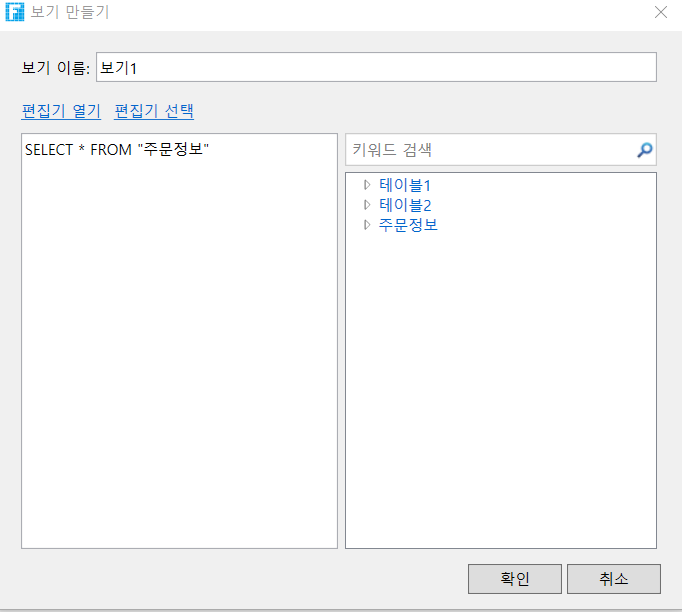
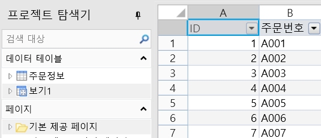
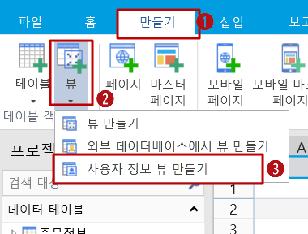
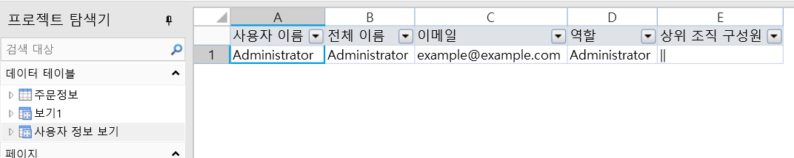
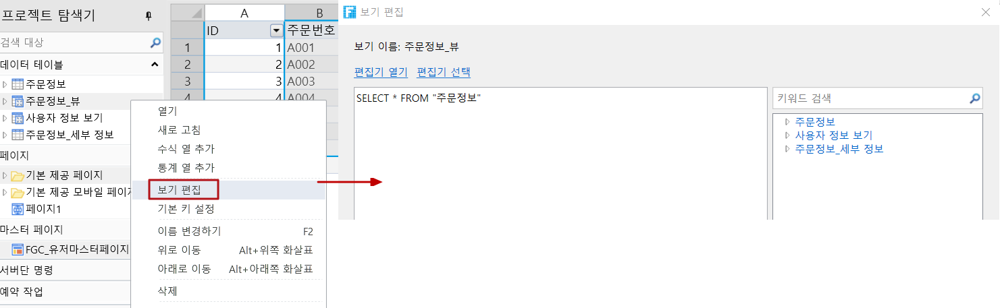
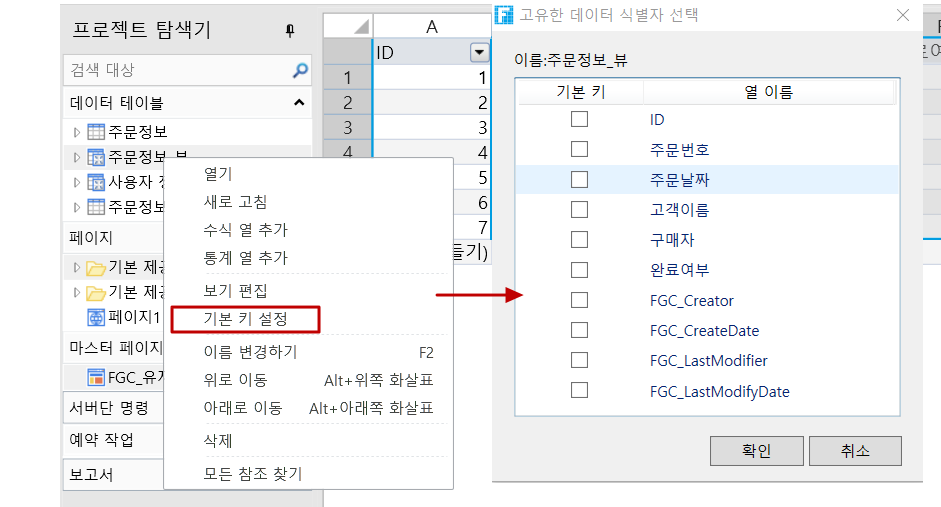

# 뷰 만들기

뷰는 SELECT 문으로 구성된 쿼리에 의해 정의된 가상 테이블입니다. 데이터베이스 시스템 내에서 뷰는 하나 이상의 테이블의 데이터로 구성됩니다. 데이터베이스 시스템 외부에서 뷰는 테이블과 같습니다.

뷰가 정의되면 데이터베이스에 저장되며, 이에 해당하는 데이터는 테이블처럼 데이터베이스에 하나 더 저장되지 않으며 뷰를 통해 표시되는 데이터는 기본 테이블에 있는 데이터일 뿐입니다.

포건시를 사용하면 일반 보기, 사용자 정보 보기 및 워크플로 기록 보기를 비롯한 뷰를 만들 수 있습니다.

## 뷰 만들기

다음은 주문 테이블을 예로 들어 일반 뷰를 만드는 단계를 보여 줍니다.

아래 절차대로 진행하세요.

1. 리본 메뉴 모음에서 \[만들기]>\[뷰]를 선택합니다.                                                                            &#x20;

2. \[보기 만들기] 대화 상자에서 뷰 이름과 SQL 문을 입력합니다.                 &#x20;

3. 편집이 완료되면 \[확인]을 클릭합니다. 데이터 테이블 아래에 뷰가 표시됩니다.                &#x20;

## 사용자 정보 보기 만들기&#x20;

사용자 계정 관리 플랫폼의 모든 사용자와 정보를 표시하는 사용자 정보 보기를 만들 수 있습니다.

리본 메뉴 모음에서 \[만들기>\[뷰]>\[사용자 정보 뷰 만들기]를 선택합니다.

작성이 완료되면 테이블 탭 막대 아래에 사용자 정보 뷰가 표시됩니다. 여기에는 사용자 계정 관리 플랫폼의 모든 사용자 및 정보가 포함됩니다.

## 뷰 기본 작업

뷰의 기본 작업에는 뷰 편집, 기본 키 설정, 뷰 이름 바꾸기, 뷰 삭제가 포함됩니다.

### 보기 편집&#x20;

보기를 선택하고 마우스 오른쪽 버튼을 클릭하여 \[보기 편집]을 클릭하 대화 상자에서 SQL 문을 수정합니다.

### 기본 키 설정&#x20;

뷰를 선택하고 마우스 오른쪽 버튼을 클릭하여 \[기본 키 설정]을 선택합니다.

### 뷰의 이름 바꾸기&#x20;

뷰를 연 후 작업 영역 아래쪽에 있는 탭을 두 번 클릭하거나 마우스 오른쪽 버튼을 클릭하여 이름 바꾸기를 선택합니다.  또는 뷰를 연 후 작업 공간 오른쪽에 있는 테이블 설정에서 뷰 이름을 수정합니다.

### 뷰 삭제

뷰를 선택하거나 삭제를 마우스 오른쪽 버튼을 클릭하거나 Delete 키를 직접 눌러 뷰를 삭제합니다.
