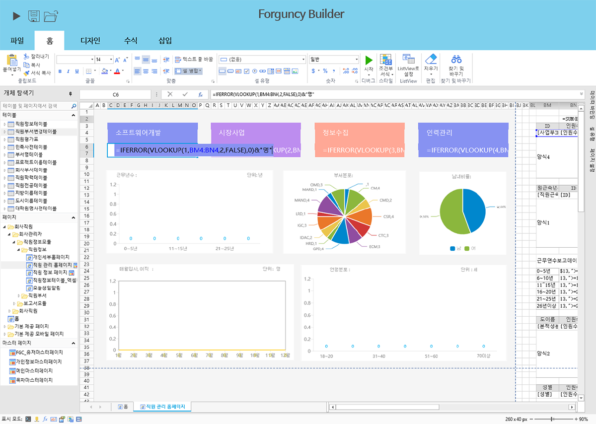

# 포건시 빌더|디자이너

## 포건시 빌더란?

포건시 빌더(Builder)를 사용하면 **HTML, CSS 를 몰라도 Excel 로 쉽고 빠르게 화면 디자인 및 로직 개발이 가능 합니다**. 또한, 기존에 사용하던 MS Excel 양식을 그대로 웹으로 변환할 수 있습니다.

### Excel 호환

Excel 함수, 차트, 조건부 서식, 셀 병합 등 Excel의 모든 기능을 디자인 요소로 활용해보세요.

### 다양한 UI 컨트롤

화면 구성에 필요한 버튼, 체크박스, 바코드, 파일 업로드, 달력 등 다양한 컨트롤을 제공합니다.

### 확장성

필요한 경우 JavaScript, CSS, Web API와 다양한 플러그인을 통해 원하는 기능을 확장해보세요.

포건시를 설치하기 전에 설치 패키지와 환경을 준비해야 합니다.&#x20;

이 장에서는 포건 패키지 다운로드, 환경 요구 사항 및 포건시 빌더와 포건시 서버 측 설치 및 제거에 대해 자세히 설명합니다.


시스템 요구사항

**포건시 빌더** 설치 전에 반드시 [**시스템 요구사항**](../systemrequirement/)을 확인해주세요.

