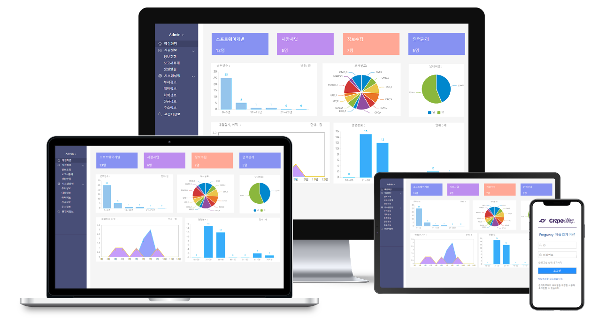

# 포건시 서버|Server

## **포건시 서버(Sever) 란?**

포건시 빌더(Builder)에서 만든 기능과 Excel 기반의 페이지를 읽어서 이를 웹 상에 HTML, CSS, JavaScript로 자동 렌더링 합니다.&#x20;

또한, Forguncy 서버 프로그램 설치만으로 어려운 서버 세팅을 한번에 완료할 수 있습니다.&#x20;

**사용자 관리**부터 **권한 관리**, **응용프로그램 배포**, **보안 및 백업** 등  **웹 서비스 운영에 필요한 전반적인 관리** **기능**에 이르기 까지 사이트 관리자를 위한 백오피스 화면을 제공합니다.

Forguncy 빌더에서 작성한 디자인을 HTML, CSS, JavaScript로 자동 렌더링 합니다.
