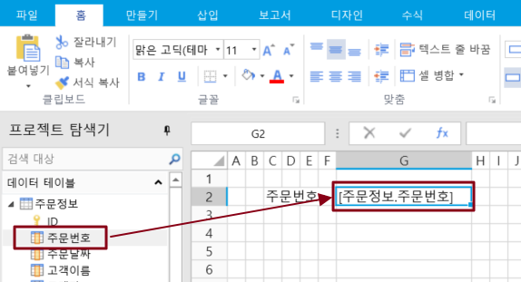
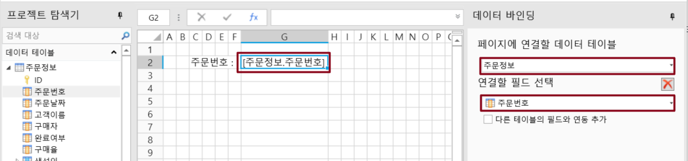

# 바인딩 필드

페이지의 셀이 데이터 테이블의 필드에 바인딩되면 해당 필드에 대한 데이터를 표시하거나 필드를 추가, 업데이트 등을 수행할 수 있습니다.&#x20;

페이지의 일반 셀 또는 테이블의 셀에 필드를 바인딩하는 방법에는 두 가지가 있습니다.

* 방법 1. 바인딩 필드를 드래그하여 바인딩합니다. 페이지에서 셀 또는 셀 범위를 선택하고 데이터 테이블에서 바인딩할 필드를 셀 또는 셀 범위로 드래그합니다.

* 방법 2. 속성 설정 영역에서 데이터 바인딩을 설정합니다. 페이지에서 셀 또는 셀 범위를 선택하고 속성 설정 영역의 데이터 바인딩에서 데이터 원본 및 바인딩 필드를 선택합니다.

### 필드를 다른 테이블에 연결

바인딩 필드에 연결된 필드가 있는 경우 이 필드를 다른 테이블에 연결을 선택하여 필드 연결을 통해 다른 테이블의 값을 사용하여 추가 설정을 수행할 수 있습니다.

예를 들어 다음 그림과 같이 고객 이름 뒤에 있는 셀을 클릭하여 데이터 바인딩을 진행합니다. 데이터 바인딩 탭에 연결할 필드를 주문 테이블의 고객 ID로 선택한 후, \[다른 테이블의 필드와 연동 추가]에 체크합니다. 관계연결테이블을 고객정보테이블로 선택, 관계 연결 시  식별 필드를 ID 필드를 선택, 관계 연결 시 표시 필드 고객이름으로 설정합니다.

.png>)

실행 후 리스트뷰에서 레코드 행을 선택하면 고객정보테이블의 고객 이름이 연결 필드를 기반으로 표시되는 것을 확인할 수 있습니다.&#x20;

.png>)
