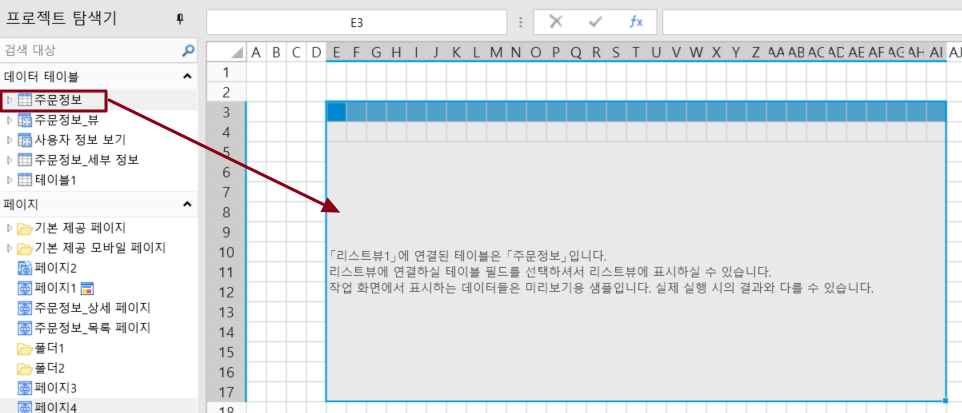
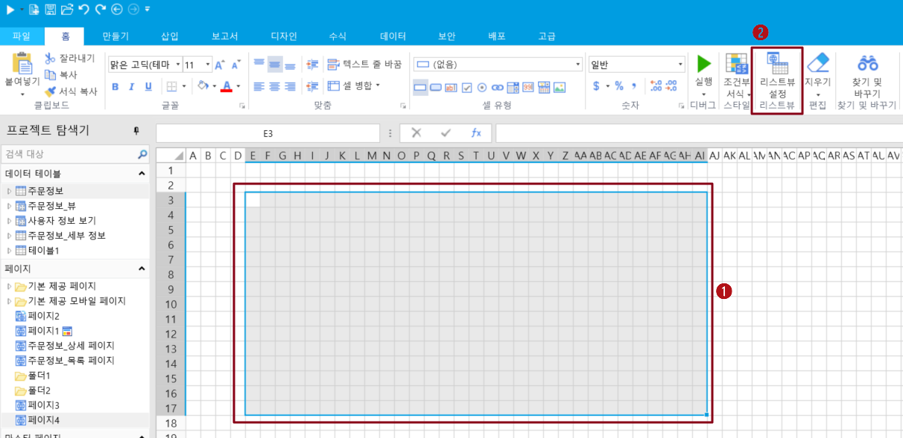
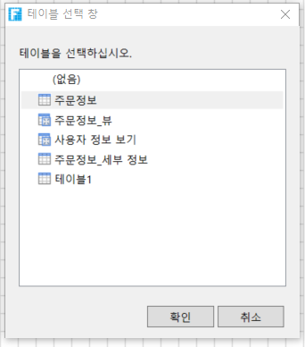
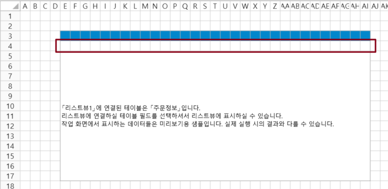
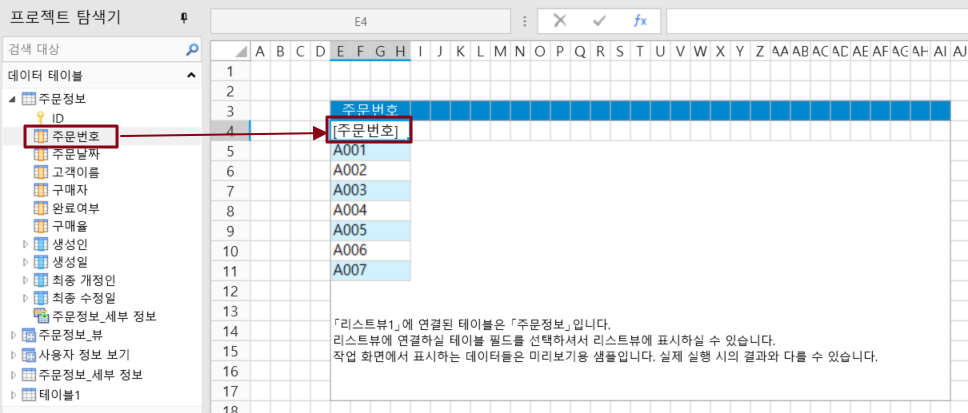
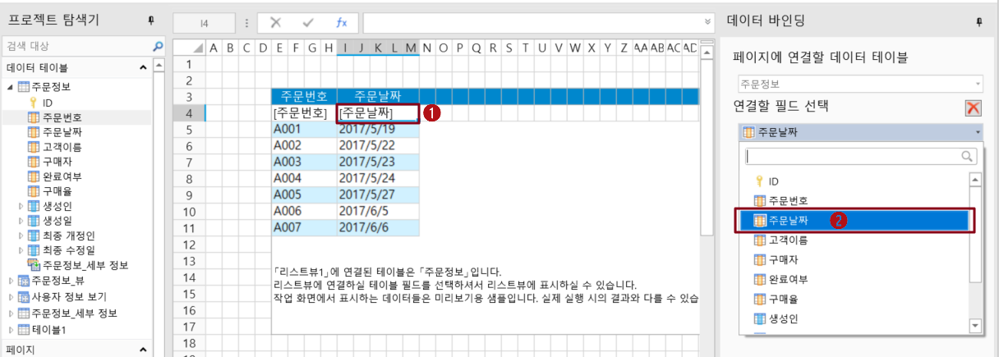

# 리스트뷰 바인딩

리스트뷰는 데이터 테이블의 데이터를 브라우저에 목록으로 표시할 수 있습니다. 테이블에는 현재 작업 레코드를 선택하는 역할도 있습니다.

## 양식 소개

리스트뷰는 다음 그림과 같이 행 헤더, 열 헤, 템플릿 행 및 테이블 자리 표시 영역으로 나뉩니다. 템플릿 행 셀의 너비는 결국 테이블 데이터 열의 너비로 사용되므로 템플릿 행 셀의 너비를 수정하거나 셀을 병합하여 데이터를 표시할 충분한 공간을 확보할 수 있습니다.

기본적으로 테이블의 필드 이름은 테이블의 열 헤더의 머리글 내용으로 사용됩니다. 열헤더 행의 셀에서 열헤더의 제목을 수정할 수 있습니다.

.png>)

## 리스트 바인딩

데이터 테이블을 리스트뷰에 바인딩하는 방법에는 두 가지가 있습니다.

* 방법 1. 바인딩 테이블을 드래그 앤 드롭합니다. 페이지에서 셀 범위를 선택하고 데이터 테이블을 셀 범위로 드래그합니다.

* 방법 2. 리스트뷰로 설정합니다.

 페이지에서 영역을 선택하고 리본 메뉴에서 \[홈]>\[리스트뷰 설정]을 선택합니다.

 데이터 테이블을 선택하고 \[확인]을 클릭합니다.

 데이터 테이블을 선택하면 리스트뷰에 바인딩됩니다.

## 리스트뷰에 필드를 바인딩 하기

리스트뷰를 선택한 영역에 바인딩되면 선택한 영역이 테이블 디자인 영역입니다. 다음 그림과 같이 리스트뷰 디자인 영역의 두 번째 동작 템플릿 행입니다.

리스트뷰의 템플릿 행에서 데이터 테이블의 필드를 바인딩하여 데이터 테이블의 데이터를 표시해야 합니다. 템플릿 행에서 셀의 셀 유형을 설정할 수도 있으며, 일부 셀 유형은 셀이 편집된 경우에만 유효합니다.

필드를 테이블 템플릿 행의 셀에 바인딩하는 방법에는 두 가지가 있습니다.

* 방법 1. 바인딩 필드를 드래그하여 바인딩합니다. 표에서 셀 또는 셀 범위를 선택하고 데이터 테이블에서 바인딩할 필드를 셀 또는 셀 범위로 드래그합니다.

* 방법 2. 속성 설정 영역에서 데이터 바인딩을 설정합니다. 표에서 셀 또는 셀 범위를 선택하고 속성 설정 영역의 데이터 바인딩에서 데이터 원본 및 바인딩 필드를 선택합니다.

### 필드를 다른 테이블에 연결

바인딩 필드에 연결된 필드가 있는 경우 이 필드를 다른 테이블에 연결을 선택하여 필드 연결을 통해 다른 테이블의 값을 사용하여 추가 설정을 수행할 수 있습니다.

예를 들어 템플릿 행의 고객 이름 셀에서 연결할 필드를 주문정보테이블의 고객\_ID로 설정하고 다음 그림과 같이 이 필드를 다른 테이블에 연결을 선택합니다. 고객정보 테이블에 연결된 ID 필드를 식별 필드로, 관계 연결 시 표시 필드는 고객이름으로 선택합니다.

.png>)
