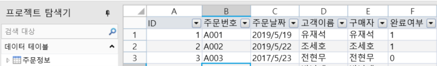
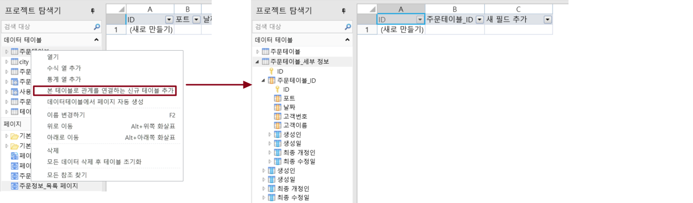
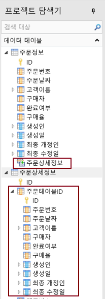
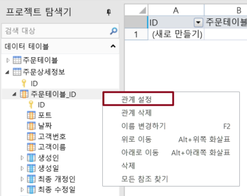
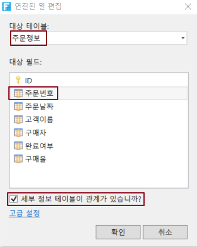
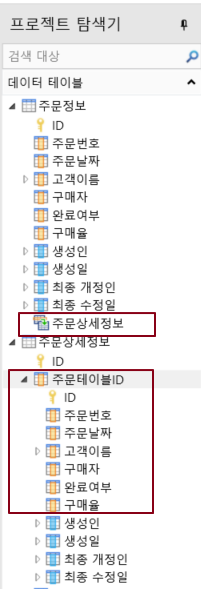

# 마스터-하위 테이블 만들기

마스터-하위 테이블은 한 쌍의 부모-자식 테이블 관계, 즉 마스터 테이블의 레코드가 테이블에서 여러 개 또는 하나의 레코드에 해당합니다.

다음은 주문정보 테이블과 주문 상세 정보 테이블을 예로 들어 마스터-하위 테이블을 직접 만드는 단계를 보여 줍니다.

 주문정보  테이블을 만듭니다.

 주문정보  테이블에서 마우스 오른쪽 버튼을 클릭하고 팝업 메뉴에서 \[본 테이블로 관계를 연결하는 신규 테이블 추가]를 선택합니다. 결과 하위 테이블의 기본 이름은 주문 테이블\_하위 테이블이며, 이 필드는 주문 정보 테이블의 ID 필드와 연결된 _기본 테이블 이름_ \_ID 필드가 자동으로 추가됩니다.

 하위테이블의 테이블 명을 변경하고 테이블 필드를 추가합니다.

.png>)

 마스터 리스트가 설정되면 마스터 테이블에 하위테이블이 나타납니다. 테이블에서 연결 필드를 확장하기 전에 기본 테이블에 대한 정보가 나타납니다.

종 테이블인 주문 상세 정보 테이블을 두 번 클릭하면 테이블이 열립니다.

## **연결 필드를 설정하여 마스터-하위 테이블을 만들기**  

다음은 주문 테이블 및 주문 상세 정보 테이블을 예로 들어 연결 필드를 설정하여 마스터-하위 테이블을 설정하는 단계를 보여 줍니다.

 주문정보 테이블을 만듭니다.

 주문 상세 정보 테이블을 만듭니다. 주문 상세 정보 테이블에는 주문 세부 정보가 속한 주문 테이블의 번호인 주문 테이블 번호 필드가 있습니다.

 주문 상세 정보 테이블 왼쪽에 있는 확장 필드를 클릭하고 주문 테이블의 번호 필드를 마우스 오른쪽 버튼을 클릭하고 연결 필드 설정을 선택합니다.

 \[연결된 열 편집] 대화 상자에서 \[대상 테이블]은 \[주문정보]를 선택하고, \[대상 필드]는 \[주문번호 ]를 선택하고 \[세부 정보 테이블이 관계가 있습니까?] 선택합니다.

 마스터 리스트가 설정되면 마스터 테이블에 하위 테이블이 나타납니다. 테이블에서 연결 필드를 확장하기 전에 기본 테이블에 대한 정보가 나타납니다.

하위 테이블인 주문 세부 정보 테이블을 두 번 클릭하면 테이블이 열립니다.

