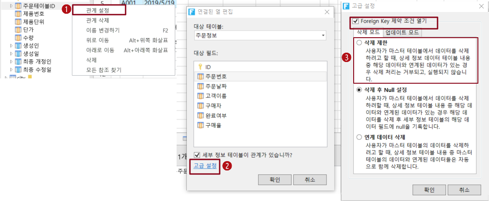

# 하위 테이블 삭제 모드

연결 필드를 설정할 때 고급 설정에서 외래 키 제약 조건을 켜서 하위 테이블의 삭제 모드를 설정할 수 있습니다.

* 삭제 제한: 기본 테이블의 레코드를 삭제할 때 해당 하위 레코드가 있는 경우 삭제가 허용되지 않으며 삭제가 실패합니다.
* 삭제 후 Null 설정: 마스터 테이블의 레코드를 삭제할 때 해당 하위 레코드가 있는 경우 마스터 테이블의 레코드가 삭제되고 테이블의 해당 레코드는 삭제되지 않지만 마스터 테이블과 연결된 필드의 값은 비어 있습니다.
* 연계 데이터 삭제: 마스터 테이블의 레코드를 삭제할 때 해당 하위 레코드가 있는 경우 마스터 테이블의 레코드가 삭제되고 테이블의 해당 레코드도 삭제됩니다.

예를 들어 주문 테이블 목록에서 삭제를 클릭하여 해당 레코드를 삭제합니다. 이 섹션에서는 주문 테이블과 주문 세부 정보 테이블을 예로 들어 하위 테이블의 세 가지 삭제 모드를 설명합니다.

## 삭제 제한&#x20;

기본 테이블의 레코드를 삭제할 때 해당 하위 레코드가 있는 경우 삭제가 허용되지 않으며 삭제가 실패합니다.

주문 상세 정보 테이블의 관련 필드인 주문 테이블의 주문 번호에서 마우스 오른쪽  버튼을 클릭하고 관계설정을 선택하고 연결된 열 편집 대화 상자를 표시한 후 고급 설정을 클릭하고 Foreign Key 제약 조건 열기를 선택하고 삭제 모드에서 삭제 제한을 선택합니다.

## 삭제 후 Null 설정&#x20;

마스터 테이블의 레코드를 삭제할 때 해당 하위 레코드가 있는 경우 기본 테이블의 레코드가 삭제되고 테이블의 해당 레코드는 삭제되지 않지만 연결된 마스터 테이블의 필드 값은 비어 있습니다.

주문 정보 테이블의 관련 필드인 주문 테이블의 주문 번호를 마우스 오른쪽 버튼을 클릭하고 관계 설정을 선택하고 연결된 열 편집 대화 상자를 표시한 후 고급 설정을 클릭하고 Foreign Key 제약 조건 열기를 선택하고 삭제 모드에서 삭제 후 Null 설정을 선택합니다.

## 연계 데이터 삭제&#x20;

마스터 테이블의 레코드를 삭제할 때 해당 하위 레코드가 있는 경우 마스터 테이블의 레코드가 삭제되고 테이블의 해당 레코드도 삭제됩니다.

주문 세부 정보 테이블의 관련 필드인 주문 테이블의 주문 번호에서 마우스 오른쪽 버튼 클릭하고 관계 정을 선택하고 연결된 열 편집 대화 상자를 표시한 후 고급 설정을 클릭하고 Foreign Key 제약 조건 열기를 선택하고 삭제 모드에서 연계 데이터 삭제를 선택합니다.&#x20;
