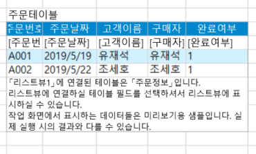
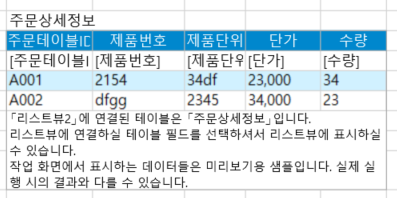
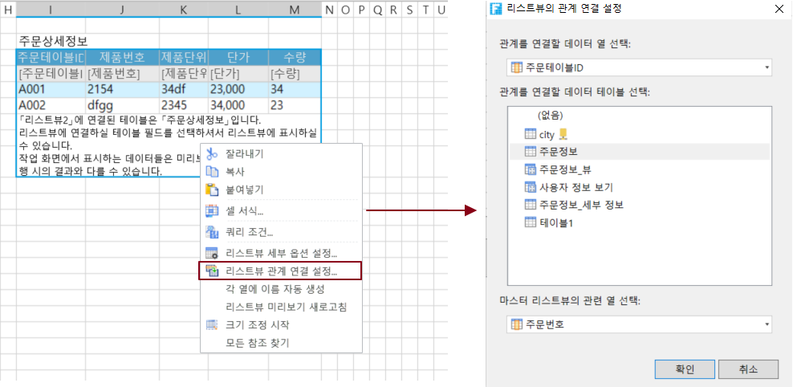
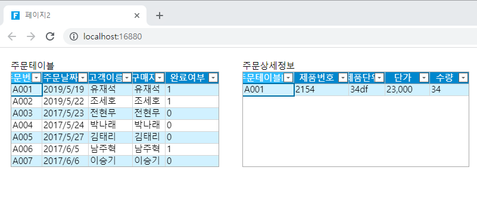

# 하위 테이블 설정

두 테이블이 마스터-하위 테이블 관계인 경우 페이지에서 두 테이블을 바인딩할 수 있으며, 하위 테이블을 바인딩된 테이블을 기본 테이블을 바인딩하는 테이블의 하위 테이블로 설정할 수 있습니다. 하위 테이블을 설정한 후 기본 테이블에서 레코드를 선택하면 해당 하위 테이블 레코드가 하위 테이블에 나열됩니다.

이 장에서는 주문 테이블 및 주문 상세 정보 테이블을 예로 들어 하위 테이블의 설정을 설명합니다.

## 하위 테이블을 자동으로 설정하기&#x20;

기본 테이블 아래에 연결된 하위 테이블을 페이지에서 선택한 영역으로 드래그하면 테이블이 자동으로 하위 테이블로 설정됩니다.&#x20;

 페이지에서 주문 테이블을 테이블에 바인딩하고 필드를 바인딩합니다.

 기본 테이블에서 연결된 주문 상세 정보 테이블 하위 테이블을 페이지에서 선택한 영역으로 드래그하고 필드를 바인딩합니다.

 주문 세부 정보 테이블은 수동으로 설정할 필요 없이 주문 테이블의 하위 테이블로 자동으로 설정됩니다. 하위 테이블 설정 대화 상자의 연결 필드, 연결된 기본 테이블 및 기본 테이블과 연결된 필드가 모두 자동으로 설정됩니다.

 페이지를 실행하여 주문 테이블의 레코드를 선택하면 주문 세부 정보 테이블에 하나 이상의 레코드가 표시됩니다.

## 하위 테이블을 수동으로 설정

주문 세부 정보 시트를 직접 사용합니다. 페이지에서 선택한 영역으로 드래그하려면 하위 테이블을 수동으로 설정해야 합니다.

 페이지에서 기본 테이블 주문 정 테이블을 테이블에 바인딩하고 필드를 바인딩합니다.

<figure><figcaption></figcaption></figure>

  주문 세부 정보 양식을 직접 제공합니다페이지에서 선택한 영역으로 드래그하여 필드를 바인딩합니다.

<figure><figcaption></figcaption></figure>

 하위 테이블을 설정합니다. 테이블을 선택하고 테이블에서 마우스 오른쪽 버튼 클릭하여 리스트뷰 관계 연 설정을 선택합니다.&#x20;

<figure><figcaption></figcaption></figure>

 하위 테이블 설정에서 연결 필드, 기본 테이블 및 기본 테이블이 연결될 필드를 설정합니다.

.png>)

 하위 테이블 설정이 완료되면 페이지를 실행하고 주문 테이블에서 레코드를 선택하면 주문 세부 정보 테이블에 하나 이상의 레코드가 표시됩니다.

.png>)
