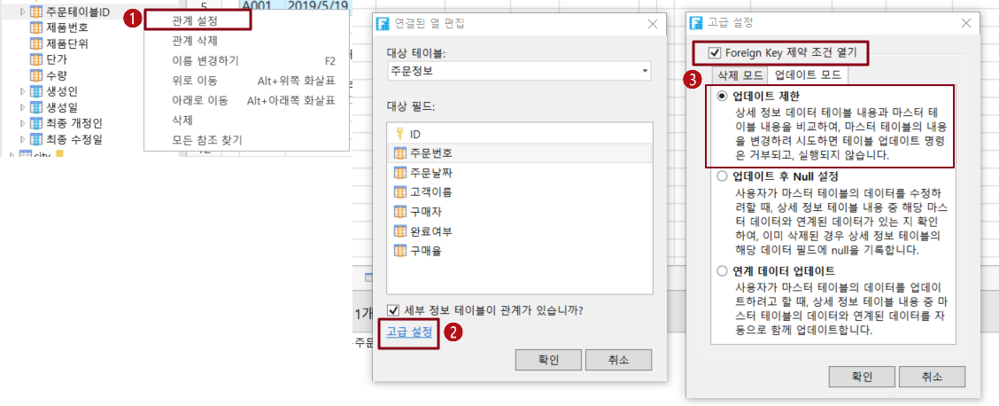
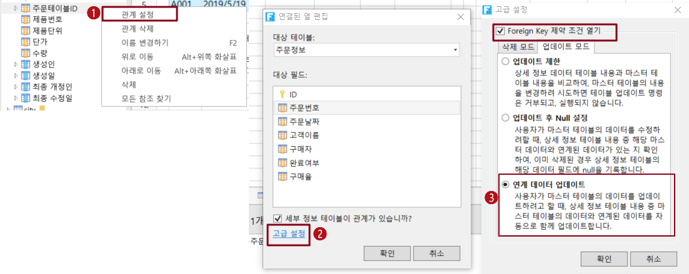

# 하위 테이블 업데이트 모드

연결 필드를 설정할 때 고급 설정에서 외래 키 제약 조건을 켜고 하위 테이블에 대한 업데이트 모드를 설정할 수 있습니다.

* 업데이트 제한: 기본 테이블의 레코드를 업데이트할 때 연결된 필드의 값으로 업데이트되고 해당 종속 레코드가 있는 경우 업데이트가 허용되지 않으며 업데이트가 실패합니다.
* 업데이트  후 Null 설정 : 기본 테이블의 레코드를 업데이트할 때 연결된 필드의 값으로 업데이트되고 해당 종속 레코드가 있는 경우 마스터 테이블의 레코드가 업데이트되고 해당 히치 테이블이 업데이트되지 않지만 연결된 마스터 테이블의 필드 값이 비어 있습니다.
* 연계데이터 업데이트: 마스터 테이블의 레코드를 업데이트할 때 연결된 필드의 값으로 업데이트되고 해당 종속 레코드가 있는 경우 마스터 테이블의 레코드와 해당 종속 레코드가 업데이트됩니다.

예를 들어 주문 테이블 목록에서 주문 번호를 클릭하여 주문 업데이트 페이지를 팝업하고 해당 페이지에서 주문을 업데이트합니다. 이 섹션에서는 주문 테이블 및 주문 세부 정보 테이블을 예로 들어 하위 테이블의 세 가지 업데이트 모드를 설명합니다.

## 업데이트 제한&#x20;

마스터 테이블의 레코드를 업데이트할 때 연결된 필드의 값으로 업데이트되고 해당 종속 레코드가 있는 경우 업데이트가 허용되지 않으며 업데이트가 실패합니다.

주문 상세 정보 테이블의 관련 필드인 주문 테이블의 주문 번호에서 마우스 오른쪽 버튼을 클릭하고 관계설정을 선택하고 연결된 열 편집 대화 상자를 표시한 후 고급 설정을 클릭하고 Foreign Key 제약 조건 열기를 선택하고 업데이트 모드에서 업데이트 제한 선택합니다.

페이지를 실행하고 주문 테이블에서 두 개의 레코드가 있는 주문 A003을 선택하고 "A003"을 클릭하여 업데이트 페이지를 팝업하는 등 주문 테이블의 레코드를 선택합니다.

"번호"는 연결된 필드이고 업데이트 번호 "A003"은 "A008"이며 "데이터베이스 업데이트 실패" 메시지가 나타나고 레코드 업데이트가 실패합니다.

## 업데이트후 Null 설정

마스터 테이블의 레코드를 업데이트할 때 연결된 필드의 값으로 업데이트되고 해당 종속 레코드가 있는 경우 마스터 테이블의 레코드가 업데이트되고 해당 레코드 업데이트되지 않지만 연결된 마스터 테이블의 필드 값은 비어 있습니다. 

주문 상세 정보 테이블의 관련 필드인 주문 테이블의 주문 번호를 마우스 오른쪽 버튼을 클릭하고 관계설정을 선택하고 연결된 열 편집 대화 상자를 표시한 후 고급 설정을 클릭하고 Foreign Key 제약 조건 열기를 선택하고 업데이트모드에서 업데이트 후 Null 설정 선택합니다.

## 연계 데이터 업데이트&#x20;

마스터 테이블의 레코드를 업데이트할 때 연결된 필드의 값으로 업데이트되고 해당 종속 레코드가 있는 경우 마스터 테이블의 레코드와 해당 종속 레코드가 업데이트됩니다.

주문 세부 정보 테이블의 연결 필드인 주문 테이블의 주문 번호에서 마우스 오른쪽 버튼 클릭하고 관계설정 선택하고 연결된 열 편집 대화 상자를 표시한 후 고급 설정을 클릭하고 Foreign key 제약 조건 열기를 선택하고 업데이트 모드에서 연계 데이터 업데이트를 선택합니다.

