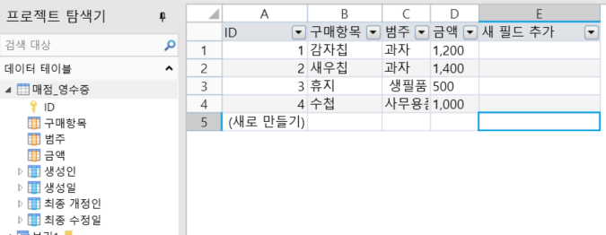
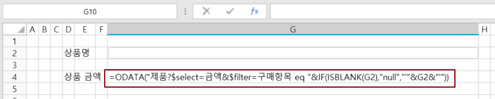
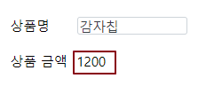

# OData

OData 함수를 사용하여 쿼리 매개 변수, 조건 등을 설정하여 데이터베이스에서 데이터를 쿼리하고 하나 이상의 데이터 집합을 페이지에 반환합니다. OData는 다른 Excel 함수 및 연산자와 함께 사용할 수 있으므로 페이지에서 데이터베이스에 쉽게 액세스할 수 있습니다.

## OData 함수&#x20;

OData 함수를 사용하여 데이터 테이블의 하나 또는 하나의 데이터 집합을 페이지로 반환합니다.&#x20;

### 데이터 가져오기

예를 들어 아래 그림과 같이  구매 항목, 범주 및 금액에 대한 세 개의 필드를 포함하는 매점 영수증 데이터 테이블이 있습니다.

위의 그림 매점 테이블에 지정된 상품의 금액을 얻으려면 =ODATA("제품?$select=금액&$filter=구매항목 eq "\&IF(ISBLANK(G2),"null","'"\&G2&"'")) 공식을 사용하여 얻을 수 있습니다.

실행 후 구매 후 입력 상자에 "감자칩"과 같은 항목을 입력하고 Enter 키를 누르면 감자칩 대한 금액을 얻을 수 있습니다.

## 데이터 집합 가져오기&#x20;

쿼리 결과가 데이터 집합, 즉 여러 행 레코드인 경우 Excel의 배열 수식과 함께 사용할 수 있습니다.

예를 들어 모든 데이터를 가져오려면 셀 조각을 선택하고 수식 =ODATA("제품?$select=구매항목,범주,금액")를 입력하고 편집 상태에서 Ctrl+Shift+Enter 키를 누르면 선택한 셀 범위 내의 모든 셀에 수식이 적용되고 각 수식이 {}로 둘러싸이는 것을 확인할 수 있습니다.&#x20;

실행 후 브라우저에서 셀 값이 배열 수식을 통해 페이지에 표시되는 것을 볼 수 있습니다. 행 수가 부족하면 "#N/A"로 채워집니다. 비어 있으면 공식을 '=IFERROR(ODATA("제품?$select=구매항목,범주,금액"), ')'로 수정하면 됩니다.&#x20;
