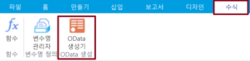
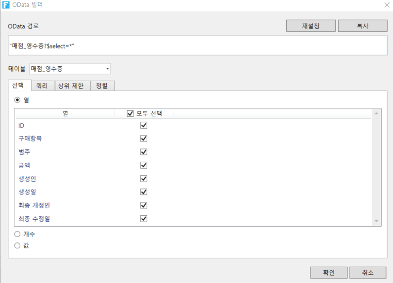

# OData의 기본 사용

&#x20;OData 함수를 사용하여 쿼리 매개 변수, 조건 등을 설정하여 데이터베이스에서 데이터를 쿼리하고, 하나 이상의 데이터 집합을 페이지에 반환할 수 있습니다.

OData 생성기는 OData 모델을 사용하여 데이터베이스 쿼리를 수행합니다. 포건시에서 바인딩할 필요가 없으므로 매개 변수, 조건 등에 따라 데이터베이스 데이터를 쿼리할 수 있습니다.

## OData 생성기

포건시에 OData 수식을 직접 입력할 필요가 없으며 OData 생성기를 사용하여 OData 수식을 생성할 수 있습니다.

페이지에서 셀을 선택한 후 리본의 메뉴 모음에서 \[수식->OData 생성기]를 선택합니다.

OData 생성기 대화 상자에서 OData 매개 변수를 설정합니다. 먼저 데이터를 쿼리하는 테이블을 선택한 다음 필요에 따라 선택, 쿼리 조건, 쿼리 행 수 및 정렬을 설정합니다. OData 매개 변수에 대한 설명은 아래 표에 나와 있으며 각 설정 항목의 구체적인 사용은 각 섹션을 참조하십시오

| 항목     | 설명                                                                                                                                                                                                                                                                                                                                                                                                                                                                                                                                                                                                                                                                                                                                                                                                                                              |
| ------ | ----------------------------------------------------------------------------------------------------------------------------------------------------------------------------------------------------------------------------------------------------------------------------------------------------------------------------------------------------------------------------------------------------------------------------------------------------------------------------------------------------------------------------------------------------------------------------------------------------------------------------------------------------------------------------------------------------------------------------------------------------------------------------------------------------------------------------------------------- |
| 선택     | 

<ul><li>열: 표시할 열을 선택합니다.</li><li>개수: 쿼리 테이블의 행 수입니다.</li><li>값: 값을 표시할 열을 선택합니다.</li></ul>                                                                                                                                                                                                                                                                                                                                                                                                                                                                                                                                                                                                                                                                                                                                               |
| 쿼리     | 

쿼리 조건을 설정합니다.
<ul><li>관계: 조건을 통과 및/또는 이전 조건에 연결합니다.</li><li>괄호: 조건을 괄호로 묶고 최대 4개의 괄호를 지정할 수 있습니다. 괄호를 사용하여 "(A 및 B) 또는 C) 및 D"와 같은 복잡한 식을 설정할 수 있습니다.</li><li>필드: 쿼리할 테이블의 필드를 선택합니다. 작성자, 생성 날짜, 마지막 업데이트자 및 마지막 업데이트 날짜는 활자 그리드에 의해 자동으로 추가되며 이러한 필드를 쿼리하도록 선택할 수도 있습니다.</li><li>작업: 필드와 값의 조건(예: 같음, 보다 크거나 같지 않음)을 비교합니다.</li><li>
값: 비교할 값, 수식 또는 특정 키워드를 입력합니다. 직접 입력하거나 직접 셀 선택 또는 수식 입력을 클릭하고 셀 값 또는 수식 결과를 조건부 값으로 사용할 수 있습니다.
<ul><li>기본 제공 키워드는 다음과 같습니다.</li><li>%Null%: 입력(empty)이 없고 정의가 없음을 나타냅니다.</li><li>%CurrentUer.UserName%: 로그인한 사용자의 사용자 이름을 나타냅니다.</li><li>%CurrentUer.FullName%: 로그인한 사용자의 전체 이름을 나타냅니다.</li><li>%CurrentUer.Email%: 로그인한 사용자의 이메일 주소를 나타냅니다.</li><li>%CurrentUer.Role%: 로그인한 사용자의 그룹을 나타냅니다.</li><li>%CurrentUser.OrganizationSuperior%: 로그인한 사용자의 조직 상위를 나타냅니다.</li></ul></li></ul> |
| 상위 제한  | 표시할 행 수를 설정합니다.                                                                                                                                                                                                                                                                                                                                                                                                                                                                                                                                                                                                                                                                                                                                                                                                                                 |
| 정렬     | 

정렬 조건을 설정합니다.
<ul><li>필드: 정렬 기준으로 테이블의 필드를 선택합니다. 작성자, 생성 날짜, 마지막 업데이트 및 마지막 업데이트 날짜는 포건시에 의해 자동으로 추가되며 정렬 기준으로 이러한 필드를 선택할 수도 있습니다.</li><li>
정렬:
<ul><li>오름차순: 테이블을 필드 오름차순으로 정렬합니다.</li><li>내림차순: 테이블을 필드 내림차순으로 정렬합니다.</li></ul></li></ul>                                                                                                                                                                                                                                                                                                                                                                                                                                                                                                                                                                                 |
