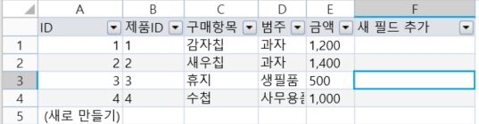
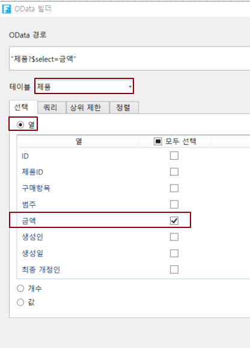
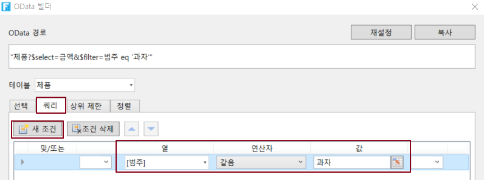
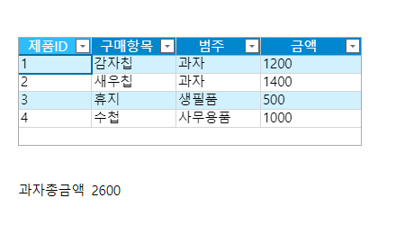

# OData를 Excel 함수와 함께 사용

OData는 다른 Excel 함수와 함께 사용할 수 있으므로 페이지에서 데이터베이스 데이터를 쉽게 가져올 수 있습니다.

## **SUM 함수, 배열 수식과 함께 사용** 

쿼리 결과가 데이터 집합(여러 행 레코드)인 경우 Excel의 배열 수식과 함께 사용할 수 있습니다. 그러나 배열 수식의 사용은 테이블에서 지원되지 않습니다.

SUM 함수와 결합하여 쿼리된 배열의 합계를 계산할 수 있습니다.

예를 들어, 주문 영수증 중 과자의  총 금액을 계산합니다.

 페이지에 테이블을 만들어 데이터를 표시합니다.&#x20;

 총 금액을 표시할 셀을 선택하고 리본 메뉴 모음에서 \[수식->OData 생성기]를 선택합니다.

 OData 생성기에서 테이블을  제품으로 선택하고 선택 탭에서 열을 선택하고 금액을 선택합니다.

 \[쿼리] 탭에서 \[새 조건]을 클릭하고 \[필드]를 \[범주], \[연산자]를 \[같음], \[값]을 \[과자]로 설정합니다.

 \[확인]을 클릭한 후 Enter 키를 눌러 OData 수식을 커밋합니다.

 다음 그림과 같이 OData 수식이 있는 셀을 두 번 클릭하여 편집 모드로 전환하고 OData 수식 앞에 SUM 함수를 추가하고 OData 수식을 괄호로 묶습니다.

 페이지를 실행한 후 브라우저에서 배열 수식에 따라 계산된 과자의 총 금액을 볼 수 있습니다.

