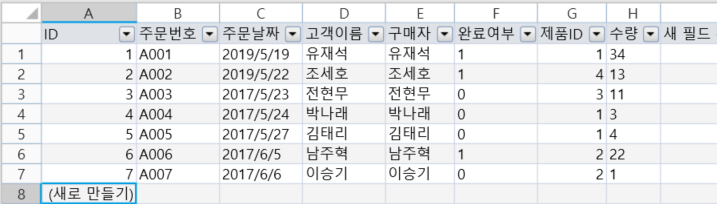
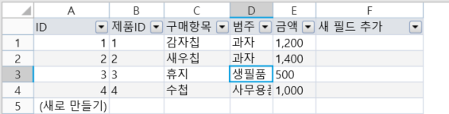
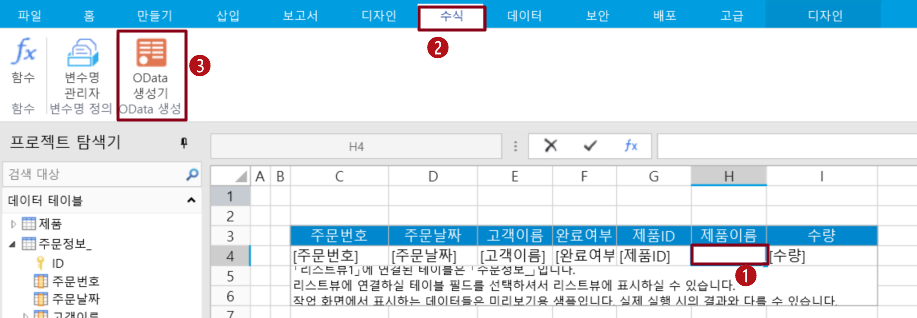
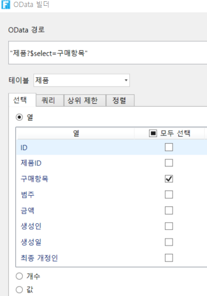
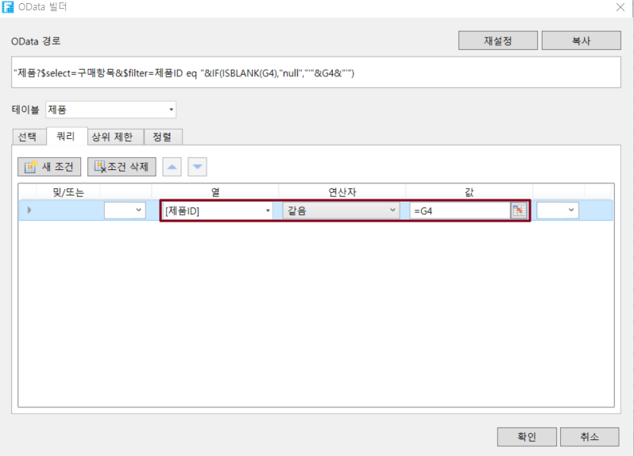

# 리스트뷰에 OData 적용

OData는 셀에 적용하고, 데이터 테이블의 데이터를 쿼리하고 표시할 뿐만 아니라, 테이블에 적용하여 다른 데이터 테이블의 데이터를 직접 쿼리하고 표시할 수도 있습니다.

OData가 테이블에 적용되면 필드를 바인딩하지 않고 다른 데이터 테이블에 표시되는 데이터를 쿼리할 수 있습니다. 다음은 테이블에서 OData를 사용하는 방법을 보여 주는 예제입니다.

예를 들어 주문 테이블에는 주문 번호, 주문 날짜, 고객 이름, 제품 ID, 수량이 있고 제품 테이블에는 제품ID, 구매항목, 범주, 금액 있는 필드가 있습니다.

주문 테이블과 제품 테이블에 모두 제품 ID 필드가 있는데 OData를 사용하여 주문 테이블 목록에 제품 이름과 단가를 표시하려면 어떻게 해야 할까요? 아래와 같이 진행하시면 됩니다.&#x20;

 다음 그림과 같이 페이지에 주문 테이블과 일부 필드를 바인딩합니다.

 OData 수식을 사용하여 주문 테이블에 제품 테이블의 제품 이름을 표시합니다.

리스트뷰 행의 \[제품 이름] 아래의 셀을 클릭하고 리본 메뉴 모음에서 \[수식->OData 생성기]를 선택합니다.

 OData 생성기에서 테이블을 제품 테이블로 선택하고 선택 탭에서 열을 선택하고, 구매항목을 선택합니다.

 쿼리 조건을 설정합니다. \[쿼리] 탭에서 \[새 조건]을 클릭합니다.

 \[확인]을 클릭하여 OData 생성기를 닫고 Enter 키를 눌러 OData 수식을 커밋합니다.

 브라우저에서 볼 수 있듯이 주문 목록에 제품 이름 표시되는 페이지를 실행합니다.

.png>)
