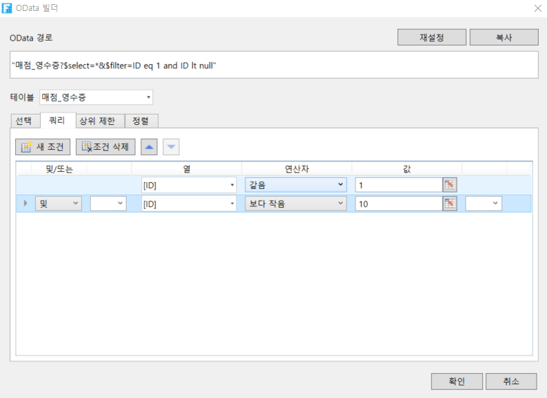

# OData 매개  변수 설정 - 쿼리

OData 생성기에서 OData에 대한 매개 변수를 설정해야 합니다. 매개 변수 중 하나는 쿼리이며, 이 때 쿼리 조건의 설정은 쿼리 조건을 설정하는 다른 다른 곳에서 사용되는 방법과 마찬가지로 쿼리 조건을 설정한 후 OData 수식은 쿼리 조건에 따라 데이터를 필터링할 수 있습니다.

\[쿼리] 탭을 선택하고 \[새 조건]을 클릭하여 쿼리 조건을 추가합니다. 여러 정렬 조건이 있는 경우 정렬 조건을 선택한 후 정렬 기준 위로 이동, 아래로 이동을 클릭하거나 \[조건 삭제]를 클릭하여 정렬 조건을 삭제할 수 있습니다.

구체적인 매개 변수는 아래에 설명되어 있습니다.

| 설정   | 설명                                                                                                                                                                                                                                                                                                                                                                                                                                                                                                                                                                                                                                              |
| ---- | ----------------------------------------------------------------------------------------------------------------------------------------------------------------------------------------------------------------------------------------------------------------------------------------------------------------------------------------------------------------------------------------------------------------------------------------------------------------------------------------------------------------------------------------------------------------------------------------------------------------------------------------------- |
| 밎/또는 | 조건을 이전 조건과 선택 및/또는 연결할 수 있습니다.                                                                                                                                                                                                                                                                                                                                                                                                                                                                                                                                                                                                                  |
| 괄호   | 조건을 괄호로 묶고 최대 4개의 괄호를 지정할 수 있습니다. 괄호를 사용하여 "(A 및 B) 또는 C) 및 D"와 같은 복잡한 식을 설정할 수 있습니다.                                                                                                                                                                                                                                                                                                                                                                                                                                                                                                                                                           |
| 열    | 쿼리할 테이블의 필드를 선택합니다. 작성자, 생성 날짜, 마지막 업데이트자 및 마지막 업데이트 날짜는 활자 그리드에 의해 자동으로 추가되며 이러한 필드를 쿼리하도록 선택할 수도 있습니다.                                                                                                                                                                                                                                                                                                                                                                                                                                                                                                                                        |
| 연산자  | 필드 및 값과 비교되는 조건(예: 같음, 보다 크거나 같지 않음)                                                                                                                                                                                                                                                                                                                                                                                                                                                                                                                                                                                                            |
| 값    | 

비교할 값, 수식 또는 특정 키워드를 입력합니다. 수식을 직접 입력하거나 셀 선택을 클릭하고 셀 값 또는 수식 결과를 조건 값으로 사용할 수 있습니다.

기본 제공 키워드는 다음과 같습니다.
<ul><li>%Null%: 입력(empty)이 없고 정의가 없음을 나타냅니다.</li><li>%CurrentUer.UserName%: 로그인한 사용자의 사용자 이름을 나타냅니다.</li><li>%CurrentUer.FullName%: 로그인한 사용자의 전체 이름을 나타냅니다.</li><li>%CurrentUer.Email%: 로그인한 사용자의 이메일 주소를 나타냅니다.</li><li>%CurrentUer.Role%: 로그인한 사용자의 그룹을 나타냅니다.</li><li>%CurrentUser.OrganizationSuperior%: 로그인한 사용자의 조직 상위를 나타냅니다. </li></ul> |

## 쿼리 설정&#x20;

OData 생성기에서 데이터 테이블을 선택한 후 쿼리 조건을 설정하고 쿼리 조건에 따라 데이터 테이블에서 데이터를 필터링합니다.

 페이지에서 셀 범위를 선택하고 리본 메뉴 모음에서 \[수식->OData 생성기]를 선택합니다.

 테이블을 선택하고 선택 항목을 설정합니다(예: 주문 테이블 선택, 선택에서 행 수 선택, 테이블에 기록된 행 수 쿼리).

 쿼리를 설정합니다. \[새 조건]을 클릭하여 필요에 따라 쿼리 조건을 설정합니다.

.png>)


* 데이터 테이블의 필드 유형은 예/아니요이고 OData에서 예/아니요 값은 true/false이므로 여기서 값은 true로 채워집니다.
* 쿼리 조건이 두 날짜 사이의 기간인 경우 날짜 규칙이 OData 규칙을 준수하도록 합니다.


