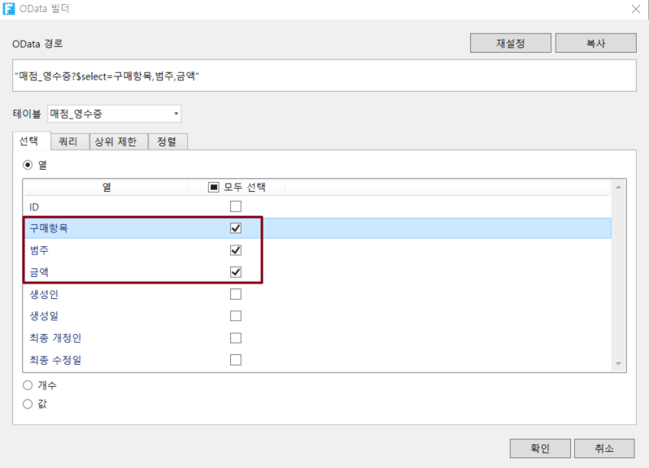
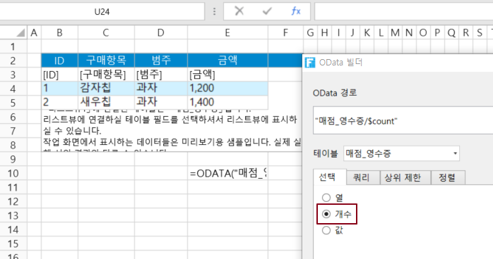
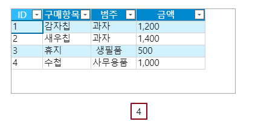
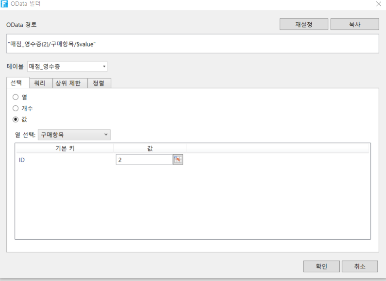

# OData 매개 변수 설정 - 선택

OData 생성기에서 OData에 대한 매개 변수를 설정해야 합니다. 매개 변수 중 하나는 표시할 데이터를 선택할 수 있는 선택 항목입니다.

* 열: 표시할 열을 선택하고 하나 이상의 열을 선택합니다.
* 개수: 테이블의 데이터를 쿼리 행 수입니다.
* 값: 값을 표시할 열을 선택합니다.

## 선택 - 열&#x20;

OData 생성기에서 데이터 테이블을 선택한 후 선택 항목을 열로 설정하면 데이터 테이블의 모든 열이 표시되며 하나 이상의 열을 선택하여 표시할 수 있습니다.

&#x20;포건시의 내부 열은 작성자, 생성 날짜, 마지막 업데이트자 및 마지막 업데이트 날짜입니다.

 페이지에서 셀 범위를 선택하고 리본 메뉴 모음에서 \[수식->OData 생성기]를 선택합니다.

 표시할 테이블과 열을 선택합니다. 예를 들어, 테이블을 선택하여 구매항목, 범주,금액 세 개의 열을 선택하고 다음 그림과 같이 확인을 클릭합니다.

 확인을 클릭하여 OData 생성기를 닫습니다. 데이터 집합을 가져오려면 Excel의 배열 수식을 사용해야 합니다.

셀 편집 상태에서 Ctrl+Shift+Enter 키를 누릅니다. 선택한 셀 범위 내의 모든 셀에 수식이 적용되고 각 수식은 Excel의 배열 수식인 중괄호{ }로 둘러싸여 있습니다.

.png>)

 실행 후 브라우저에서 셀 값이 배열 수식을 통해 페이지에 표시되는 것을 볼 수 있습니다. 행 수가 부족하면 "#N/A"로 채워집니다. 비어있는 부분은 IFERROR(ODATA("제품?$select=구매항목,범주,금액"),)로 수정하면 됩니다.&#x20;

## 선택 - 개수&#x20;

OData 생성기에서 데이터 테이블을 선택한 후 선택 항목을 개수로 설정합니다.데이터 테이블에 기록된 개수가  쿼리됩니다.

  페이지에서 셀 범위를 선택하고 리본 메뉴 모음에서 \[수식->OData 생성기]를 선택합니다.

 표시할 테이블과 열을 선택합니다. 예를 들어 테이블을 "매점 영수증"으로 선택하고 선택에서 "개수"를 선택합니다.

  \[확인]을 클릭하여 OData 생성기를 닫고 Enter 키를 눌러 OData 수식을 커밋합니다. 실행 후 페이지에 OData 수식이 테이블에 기록된 개수를 계산하는 것을 볼 수 있습니다.

## 선택 - 값&#x20;

OData 생성기에서 데이터 테이블을 선택한 후 선택을 값으로 설정하면 값을 표시할 열을 설정할 수 있습니다。


ID를 설정하여 하나의 열 값을 쿼리하고 표시할 수 있습니다.


 페이지에서 셀 범위를 선택하고 리본 메뉴 모음에서 \[수식->OData 생성기]를 선택합니다.

 테이블을 선택하고 선택 항목을 \[값]으로 설정합니다. 예를 들어 테이블을 매점 영수증 선택하고 선택 항목의 값을 선택하고 값을 표시할 항목을 "구매항목"로 선택하고 ID는 "2"입니다.

 \[확인]을 클릭하여 OData 생성기를 닫고 Enter 키를 눌러 OData 수식을 커밋합니다. 실행 후 페이지에서 OData 수식이 ID 2 구매의 값을 "새우칩"으로 가져옵니다.

