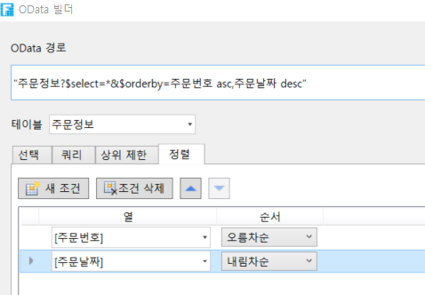
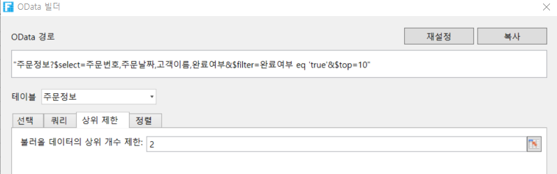
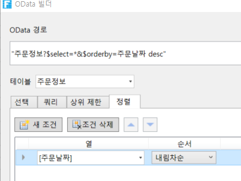

# OData 매개 변수 설정 - 정렬

OData 생성기에서 OData에 대한 매개 변수를 설정해야 합니다. 매개 변수 중 하나는 정렬이며 필요에 따라 데이터의 데이터 정렬을 설정할 수 있습니다.

\[정렬] 탭을 선택하고 \[새 조건]을 클릭하고 데이터 테이블의 필드를 선택하고 선택한 필드의 오름차순 또는 내림차순 정렬에 따라 데이터를 정렬하는 방법을 설정합니다.

여러 정렬 조건이 있는 경우 정렬 조건을 선택한 후 정렬 기준 위로 이동, 아래로 이동을 클릭하거나 \[조건 삭제]를 클릭하여 정렬 조건을 삭제할 수 있습니다.\
서

## &#x20;정렬 설정&#x20;

OData 생성기에서 데이터 테이블을 선택한 후 선택 항목을 열로 설정하고 데이터에 대한 데이터 정렬을 설정합니다.

 페이지에서 셀 범위를 선택하고 리본 메뉴 모음에서 \[수식->OData 생성기]를 선택합니다.

 표시할 테이블과 열을 선택합니다. 예를 들어 테이블을 주문정보 테이블로 선택하고 열로 선택한 다음 주문번호, 주문날짜, 고객이름, 완료여부 선택합니다.

.png>)

 (선택 사항) 쿼리 조건을 설정합니다. 예를 들어 완료된 주문에 대한 레코드를 쿼리하려면 쿼리 조건이 완료 여부 필드가 true와 같도록 설정됩니다.

.png>)

 쿼리 행 수를 설정합니다. 예를 들어 쿼리 행 수가 2이면 처음 세 줄의 완료된 주문에 대한 레코드가 표시됩니다.

 데이터 정렬을 설정합니다. 예를 들어 주문 날짜를 내림차순으로 정렬합니다.

새 조건을 클릭하여 필드를 주문 날짜로 설정하고 내림차순으로 정렬합니다.

  확인을 클릭하여 OData 생성기를 닫습니다. 이 시점에서 완료된 주문에 대한 레코드를 가져오는 것은 데이터 집합이므로 Excel의 배열 수식이 필요합니다.

셀 편집 상태에서 Ctrl+Alt+Enter 키를 누릅니다. 선택한 셀 범위 내의 모든 셀에 수식이 적용되고 각 수식은 Excel의 배열 수식인 중괄호{ }로 둘러싸여 있습니다.

 실행 후 브라우저에서 완료된 처음 세 개의 주문이 날짜 내림차순으로 표시되는 것을 볼 수 있습니다.
