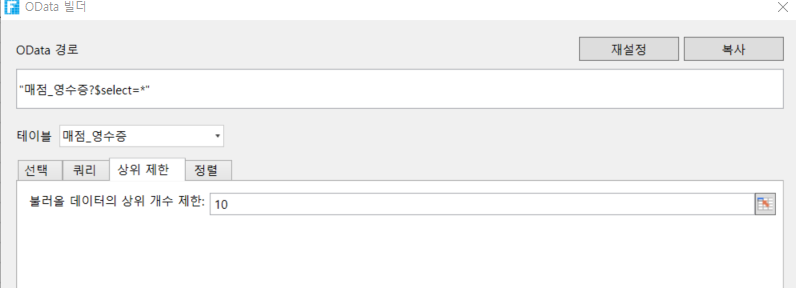
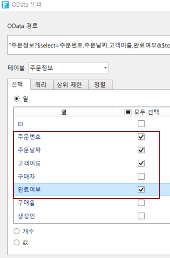
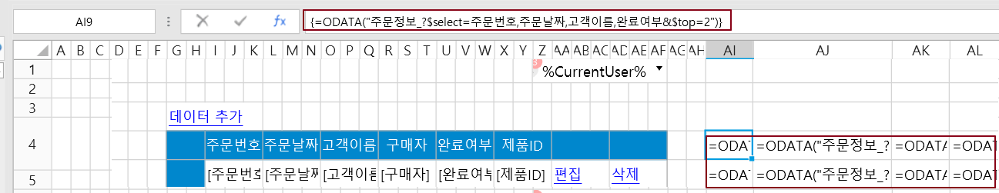
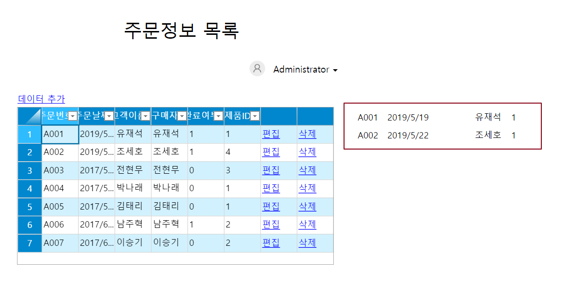

# OData 매개 변수 설정 - 상위 제한

OData 생성기에서 OData에 대한 매개 변수를 설정해야 합니다. 매개 변수 중 하나는 표시할 데이터의 행 수를 설정하는 쿼리 행 수입니다.

\[상위 제한] 탭을 선택하고 불러올 데이터의 상위 개수 제한 입력 상자에 표시할 데이터의 행 수를 직접 입력하거나 선택 페이지에서 셀을 클릭하여 셀 값에 따라 데이터를 표시합니다.

예를 들어 쿼리 결과가 100개 레코드이고 쿼리 행 수가 10개인 경우 상위 10개 레코드만 표시됩니다.

## 상위 제한 설정하기&#x20;

OData 생성기에서 데이터 테이블을 선택한 후 선택 항목을 열로 설정하고 쿼리 행 수를 설정합니다.

 페이지에서 셀 범위를 선택하고 리본 메뉴 모음에서 \[수식->OData 생성기]를 선택합니다.

 표시할 테이블과 열을 선택합니다. 예를 들어 테이블을 주문정보 테이블로 선택하고 열로 선택한 다음 주주문번호, 주문날짜, 고객이름, 완료여부 선택합니다.

 (선택 사항) 쿼리 조건을 설정합니다. 예를 들어 완료된 주문에 대한 레코드를 쿼리하려면 쿼리 조건이 완료 여부 필드가 true와 같도록 설정됩니다.

 쿼리 행 수를 설정합니다. 예를 들어 쿼리 행 수가 2이면 처음 세 줄의 완료된 주문에 대한 레코드가 표시됩니다.

.png>)

 확인을 클릭하여 OData 생성기를 닫습니다. 이 시점에서 얻은 처음 세 행의 데이터는 데이터 집합이므로 Excel의 배열 수식이 필요합니다.

셀 편집 상태에서 Ctrl+Shift+Enter 키를 누릅니다. 선택한 셀 범위 내의 모든 셀에 수식이 적용되고 각 수식은 Excel의 배열 수식인 중괄호{ }로 둘러싸여 있습니다.

 (선택 사항) 셀 서식을 지정합니다. 두 번째 열은 날짜 형식 필드이며 날짜 형식으로 설정해야 합니다.&#x20;

 실행 후 브라우저에서 완료된 처음 주문에 대한 레코드를 볼 수 있습니다.

